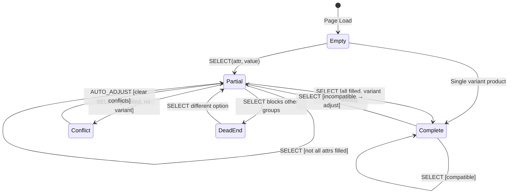

# Variant Selection System

> **Source**: [Saleor Docs - Attributes](https://docs.saleor.io/developer/attributes/overview) - How product/variant attributes work

## When to Use

Use this skill when:

- Modifying variant/attribute selection on product pages
- Understanding why a variant isn't selectable
- Adding discount indicators to variant options
- Debugging "Add to Cart" button state

## Instructions

### Core Concept: Variants, Not Products

**You add VARIANTS to cart, not products.** Each variant is a specific attribute combination:

| Product | Attributes     | Variant ID |
| ------- | -------------- | ---------- |
| T-Shirt | Black + Medium | `abc123`   |
| T-Shirt | Black + Large  | `def456`   |
| T-Shirt | White + Medium | `ghi789`   |

The `checkoutLinesAdd` mutation requires a specific `variantId`. Without selecting ALL attributes, there's no variant to add.

### File Structure

```
src/ui/components/pdp/variant-selection/
├── index.ts                    # Public exports
├── types.ts                    # TypeScript interfaces
├── utils.ts                    # Data transformation & logic
├── VariantSelector.tsx         # Single attribute selector
├── VariantSelectionSection.tsx # Main container
└── renderers/
    ├── ColorSwatchOption.tsx   # Color swatch (circular)
    ├── SizeButtonOption.tsx    # Size button (rectangular)
    └── TextOption.tsx          # Generic text (fallback)
```

### Key Functions in `utils.ts`

| Function                        | Purpose                                          |
| ------------------------------- | ------------------------------------------------ |
| `groupVariantsByAttributes()`   | Extract unique attribute values from variants    |
| `findMatchingVariant()`         | Find variant matching ALL selected attributes    |
| `getOptionsForAttribute()`      | Get options with availability/compatibility info |
| `getAdjustedSelections()`       | Clear conflicting selections when needed         |
| `getUnavailableAttributeInfo()` | Detect dead-end selections                       |

### Option States

| State            | Meaning                                   | Visual        | Clickable?        |
| ---------------- | ----------------------------------------- | ------------- | ----------------- |
| **Available**    | In stock                                  | Normal        | ✓                 |
| **Incompatible** | No variant with this + current selections | Dimmed        | ✓ (clears others) |
| **Out of stock** | Variant exists but quantity = 0           | Strikethrough | ✗                 |

### URL Parameter Pattern

Selections are stored in URL params:

```
?color=black&size=m&variant=abc123
  ↑           ↑       ↑
Color sel  Size sel  Matching variant (set automatically)
```

The `variant` param is only set when ALL attributes are selected.

### Discount Badges

Options can show discount percentages:

```typescript
// In utils.ts
interface VariantOption {
	id: string;
	name: string;
	available: boolean;
	hasDiscount?: boolean; // Any variant with this option is discounted
	discountPercent?: number; // Max discount percentage
	// ...
}
```

The renderers display a small badge when `discountPercent` is set.

## Examples

### Smart Selection Adjustment

When user selects an incompatible option:

```
State: ?color=red (Red only exists in Size S)
User clicks: Size L
Result: ?size=l (Red is cleared, not blocked)
```

Users are never "stuck" - they can always explore all options.

### Dead End Detection

```typescript
const deadEnd = getUnavailableAttributeInfo(variants, groups, selections);
// Returns: { slug: "size", name: "Size", blockedBy: "Red" }
// UI shows: "No size available in Red"
```

### Custom Renderers

```tsx
<VariantSelectionSection
	variants={variants}
	renderers={{
		color: MyCustomColorPicker,
		size: MySizeChart,
	}}
/>
```

## State Machine

> **Why include this?** State machines clarify complex interactive features. For multi-state UI with non-obvious transitions (like auto-adjustment here), a diagram prevents edge case bugs and helps AI agents reason about the system correctly.

Understanding the state machine helps prevent edge case bugs:



### States

| State        | URL Params                        | Add to Cart | Description                         |
| ------------ | --------------------------------- | ----------- | ----------------------------------- |
| **Empty**    | `?`                               | ❌          | No selections                       |
| **Partial**  | `?color=black`                    | ❌          | Some attributes selected            |
| **Complete** | `?color=black&size=m&variant=abc` | ✅          | All selected, variant found         |
| **Conflict** | (transient)                       | —           | Impossible combination, auto-clears |
| **DeadEnd**  | `?color=black`                    | ❌          | Selection blocks other groups       |

### Example User Flow

```
1. User lands on product page
   State: Empty → URL: /products/t-shirt

2. User clicks "Black" color
   State: Partial → URL: ?color=black

3. User clicks "Medium" size
   State: Complete → URL: ?color=black&size=medium&variant=abc123
   → Add to Cart enabled ✓

4. User clicks "XL" (but Black/XL doesn't exist)
   State: Conflict → AUTO_ADJUST → Partial
   → URL: ?size=xl (color cleared)
   → User can now pick a color that has XL
```

This "smart adjustment" pattern ensures users are never stuck. They can always explore all options.

## Anti-patterns

❌ **Don't enable "Add to Cart" without full selection** - Needs variant ID  
❌ **Don't block incompatible options** - Let users click, clear others  
❌ **Don't assume single attribute** - Products can have multiple  
❌ **Don't use `0` in boolean checks for prices** - Use `typeof === "number"`
