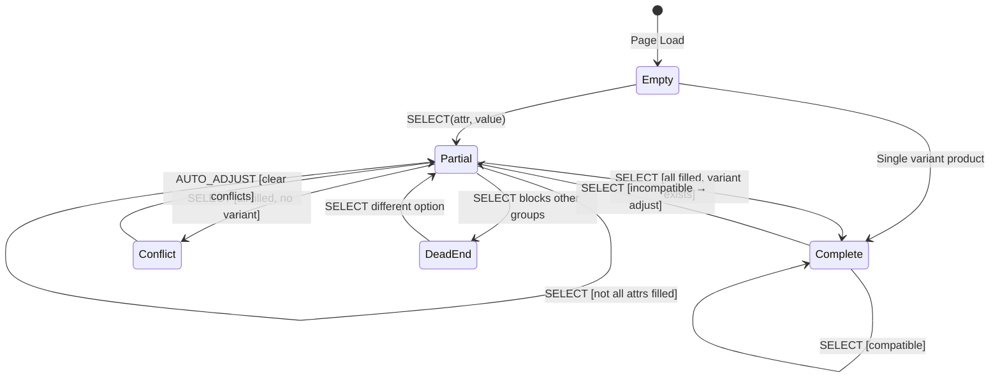

# Variant Selection State Machine

> **Why include this?** State machines clarify complex interactive features. For multi-state UI with non-obvious transitions (like auto-adjustment here), a diagram prevents edge case bugs and helps AI agents reason about the system correctly.

## State Diagram



## States

| State        | URL Params                        | Add to Cart | Description                         |
| ------------ | --------------------------------- | ----------- | ----------------------------------- |
| **Empty**    | `?`                               | ❌          | No selections                       |
| **Partial**  | `?color=black`                    | ❌          | Some attributes selected            |
| **Complete** | `?color=black&size=m&variant=abc` | ✅          | All selected, variant found         |
| **Conflict** | (transient)                       | —           | Impossible combination, auto-clears |
| **DeadEnd**  | `?color=black`                    | ❌          | Selection blocks other groups       |

## Example User Flow

```
1. User lands on product page
   State: Empty → URL: /products/t-shirt

2. User clicks "Black" color
   State: Partial → URL: ?color=black

3. User clicks "Medium" size
   State: Complete → URL: ?color=black&size=medium&variant=abc123
   → Add to Cart enabled ✓

4. User clicks "XL" (but Black/XL doesn't exist)
   State: Conflict → AUTO_ADJUST → Partial
   → URL: ?size=xl (color cleared)
   → User can now pick a color that has XL
```

This "smart adjustment" pattern ensures users are never stuck. They can always explore all options.

## Transition Rules

### SELECT Action

When user clicks an option:

1. **If variant exists with new selection** → Update selection, keep others
2. **If no variant exists** → Clear conflicting selections (AUTO_ADJUST)
3. **If all attributes now filled and variant exists** → Set `variant` param

### AUTO_ADJUST Logic

Implemented in `getAdjustedSelections()`:

```typescript
// Pseudo-code
function getAdjustedSelections(variants, currentSelections, newAttr, newValue) {
	const newSelections = { ...currentSelections, [newAttr]: newValue };

	// Check if valid variant exists
	if (findMatchingVariant(variants, newSelections)) {
		return newSelections;
	}

	// No valid variant - clear other selections
	return { [newAttr]: newValue };
}
```

## Dead End Detection

A "dead end" occurs when a selection makes ALL options in another attribute group unavailable.

Example: Red only exists in Size S. User selects Red → Size dropdown shows only S (or shows "No sizes available in Red").

Detected via `getUnavailableAttributeInfo()`:

```typescript
const deadEnd = getUnavailableAttributeInfo(variants, groups, selections);
// Returns: { slug: "size", name: "Size", blockedBy: "Red" }
```
