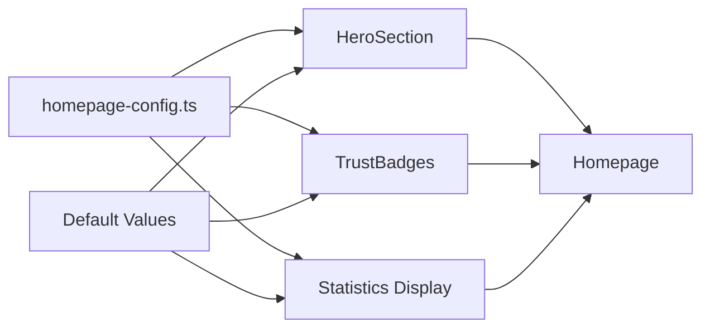

# Design Document

## Overview

This feature transforms hardcoded homepage content into a dynamic, configuration-driven system. The implementation uses a centralized configuration file that defines all homepage content, with TypeScript interfaces ensuring type safety. Components read from this configuration at build/runtime, with sensible defaults as fallbacks.

The approach prioritizes simplicity and maintainability - using a single configuration file rather than complex CMS integration, while still allowing easy content updates without touching component code.

## Architecture

### Configuration Flow



### File Structure

```
src/
├── config/
│   └── homepage.ts          # Centralized homepage configuration
├── ui/components/
│   ├── HeroSection.tsx      # Updated to use config
│   └── TrustBadges.tsx      # Updated to use config
```

## Components and Interfaces

### Configuration Types

```typescript
// src/config/homepage.ts

interface HeroConfig {
	badge: string;
	headline: string;
	headlineAccent: string;
	description: string;
	primaryCta: {
		text: string;
		href: string;
	};
	secondaryCta: {
		text: string;
		href: string;
	};
	stats: Array<{
		value: string;
		label: string;
	}>;
}

interface TrustBadge {
	icon: "truck" | "rotate" | "shield" | "credit-card";
	title: string;
	description: string;
}

interface HomepageConfig {
	hero: HeroConfig;
	trustBadges: TrustBadge[];
}
```

### Component Updates

**HeroSection Component**

- Import configuration from `@/config/homepage`
- Replace hardcoded strings with config values
- Maintain existing styling and structure

**TrustBadges Component**

- Import badge configuration from `@/config/homepage`
- Map icon names to Lucide components
- Replace hardcoded badge array with config

## Data Models

### Homepage Configuration Schema

```typescript
export const homepageConfig: HomepageConfig = {
	hero: {
		badge: "✨ New Season Collection",
		headline: "Discover Your",
		headlineAccent: "Perfect Style",
		description: "Explore our curated collection of premium products...",
		primaryCta: {
			text: "Shop Now",
			href: "/products",
		},
		secondaryCta: {
			text: "View Collections",
			href: "/collections/featured-products",
		},
		stats: [
			{ value: "1000+", label: "Products" },
			{ value: "24/7", label: "Support" },
			{ value: "Free", label: "Shipping $50+" },
		],
	},
	trustBadges: [
		{ icon: "truck", title: "Free Shipping", description: "On orders over $50" },
		{ icon: "rotate", title: "Easy Returns", description: "30-day return policy" },
		{ icon: "shield", title: "Secure Checkout", description: "SSL encrypted payment" },
		{ icon: "credit-card", title: "Flexible Payment", description: "Multiple payment options" },
	],
};
```

## Error Handling

### Configuration Validation

- TypeScript compiler catches type mismatches at build time
- Default values embedded in config file ensure fallback content
- Missing optional fields gracefully handled with nullish coalescing

### Runtime Safety

- Components use optional chaining for nested config access
- Empty arrays handled with conditional rendering
- Invalid icon names fall back to default icon

## Testing Strategy

### Unit Tests (Optional)

- Verify config exports correct structure
- Test icon mapping function
- Validate default values are sensible

### Manual Testing

- Verify all homepage sections render correctly
- Test config changes reflect on page
- Confirm no visual regressions

## Implementation Notes

### Migration Strategy

1. Create configuration file with current hardcoded values
2. Update HeroSection to use config
3. Update TrustBadges to use config
4. Verify no visual changes
5. Document configuration options

### Future Enhancements

- Environment variable overrides for different deployments
- CMS integration via Saleor pages API
- A/B testing support for hero content
