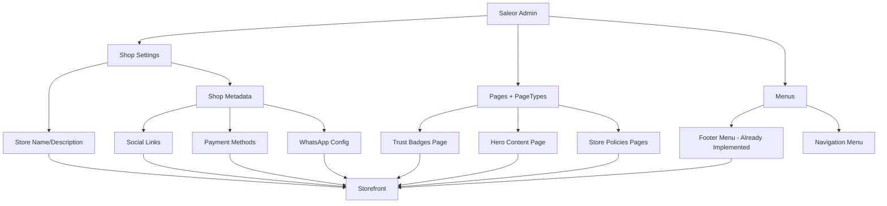
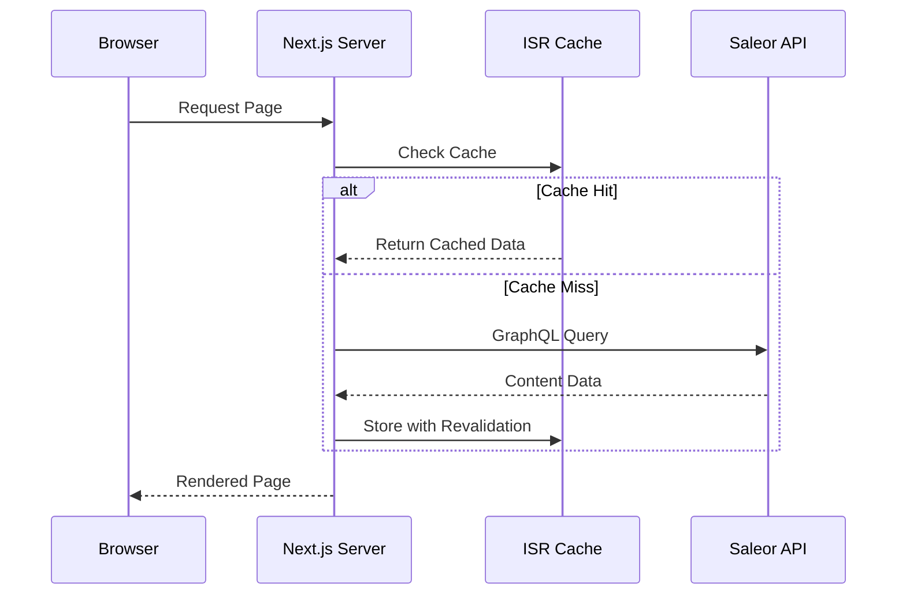

# Design Document: Dynamic Storefront Content

## Overview

This design document outlines the architecture for replacing hardcoded content in the Luxior Mall storefront with dynamic content fetched from Saleor 3.22.17's GraphQL API. The solution leverages Saleor's Shop settings, Pages with PageTypes, and metadata system to enable content management through the Saleor admin dashboard.

## Architecture

### Content Sources in Saleor 3.22.17



### Data Flow



## Components and Interfaces

### 1. GraphQL Queries

#### Shop Settings Query

```graphql
# src/graphql/ShopSettings.graphql
query ShopSettings {
	shop {
		id
		name
		description
		headerText
		metadata {
			key
			value
		}
		metafields(
			keys: [
				"social_facebook"
				"social_instagram"
				"social_twitter"
				"payment_methods"
				"whatsapp_number"
				"whatsapp_message"
			]
		)
	}
}
```

#### Site Content Query (for Pages with specific PageType)

```graphql
# src/graphql/SiteContent.graphql
query SiteContentBySlug($slug: String!) {
	page(slug: $slug) {
		id
		slug
		title
		content
		metadata {
			key
			value
		}
		metafields(keys: ["icon", "cta_text", "cta_href", "badge_text", "headline", "headline_accent", "stats"])
		pageType {
			slug
		}
	}
}
```

#### Trust Badges Query

```graphql
# src/graphql/TrustBadges.graphql
query TrustBadgesContent {
	pages(first: 10, filter: { pageTypes: ["trust-badge"] }) {
		edges {
			node {
				id
				slug
				title
				content
				metafields(keys: ["icon", "description", "sort_order"])
			}
		}
	}
}
```

### 2. Content Service

Create a centralized service for fetching and caching site content:

```typescript
// src/lib/content.ts
import { executeGraphQL } from "./graphql";
import { ShopSettingsDocument, SiteContentBySlugDocument, TrustBadgesContentDocument } from "@/gql/graphql";

export interface TrustBadge {
	icon: "truck" | "rotate" | "shield" | "credit-card";
	title: string;
	description: string;
	sortOrder?: number;
}

export interface HeroContent {
	badge: string;
	headline: string;
	headlineAccent: string;
	description: string;
	primaryCta: { text: string; href: string };
	secondaryCta: { text: string; href: string };
	stats: Array<{ value: string; label: string }>;
}

export interface ShopInfo {
	name: string;
	description: string;
	socialLinks: {
		facebook?: string;
		instagram?: string;
		twitter?: string;
	};
	paymentMethods: string[];
	whatsApp?: {
		phoneNumber: string;
		message: string;
	};
}

export interface StorePolicy {
	freeShippingThreshold: string;
	returnPeriodDays: number;
	shippingContent?: string;
	returnsContent?: string;
}

// Cache revalidation periods
const CACHE_REVALIDATE = {
	SHOP_SETTINGS: 60 * 60, // 1 hour
	TRUST_BADGES: 60 * 60, // 1 hour
	HERO_CONTENT: 60 * 60, // 1 hour
	STORE_POLICIES: 60 * 60 * 24, // 24 hours
};

export async function getShopInfo(): Promise<ShopInfo> {
	// Implementation fetches from Saleor and transforms
}

export async function getTrustBadges(): Promise<TrustBadge[]> {
	// Implementation fetches from Saleor Pages
}

export async function getHeroContent(): Promise<HeroContent> {
	// Implementation fetches from Saleor Page
}

export async function getStorePolicies(): Promise<StorePolicy> {
	// Implementation fetches from Saleor
}
```

### 3. Component Updates

#### TrustBadges Component (Server Component)

```typescript
// src/ui/components/TrustBadges.tsx
import { getTrustBadges } from "@/lib/content";

export async function TrustBadges() {
	const badges = await getTrustBadges();
	// Render badges dynamically
}
```

#### ProductPageTrustBadges Component

```typescript
// src/ui/components/ProductPageTrustBadges.tsx
import { getStorePolicies } from "@/lib/content";

export async function ProductPageTrustBadges() {
	const policies = await getStorePolicies();
	// Render shipping, returns, secure checkout info
}
```

#### HeroSection Component (Server Component)

```typescript
// src/ui/components/HeroSection.tsx
import { getHeroContent } from "@/lib/content";

export async function HeroSection() {
	const hero = await getHeroContent();
	// Render hero dynamically
}
```

#### Footer Component Updates

```typescript
// src/ui/components/Footer.tsx
import { getShopInfo } from "@/lib/content";

export async function Footer({ channel }: { channel: string }) {
	const shopInfo = await getShopInfo();
	// Use shopInfo.name, shopInfo.description, shopInfo.socialLinks
}
```

## Data Models

### Saleor Admin Setup Required

#### 1. Shop Metadata Keys

Store these in Shop > Settings > Metadata:

| Key                | Example Value                      | Description                   |
| ------------------ | ---------------------------------- | ----------------------------- |
| `social_facebook`  | `https://facebook.com/luxiormall`  | Facebook page URL             |
| `social_instagram` | `https://instagram.com/luxiormall` | Instagram profile URL         |
| `social_twitter`   | `https://twitter.com/luxiormall`   | Twitter/X profile URL         |
| `payment_methods`  | `["visa", "mastercard", "mpesa"]`  | JSON array of payment methods |
| `whatsapp_number`  | `+254700000000`                    | WhatsApp business number      |
| `whatsapp_message` | `Hi! I have a question...`         | Default WhatsApp message      |

#### 2. PageTypes to Create

**PageType: `trust-badge`**

- Attributes: `icon` (dropdown: truck, rotate, shield, credit-card), `sort_order` (number)

**PageType: `hero-content`**

- Attributes: `badge_text`, `headline`, `headline_accent`, `description`, `primary_cta_text`, `primary_cta_href`, `secondary_cta_text`, `secondary_cta_href`, `stats` (JSON)

**PageType: `store-policy`**

- Attributes: `policy_type` (dropdown: shipping, returns, privacy, terms), `summary` (short text for badges)

#### 3. Pages to Create

| Slug                   | PageType     | Purpose                 |
| ---------------------- | ------------ | ----------------------- |
| `trust-badge-shipping` | trust-badge  | Free shipping badge     |
| `trust-badge-returns`  | trust-badge  | Returns policy badge    |
| `trust-badge-secure`   | trust-badge  | Secure checkout badge   |
| `trust-badge-payment`  | trust-badge  | Payment options badge   |
| `homepage-hero`        | hero-content | Homepage hero section   |
| `policy-shipping`      | store-policy | Shipping policy details |
| `policy-returns`       | store-policy | Returns policy details  |

## Error Handling

### Fallback Strategy

```typescript
// src/lib/content.ts

const FALLBACK_TRUST_BADGES: TrustBadge[] = [
	{ icon: "truck", title: "Free Shipping", description: "On qualifying orders" },
	{ icon: "rotate", title: "Easy Returns", description: "Hassle-free returns" },
	{ icon: "shield", title: "Secure Checkout", description: "SSL encrypted" },
	{ icon: "credit-card", title: "Flexible Payment", description: "Multiple options" },
];

const FALLBACK_HERO: HeroContent = {
	badge: "Welcome",
	headline: "Discover Your",
	headlineAccent: "Perfect Style",
	description: "Explore our curated collection of premium products.",
	primaryCta: { text: "Shop Now", href: "/products" },
	secondaryCta: { text: "View Collections", href: "/collections" },
	stats: [],
};

export async function getTrustBadges(): Promise<TrustBadge[]> {
	try {
		const data = await executeGraphQL(TrustBadgesContentDocument, {
			revalidate: CACHE_REVALIDATE.TRUST_BADGES,
		});

		if (!data.pages?.edges?.length) {
			return FALLBACK_TRUST_BADGES;
		}

		return transformTrustBadges(data.pages.edges);
	} catch (error) {
		console.error("Failed to fetch trust badges:", error);
		return FALLBACK_TRUST_BADGES;
	}
}
```

### Error Boundaries

Components should gracefully handle missing data:

```typescript
export async function TrustBadges() {
  const badges = await getTrustBadges();

  if (!badges.length) {
    return null; // Don't render section if no badges
  }

  return (
    <section>
      {/* Render badges */}
    </section>
  );
}
```

## Testing Strategy

### Unit Tests

- Test content transformation functions
- Test fallback behavior when API returns empty/error
- Test metadata parsing utilities

### Integration Tests

- Test GraphQL queries against Saleor API
- Test component rendering with mocked API responses
- Test cache invalidation behavior

### Manual Testing Checklist

1. Update content in Saleor admin
2. Verify changes appear on storefront after cache revalidation
3. Test with missing/incomplete data
4. Test with Saleor API unavailable (fallbacks)

## Migration Plan

### Phase 1: Add New Infrastructure

1. Create GraphQL queries for Shop settings and Pages
2. Create content service with fallbacks
3. Keep existing hardcoded config as fallback

### Phase 2: Update Components

1. Update TrustBadges to fetch from API
2. Update HeroSection to fetch from API
3. Update Footer to use Shop settings
4. Update ProductPage trust badges

### Phase 3: Saleor Admin Setup

1. Document required PageTypes and metadata
2. Create initial content in Saleor admin
3. Verify all content displays correctly

### Phase 4: Cleanup

1. Remove `src/config/homepage.ts` (or keep as fallback reference)
2. Update documentation
3. Remove any remaining hardcoded strings

## File Structure

```
src/
├── graphql/
│   ├── ShopSettings.graphql      # New
│   ├── SiteContent.graphql       # New
│   └── TrustBadges.graphql       # New
├── lib/
│   ├── content.ts                # New - Content fetching service
│   └── graphql.ts                # Existing
├── ui/
│   └── components/
│       ├── TrustBadges.tsx       # Updated - Server component
│       ├── HeroSection.tsx       # Updated - Server component
│       ├── Footer.tsx            # Updated - Use shop settings
│       └── ProductPageTrustBadges.tsx  # New - For product page
├── config/
│   └── homepage.ts               # Deprecated - Keep as fallback reference
└── app/
    └── [channel]/
        └── (main)/
            ├── page.tsx          # Updated - Pass content to components
            └── products/
                └── [slug]/
                    └── page.tsx  # Updated - Use ProductPageTrustBadges
```
