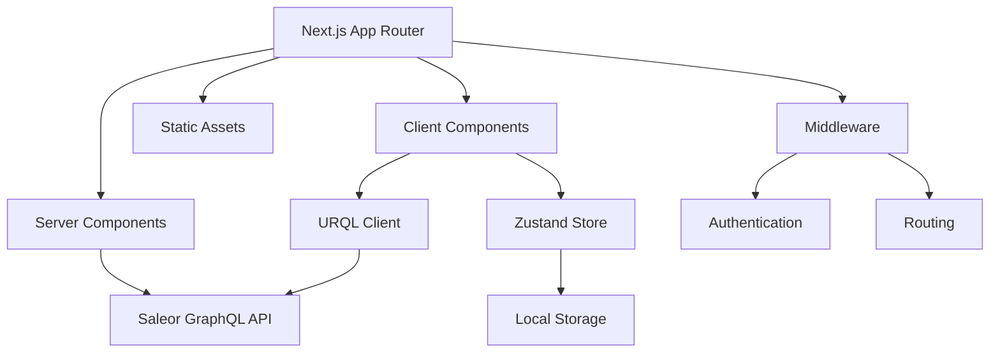

# Design Document

## Overview

The Luxior Mall Storefront is a modern, high-performance e-commerce platform built with Next.js 14+ App Router, leveraging server-side rendering and static generation for optimal performance. The system integrates with Saleor GraphQL API for backend services and implements a mobile-first, conversion-optimized design using Tailwind CSS.

The architecture follows modern React patterns with TypeScript for type safety, URQL for GraphQL client management, and Zustand for client-side state management. The design emphasizes progressive enhancement, accessibility, and SEO optimization.

## Architecture

### High-Level Architecture



### Technology Stack

- **Frontend Framework**: Next.js 14+ with App Router
- **UI Library**: React 19+ with TypeScript
- **Styling**: Tailwind CSS with custom design system
- **State Management**: Zustand for client state, React Context for auth
- **Data Fetching**: URQL for GraphQL client, Next.js native fetch for SSR
- **Authentication**: Saleor Auth SDK with JWT tokens
- **Forms**: Formik with Yup validation
- **Payments**: Stripe and Adyen integration
- **Icons**: Lucide React
- **Notifications**: React Toastify

### Folder Structure

```
src/
├── app/                    # Next.js App Router pages
│   ├── (auth)/            # Auth-related pages
│   ├── (shop)/            # Main shopping pages
│   ├── account/           # User account pages
│   ├── checkout/          # Checkout flow
│   └── api/               # API routes
├── components/            # Reusable UI components
│   ├── ui/               # Base UI components
│   ├── forms/            # Form components
│   ├── layout/           # Layout components
│   └── product/          # Product-specific components
├── lib/                  # Utility functions and configurations
├── hooks/                # Custom React hooks
├── store/                # Zustand stores
├── types/                # TypeScript type definitions
└── styles/               # Global styles and Tailwind config
```

## Components and Interfaces

### Core Component Architecture

#### 1. Layout Components

**Header Component**
- Responsive navigation with mobile hamburger menu
- Search bar with autocomplete
- Cart icon with item count
- User account dropdown
- Channel/language selector

**Footer Component**
- Multi-column layout with links
- Newsletter signup form
- Social media icons
- Payment method badges

**Navigation Component**
- Category-based menu structure
- Mega menu for desktop
- Drawer navigation for mobile
- Breadcrumb navigation

#### 2. Product Components

**ProductCard Component**
```typescript
interface ProductCardProps {
  product: Product;
  variant?: 'grid' | 'list';
  showWishlist?: boolean;
  showQuickView?: boolean;
}
```

**ProductGallery Component**
```typescript
interface ProductGalleryProps {
  images: ProductImage[];
  productName: string;
  enableZoom?: boolean;
}
```

**VariantSelector Component**
```typescript
interface VariantSelectorProps {
  product: Product;
  selectedVariant: ProductVariant;
  onVariantChange: (variant: ProductVariant) => void;
}
```

#### 3. Cart Components

**CartItem Component**
```typescript
interface CartItemProps {
  item: CheckoutLine;
  onQuantityChange: (quantity: number) => void;
  onRemove: () => void;
}
```

**CartSummary Component**
```typescript
interface CartSummaryProps {
  checkout: Checkout;
  showPromoCode?: boolean;
  showShipping?: boolean;
}
```

#### 4. Form Components

**AddressForm Component**
```typescript
interface AddressFormProps {
  initialValues?: Address;
  onSubmit: (address: Address) => void;
  countries: Country[];
}
```

**PaymentForm Component**
```typescript
interface PaymentFormProps {
  checkout: Checkout;
  onPaymentComplete: (result: PaymentResult) => void;
  paymentMethods: PaymentMethod[];
}
```

### State Management Architecture

#### Zustand Stores

**Cart Store**
```typescript
interface CartStore {
  checkout: Checkout | null;
  isLoading: boolean;
  addItem: (variantId: string, quantity: number) => Promise<void>;
  updateItem: (lineId: string, quantity: number) => Promise<void>;
  removeItem: (lineId: string) => Promise<void>;
  clearCart: () => void;
}
```

**User Store**
```typescript
interface UserStore {
  user: User | null;
  isAuthenticated: boolean;
  login: (email: string, password: string) => Promise<void>;
  logout: () => void;
  register: (userData: RegisterInput) => Promise<void>;
}
```

**Wishlist Store**
```typescript
interface WishlistStore {
  items: Product[];
  addItem: (product: Product) => void;
  removeItem: (productId: string) => void;
  isInWishlist: (productId: string) => boolean;
}
```

## Data Models

### Core Entities

#### Product Model
```typescript
interface Product {
  id: string;
  name: string;
  slug: string;
  description: string;
  seoTitle?: string;
  seoDescription?: string;
  category: Category;
  collections: Collection[];
  variants: ProductVariant[];
  images: ProductImage[];
  attributes: ProductAttribute[];
  pricing: ProductPricing;
  isAvailable: boolean;
  availableForPurchase?: Date;
}
```

#### User/Customer Model
```typescript
interface User {
  id: string;
  email: string;
  firstName: string;
  lastName: string;
  isActive: boolean;
  dateJoined: Date;
  addresses: Address[];
  orders: Order[];
  defaultShippingAddress?: Address;
  defaultBillingAddress?: Address;
}
```

#### Checkout Model
```typescript
interface Checkout {
  id: string;
  token: string;
  email?: string;
  lines: CheckoutLine[];
  shippingAddress?: Address;
  billingAddress?: Address;
  shippingMethod?: ShippingMethod;
  paymentMethod?: PaymentMethod;
  subtotalPrice: Money;
  totalPrice: Money;
  shippingPrice: Money;
  taxPrice: Money;
}
```

### GraphQL Integration

#### Query Patterns
- Use TypeScript codegen for type-safe GraphQL operations
- Implement fragment composition for reusable data structures
- Cache frequently accessed data (categories, collections)
- Use optimistic updates for cart operations

#### Mutation Patterns
- Implement error handling with user-friendly messages
- Use loading states for all mutations
- Implement retry logic for failed operations
- Validate data before sending mutations

## Error Handling

### Error Boundary Strategy

**Global Error Boundary**
- Catches unhandled React errors
- Displays fallback UI with error reporting
- Logs errors to monitoring service

**Route-Level Error Boundaries**
- Specific error handling for different page types
- Graceful degradation for non-critical features
- Retry mechanisms for recoverable errors

### API Error Handling

**GraphQL Error Types**
```typescript
enum ErrorType {
  NETWORK_ERROR = 'NETWORK_ERROR',
  GRAPHQL_ERROR = 'GRAPHQL_ERROR',
  VALIDATION_ERROR = 'VALIDATION_ERROR',
  AUTHENTICATION_ERROR = 'AUTHENTICATION_ERROR',
  PERMISSION_ERROR = 'PERMISSION_ERROR'
}
```

**Error Display Strategy**
- Toast notifications for temporary errors
- Inline form validation errors
- Page-level error states for critical failures
- Fallback content for missing data

## Testing Strategy

### Testing Pyramid

**Unit Tests (70%)**
- Component logic testing with React Testing Library
- Utility function testing with Jest
- Store logic testing with Zustand test utilities
- Form validation testing

**Integration Tests (20%)**
- API integration testing with MSW (Mock Service Worker)
- User flow testing with Testing Library
- Cart and checkout flow testing
- Authentication flow testing

**End-to-End Tests (10%)**
- Critical user journeys with Playwright
- Cross-browser compatibility testing
- Performance testing with Lighthouse CI
- Accessibility testing with axe-core

### Test Organization

```
__tests__/
├── components/           # Component unit tests
├── pages/               # Page integration tests
├── utils/               # Utility function tests
├── stores/              # State management tests
├── e2e/                 # End-to-end tests
└── __mocks__/           # Mock data and services
```

## Performance Optimization

### Core Web Vitals Targets
- **LCP (Largest Contentful Paint)**: < 2.5s
- **FID (First Input Delay)**: < 100ms
- **CLS (Cumulative Layout Shift)**: < 0.1

### Optimization Strategies

**Image Optimization**
- Next.js Image component with automatic optimization
- WebP format with fallbacks
- Lazy loading for below-the-fold images
- Responsive image sizing

**Code Splitting**
- Route-based code splitting with Next.js
- Component-level dynamic imports
- Vendor bundle optimization
- Tree shaking for unused code

**Caching Strategy**
- Static generation for product pages
- Incremental Static Regeneration (ISR) for dynamic content
- Client-side caching with URQL
- CDN caching for static assets

**Bundle Optimization**
- Bundle analyzer for size monitoring
- Dynamic imports for heavy components
- Preloading critical resources
- Service worker for offline functionality

## SEO and Analytics

### SEO Implementation

**Meta Tags Strategy**
- Dynamic meta titles and descriptions
- Open Graph tags for social sharing
- Twitter Card tags
- Canonical URLs for duplicate content

**Structured Data**
- Product schema markup
- BreadcrumbList schema
- Organization schema
- Review/Rating schema

**Technical SEO**
- XML sitemap generation
- Robots.txt optimization
- Internal linking strategy
- Page speed optimization

### Analytics Integration

**Google Analytics 4**
- Enhanced e-commerce tracking
- Custom events for user interactions
- Conversion goal tracking
- Audience segmentation

**Facebook Pixel**
- Purchase event tracking
- Custom audience creation
- Retargeting campaign support
- Conversion optimization

## Security Considerations

### Authentication Security
- JWT token management with secure storage
- Token refresh mechanism
- Session timeout handling
- CSRF protection

### Data Protection
- Input sanitization and validation
- XSS prevention
- SQL injection protection (API level)
- PCI DSS compliance for payments

### Privacy Compliance
- GDPR compliance for EU users
- Cookie consent management
- Data retention policies
- User data export/deletion

## Accessibility

### WCAG 2.1 AA Compliance
- Semantic HTML structure
- ARIA labels and roles
- Keyboard navigation support
- Screen reader compatibility
- Color contrast compliance
- Focus management

### Implementation Strategy
- Automated accessibility testing
- Manual testing with screen readers
- Keyboard-only navigation testing
- Color blindness testing
- Mobile accessibility testing