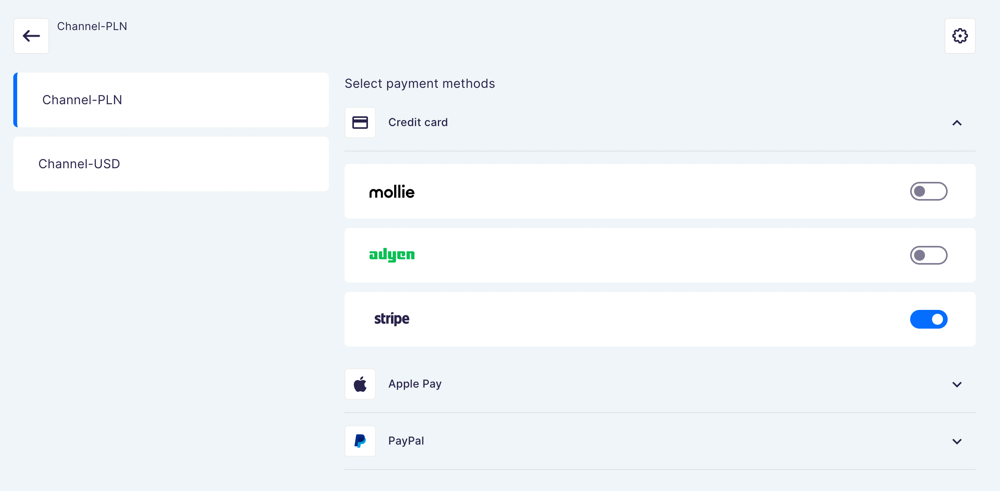

<div align="center">
  <h1>Next.js Storefront</h1>
</div>

<div align="center">
  <p><b>Next.js Storefront</b>: Your open-source frontend starter pack for building performant e-commerce experiences with <a href="https://github.com/saleor/saleor">Saleor</a>.
  <p><b>Saleor Checkout</b>: Extensible Next.js checkout application and payment integrations powered by Saleor API.</p>
</div>

<div align="center">
  <a href="https://saleor.io/">🏠 Website</a>
  <span> • </span>
  <a href="https://docs.saleor.io/docs/3.x/">📚 Docs</a>
  <span> • </span>
  <a href="https://saleor.io/blog/">📰 Blog</a>
  <span> • </span>
  <a href="https://twitter.com/getsaleor">🐦 Twitter</a>
</div>

<div align="center">
  <a href="https://demo.saleor.io/">▶️ Demo</a>
   <span> • </span>
  <a href="https://githubbox.com/saleor/react-storefront">🔎 Explore Code</a>
</div>

## Motivation

**modern & fast**:
The project focuses on best practices for e-commerce, like: SSR & ISR, image optimization.

**easily customizable**:
TailwindCSS can be easily extended and tweaked, or completely replaced with your favorite CSS solution.

**works out-of-the-box**:
Pre-configured tools for DX.

## Stack

- Next.js
- TypeScript
- GraphQL with Apollo Client
- Tailwind CSS
- Saleor Checkout

## Quickstart

Supercharge your development with our CLI tool and free developer account at [Saleor Cloud](https://cloud.saleor.io/). To download and install Saleor CLI, run the following command:

```
npm i -g @saleor/cli
```

Set up your local storefront development environment by running the `storefront create` command. It will take you through the process of creating a new Saleor API instance (or choosing an existing one) and connecting it to your freshly cloned local storefront setup:

```
saleor storefront create
```

If you don't want to customize available options, you can also spawn a fully functional local storefront development environment using`--demo` attribute:

```
saleor storefront create --demo
```

[Learn more about Saleor CLI](https://docs.saleor.io/docs/3.x/cli)

---

## Setup

### Monorepo structure

Here's the list of each app and shared package in the monorepo (click to see a README of that project)

#### Apps

- [`apps/storefront`](apps/storefront/README.md): Next.js e-commerce storefront starter pack
- [`apps/saleor-app-checkout`](apps/saleor-app-checkout/README.md): a Next.js Saleor app with a dashboard for managing settings and theme, backend for Checkout, and the Checkout Storefront – ready to be extended/modified

#### Packages

- `packages/ui-kit`: UI kit for Storefront and Checkout
- `packages/config-checkout`: `eslint` configuration
- `packages/config-storefront`: `eslint` configuration
- `packages/tsconfig`: `tsconfig.json`s used throughout the monorepo
- `packages/checkout-storefront`: Checkout storefront component
- `packages/checkout-common`: Common types and utils

### Install dependencies

This monorepo uses [PNPM](https://pnpm.io/) as a package manager and [Turborepo](https://turborepo.org/) for building packages. In order to install pnpm, run:

```bash
npm install -g pnpm
```

Then install dependencies:

```
pnpm i
```

And start all the dev servers:

```bash
pnpm dev
```

[The apps will start on different ports](#ports).

## Development

### Configuration

Instructions how to configure the application (e.g. change the GraphQL API URL) can be found [here](apps/storefront/docs/configuration.md).

### Build

To build all apps and packages, run the following command:

```
pnpm run build
```

You can also build a specific app or package by running this command:

```bash
pnpm run build --filter=saleor-app-checkout
```

In this example, we'll only build `apps/saleor-app-checkout`

### Develop Saleor App

Create a tunnel for `saleor-app-checkout`:

```bash
cd apps/saleor-app-checkout && npx saleor app tunnel 3001
```

> Note: the process needs to be running in the background

Before you start the server, you need to change the default environment variables. Create `.env.local` file in each app:

- [`apps/saleor-app-checkout`](./apps/saleor-app-checkout/README.md#env-variables)

To run the development server for all the apps, use the following command:

```
pnpm run dev --filter=saleor-app-checkout...
```

### Develop Checkout Storefront

When in dev, a special development server is also running for `checkout-storefront` on port 3002. Check out [localhost:3002?checkout=<ID>](http://localhost:3002?checkout=) and add your token to the URL.

### Code style

Before committing the code, Git pre-hooks will check staged changes for following the code styles. If you would like to format the code by yourself, run the command:

```bash
pnpm lint
```

### Other

You can also run only a specific app by running this command:

```bash
pnpm dev --filter=saleor-app-checkout
```

## Deployment

### GraphQL Schema

To generate GraphQL code based on the latest schema from Saleor instance defined in `SALEOR_API_URL` env variable, run this command:

```
pnpm run generate
```

You need to run this command after each change in `*.graphql` files.

### Env variables

Change environment variables inside `.env` file:

- `SALEOR_API_URL` — GraphQL endpoint of your Saleor

  Example:

  ```
  https://my-env.eu.saleor.cloud/graphql/
  ```

  > To run sandbox Saleor environment in [Saleor Cloud](https://cloud.saleor.io/) use this command:
  >
  > ```bash
  > npx saleor project create && npx saleor environment create
  > ```
  >
  > You can also run Saleor locally. See [Saleor docs](https://docs.saleor.io/docs/3.x/developer/installation) for more instructions

- `CHECKOUT_APP_URL` — URL of deployed Saleor App Checkout

  Example:

  ```
  https://saleor-app-checkout.vercel.app
  ```

  > See [guide below](#vercel) on how to deploy the Saleor App Checkout

There are more environment variables available in each app. Go to their README's to learn more.

## Other tools

### Debugging using VS Code

The repository contains ready to use VS Code debugger configuration (`.vscode/launch.json`).

Start server in debug mode

```bash
pnpm debug
```

Add [breakpoints](https://code.visualstudio.com/docs/editor/debugging#_breakpoints), and start debugging session in your editor.

### VS Code GraphQL Extension

GraphQL extension for VSCode adds syntax highlighting, validation, and language features like go to definition, hover information, and autocompletion for GraphQL projects. This extension also works with queries annotated with `gql` tag.

VS Marketplace [link](https://marketplace.visualstudio.com/items?itemName=GraphQL.vscode-graphql)

### Vercel

Read Vercel deployment guide in [docs/vercel.md](./docs/vercel.md)

## Payment gateways configuration

Saleor App Checkout supports two payment gateways that you can configure:

<a href="https://www.mollie.com/en">
  <picture>
    <source media="(prefers-color-scheme: dark)" srcset="./docs/logos/mollie_light.svg">
    <source media="(prefers-color-scheme: light)" srcset="./docs/logos/mollie_dark.svg">
    
  </picture>
</a>

<br>

[](https://www.adyen.com/)

You can configure the payment gateways in the Saleor App Checkout inside the Saleor dashboard.
Go to **Apps > Third party apps > Checkout**.

You can toggle, which payment gateway handles each different payment options per channel:



To use a payment gateway, you need to provide its credentials. You can do that by clicking the settings icon on the channel configuration page.


### Mollie

Read setup guide in [docs/mollie.md](./docs/mollie.md)

### Adyen

Read setup guide in [docs/adyen.md](./docs/adyen.md)

## FAQ

Read FAQ in [docs/faq.md](./docs/faq.md)

## Ports

- apps/react-storefront: **http://localhost:3000**
- apps/saleor-app-checkout: **http://localhost:3001**
- packages/checkout-storefront: **http://localhost:3002**
- packages/ui-kit storybook: **http://localhost:6006**
