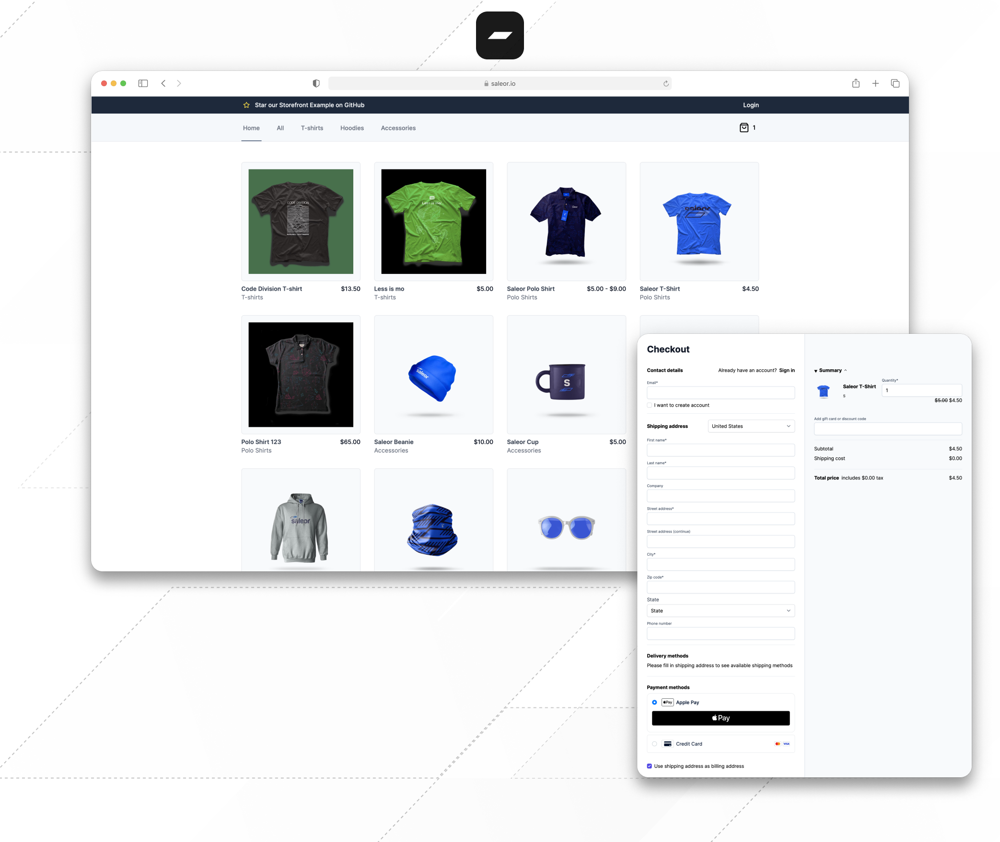

<div align="center">
  <h1>Next.js Storefront</h1>
  Starter pack for building performant e-commerce experiences with <a href="https://github.com/saleor/saleor">Saleor</a>.
</div>

<div align="center">
  <a href="https://saleor.io/">🏠 Website</a>
  <span> • </span>
  <a href="https://docs.saleor.io/docs/3.x">📚 Docs</a>
  <span> • </span>
  <a href="https://saleor.io/blog/">📰 Blog</a>
  <span> • </span>
  <a href="https://twitter.com/getsaleor">🐦 Twitter</a>
  <span> • </span>
  <a href="https://discord.gg/H52JTZAtSH">💬 Discord</a>
  <span> • </span>
  <a href="https://storefront-git-canary-saleorcommerce.vercel.app/">▶️ Demo</a>
</div>

<br/>
<div align="center">
  
[](https://discord.gg/H52JTZAtSH)

</div>

## Features

🏎️ **Next.js 13**: Using the latest version of Next.js with file-based routing, React 18, Fast Refresh, Image Optimization and more.

🔥 **App Router**: Storefront utilizes React Server Components, Data Cache, and async components.

🟦 **TypeScript**: Built with typesafety in mind and with TypeScript strict mode enabled.

🦄 **GraphQL best practices**: Reduced boilerplate and bundle size thanks to GraphQL Codegen and `TypedDocumentString`.

💳 **Payment Apps integration**: The checkout process is integrated with Saleor Payment Apps – just a few clicks away from using Adyen (Stripe coming soon).

🛠️ **Customizable CSS**: TailwindCSS can be extended or replaced with your favorite CSS solution.

👌 **Tooling included**: Comes with ESLint, Prettier, Husky, Lint Staged, and Codegen preconfigured.

## Quickstart

> [!IMPORTANT]
> The fastest way to get started with Saleor is using a free developer account at [Saleor Cloud](https://cloud.saleor.io/).

Install the latest version of the Saleor CLI by running the following command:

```bash
npm i -g @saleor/cli@latest
```

[Learn more about Saleor CLI](https://docs.saleor.io/docs/3.x/cli).

Set up your local storefront development environment by running the `storefront create` command with `--url` parameter. It will create a fresh clone, install dependencies, and connect to the provided Saleor instance.

```bash
saleor storefront create --url https://{your_cloud_instance}.saleor.cloud
```

> [!NOTE]
> The minimum required version of Saleor CLI is `1.36.0`.

## Payments

Currently, Saleor Storefront supports payments via the [Saleor Adyen App](https://docs.saleor.io/docs/3.x/developer/app-store/apps/adyen). To enable it, you need to install the app in your Saleor Cloud instance. To do so, go to the Saleor Dashboard and click on the "Apps" tab. Then, click on the "Install" button next to the Adyen app. After the installation is complete, you must click on the app and configure it.

> [!WARNING]
> To configure the Adyen App, you must have an account with [Adyen](https://www.adyen.com/).

> [!NOTE]
> Saleor Stripe App integration is a work in progress.

## Development

Clone and repo and copy `.env.example` to `.env`:

```bash
cp .env.example .env
```

Edit `.env.local` and set `NEXT_PUBLIC_SALEOR_API_URL` to your Saleor GraphQL endpoint URL, e.g., `https://example.saleor.cloud/graphql/`.

Then, [install `pnpm`](https://pnpm.io/installation) and run the following command to install all dependencies in the repo:

```bash
pnpm i
```

To start the development server, run the following:

```bash
pnpm dev
```

The app is now running at `http://localhost:3000`.

> [!NOTE]
> Saleor Storefront is a Next.js app. In case you are not familiar with Next.js, we recommend you to read the [Next.js documentation](https://nextjs.org/docs) (make sure you've selected "Using App Router" in the sidebar).
