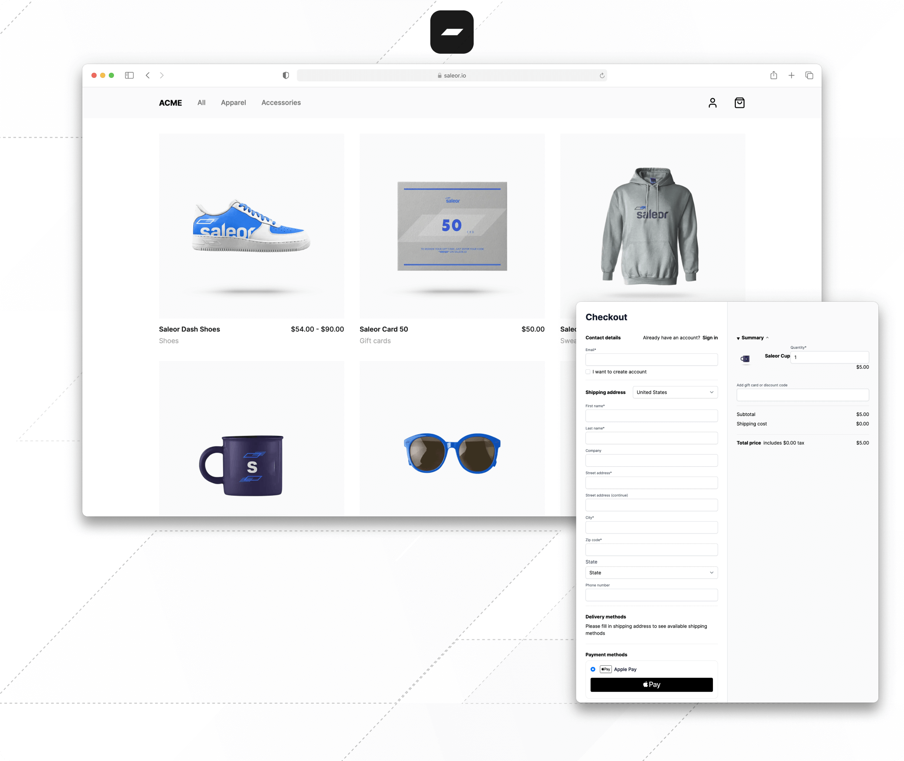

[](https://vercel.com/new/clone?repository-url=https%3A%2F%2Fgithub.com%2Fsaleor%2Fstorefront&env=NEXT_PUBLIC_SALEOR_API_URL&envDescription=Full%20Saleor%20GraphQL%20endpoint%20URL%2C%20eg%3A%20https%3A%2F%2Fstorefront1.saleor.cloud%2Fgraphql%2F&project-name=my-saleor-storefront&repository-name=my-saleor-storefront&demo-title=Saleor%20Next.js%20Storefront&demo-description=Starter%20pack%20for%20building%20performant%20e-commerce%20experiences%20with%20Saleor.&demo-url=https%3A%2F%2Fstorefront.saleor.io%2F&demo-image=https%3A%2F%2Fstorefront-d5h86wzey-saleorcommerce.vercel.app%2Fopengraph-image.png%3F4db0ee8cf66e90af)
[](https://storefront.saleor.io)



<div align="center">
  <h1>Paper</h1>
  <p>A minimal, production-ready storefront template for <a href="https://github.com/saleor/saleor">Saleor</a>.<br/>Clean as a blank page—and unlike most templates, it's not just for screenshots.</p>
</div>

<br/>

<div align="center">
  <a href="https://saleor.io/">Website</a>
  <span> · </span>
  <a href="https://docs.saleor.io/docs/3.x">Docs</a>
  <span> · </span>
  <a href="https://saleor.io/discord">Discord</a>
  <span> · </span>
  <a href="https://saleor.io/roadmap">Roadmap</a>
</div>

<br/>

> [!TIP]
> Questions or issues? Check our [Discord](https://saleor.io/discord) for help.

---

## Why Paper?

**Ship faster, customize everything.** Paper is a new release—expect some rough edges—but every component is built with real-world e-commerce in mind. This is a foundation you can actually build on.

### 🛒 Checkout That Actually Works

The checkout is where most storefronts fall apart. Paper's doesn't.

- **Multi-step, mobile-first** — Each step is a focused form. No infinite scrolling on phones.
- **Guest & authenticated** — Seamless flow for everyone. Logged-in users get address book and saved preferences.
- **International address forms** — Country-aware fields that adapt (US states, UK postcodes, German formats).
- **Connection resilience** — Automatic retries with exponential backoff. Flaky networks? Handled.
- **Componentized architecture** — Swap steps, add steps, remove steps. It's your checkout.
- **Multi-channel ready** — Different currencies and shipping zones per channel.

### 🌍 Multi-Channel, Multi-Currency

One codebase, many storefronts. Channel-scoped routing means `/us/products` and `/eu/products` can serve different catalogs, prices, and shipping options—all from the same deployment.

### 📱 Product Pages Done Right

The hard parts are solved. Adapt the look, keep the logic.

- **Multi-attribute variant selection** — Color + Size + Material? Handled. Complex variant matrices just work.
- **Dynamic pricing** — Sale prices, variant-specific pricing, channel pricing—all reactive.
- **Image gallery** — Next.js Image optimization, proper aspect ratios, keyboard navigation.

### ♿ Accessibility Built In

Not an afterthought. Focus management on step transitions, keyboard navigation everywhere, semantic HTML, proper ARIA labels. Everyone deserves to shop.

### 🤖 AI-Ready Codebase

Built for front-end developers _and_ AI agents. The codebase includes:

- **`AGENTS.md`** — Architecture overview and quick reference for AI assistants
- **Skills system** — Task-specific guides in `.claude/skills/` for GraphQL workflows, component patterns, variant selection, and more
- **Consistent patterns** — Predictable structure that AI tools can navigate and modify confidently

Whether you're pair-programming with Cursor, Claude, or Copilot—the codebase is designed to help them help you.

### ⚡ Bleeding Edge Stack

- **Next.js 16** with App Router and Server Components
- **React 19** with the latest concurrent features
- **TypeScript** in strict mode—your IDE will thank you
- **Tailwind CSS** with design tokens (OKLCH colors, CSS variables)
- **GraphQL Codegen** for type-safe Saleor API calls

---

## What's in the Box

| Feature              | Description                                                                    |
| -------------------- | ------------------------------------------------------------------------------ |
| **Checkout**         | Multi-step flow with guest/auth support, address selector, international forms |
| **Cart**             | Slide-over drawer with real-time updates, quantity editing                     |
| **Product Pages**    | Multi-attribute variants, image gallery, sticky add-to-cart                    |
| **Product Listings** | Category & collection pages with pagination                                    |
| **Navigation**       | Dynamic menus from Saleor, mobile hamburger                                    |
| **SEO**              | Metadata, JSON-LD, Open Graph images                                           |
| **Caching**          | ISR with on-demand revalidation via webhooks                                   |
| **Authentication**   | Login, register, password reset, order history                                 |

---

## Quick Start

### 1. Get a Saleor Backend

**Option A:** Free [Saleor Cloud](https://cloud.saleor.io/?utm_source=storefront&utm_medium=github) account (recommended)

**Option B:** [Run locally with Docker](https://docs.saleor.io/docs/3.x/setup/docker-compose)

### 2. Clone & Configure

```bash
# Using Saleor CLI (recommended)
npm i -g @saleor/cli@latest
saleor storefront create --url https://{YOUR_INSTANCE}/graphql/

# Or manually
git clone https://github.com/saleor/storefront.git
cd storefront
cp .env.example .env
# Edit .env with your NEXT_PUBLIC_SALEOR_API_URL
pnpm install
```

### 3. Run

```bash
pnpm dev
```

Open [localhost:3000](http://localhost:3000). That's it.

---

## Development

### Commands

```bash
pnpm dev                    # Start dev server
pnpm build                  # Production build
pnpm run generate           # Regenerate GraphQL types (storefront)
pnpm run generate:checkout  # Regenerate GraphQL types (checkout)
```

### Project Structure

```
src/
├── app/                    # Next.js App Router
│   ├── [channel]/          # Channel-scoped routes
│   └── checkout/           # Checkout pages
├── checkout/               # Checkout components & logic
├── graphql/                # GraphQL queries
├── gql/                    # Generated types (don't edit)
├── ui/components/          # UI components
│   ├── pdp/                # Product detail page
│   ├── plp/                # Product listing page
│   ├── cart/               # Cart drawer
│   └── ui/                 # Primitives (Button, Badge, etc.)
└── styles/brand.css        # Design tokens
```

### For AI Agents

If you're working with AI coding assistants, point them to:

- **`AGENTS.md`** — Architecture, commands, gotchas
- **`.claude/skills/`** — Task-specific guides (GraphQL, components, checkout, etc.)

### Environment Variables

```env
# Required
NEXT_PUBLIC_SALEOR_API_URL=https://your-instance.saleor.cloud/graphql/

# Optional
NEXT_PUBLIC_STOREFRONT_URL=   # For canonical URLs and OG images
REVALIDATE_SECRET=            # Manual cache invalidation
SALEOR_WEBHOOK_SECRET=        # Webhook HMAC verification
SALEOR_APP_TOKEN=             # For channels query
```

---

## Payments

The checkout architecture supports Saleor payment apps like [Adyen](https://docs.saleor.io/docs/3.x/developer/app-store/apps/adyen) and [Stripe](https://docs.saleor.io/docs/3.x/developer/app-store/apps/stripe). The heavy lifting is done—integrating your gateway requires minimal work compared to building from scratch.

---

## Customization

Paper works as a reference implementation and as a starting point for your own storefront. Start here:

- **Colors & typography** → `src/styles/brand.css`
- **Components** → `src/ui/components/`
- **Checkout flow** → `src/checkout/views/SaleorCheckout/`

The design token system uses CSS custom properties—swap the entire color palette by editing a few lines.

---

## License

[OSSasy](./LICENSE) — use it, modify it, ship it. Build your storefront, run your business.

Want to offer it as a managed service? [Let's talk](https://saleor.io/contact).

---

<div align="center">
  <br/>
  <p>Built with 🖤 by the <a href="https://saleor.io">Saleor</a> team</p>
</div>
