# Adyen setup guide

In this guide we'll setup [Adyen](https://www.adyen.com/) payment gateway with Saleor Checkout.

## Setup

Saleor Checkout uses Adyen's [Pay by Link flow](https://docs.adyen.com/unified-commerce/pay-by-link)

1. [Sign up for Adyen test account](https://www.adyen.com/signup)

2. In [test Customer Area](https://ca-test.adyen.com/) create [new merchant account](https://ca-test.adyen.com/ca/ca/accounts/show.shtml)

3. [Create new API credentials](https://ca-test.adyen.com/ca/ca/config/api_credentials_new.shtml). Go to **Developers > API credentials > Create new credential**

Select "Web service user" and enter some description (for example "Saleor Checkout")

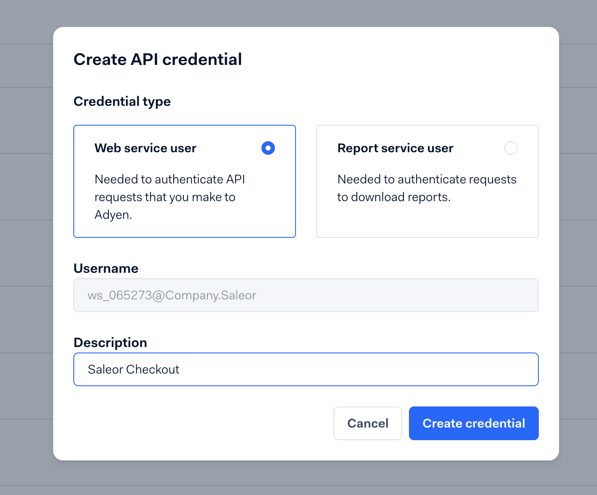

4. Copy **API key** from newly generated API credentials:

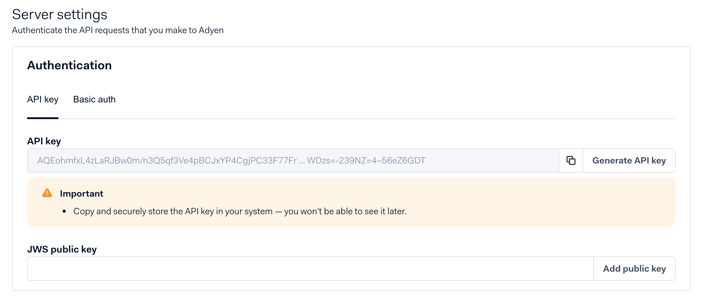

Go to Checkout app configuration. It can be found in Saleor dashboard in: **Apps > Third party apps > Checkout**. Once you open the app, select one of the channels and click the gears icon:

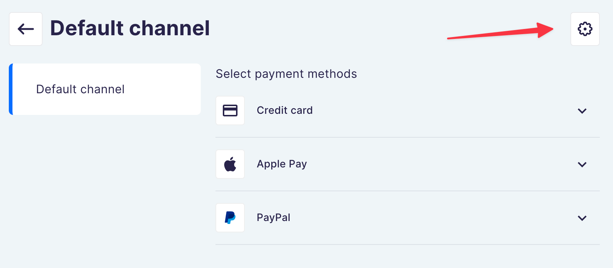

To configure API key go to: Adyen > **Private API key** and paste what you've copied from Adyen.

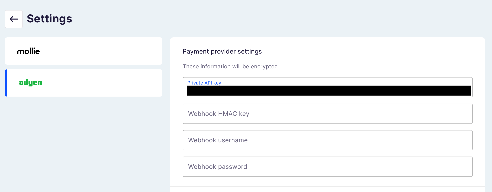

5. Click **"Generate client key"** and copy it to clipboard, paste it in Checkout app configuration > Adyen > **Public client key**

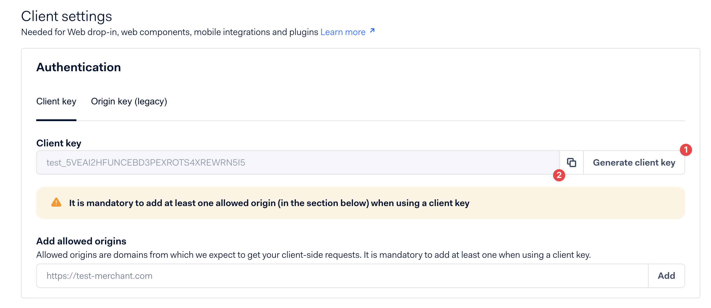

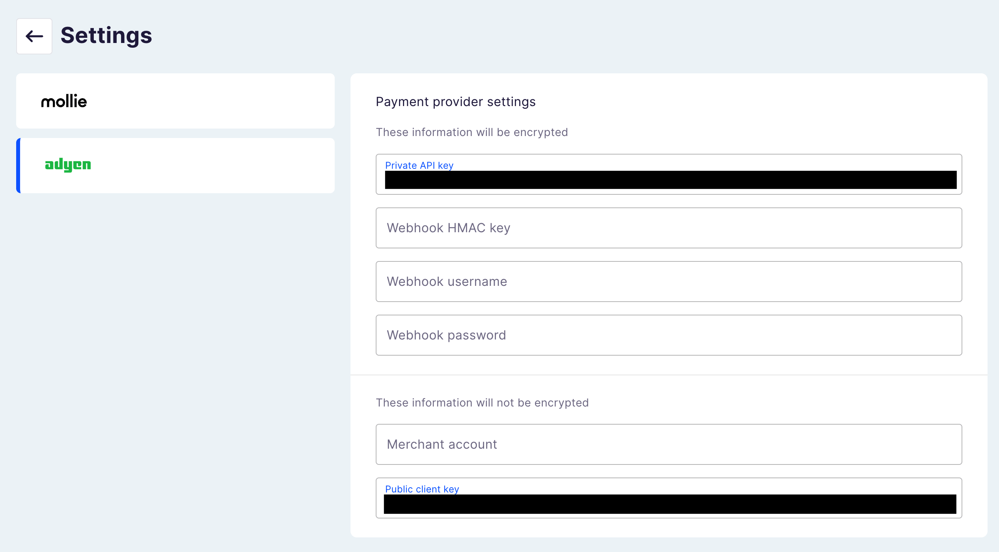

6. **Add allowed origin** to your Client key, paste URL of your deployed [Checkout SPA](#checkout-spa) and click **"Add"**

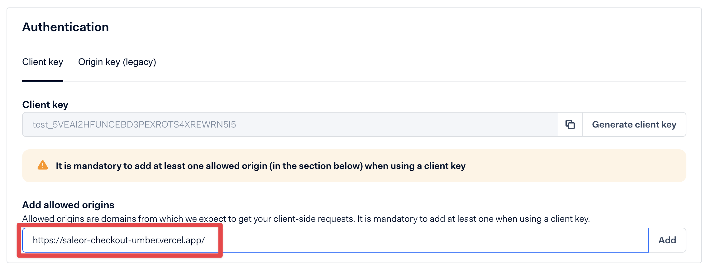

7. **Save changes** you've made to API credential

8. [Create standard notification webhook](https://docs.adyen.com/unified-commerce/pay-by-link/payment-links/api#webhooks). Go to Developers > [Webhooks](https://ca-test.adyen.com/ca/ca/config/showthirdparty.shtml) > "+ Webhook" > ["Standard notification"](https://ca-test.adyen.com/ca/ca/config/configurethirdparty.shtml?method:add&selectedMimetype=notifications)


Fill out the webhook details:

- **Description** - enter some description for your webhook (ex. Saleor Checkout notifications)
- **Server configuration**
  - **URL** - URL of your deployed [Checkout App](#saleor-app-checkout) + `/api/webhooks/adyen`

```
<YOUR_CHECKOUT_APP_URL>/api/webhooks/adyen
```

- Other settings should be set to default:
  - **Method**: JSON
  - **SSL version**: TLSv1.2
  - **Service version** - 1

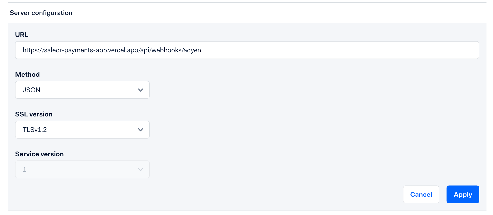

- **Merchant accounts** - choose "Include only specific merchant accounts" and select the merchant account you'll use for checkout, the name must be provided in Checkout App configuration

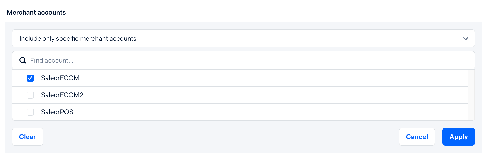

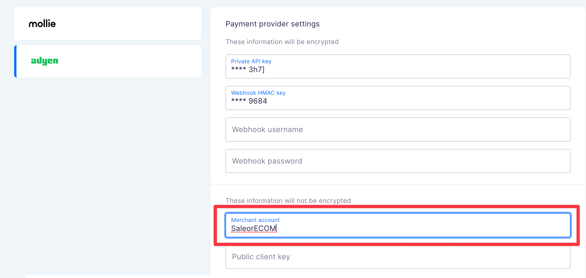

- **Events** - leave events selected by default
- **Security**
  - **Basic authentication** - arbitrary username and password, you can use `openssl rand -hex 64` to generate random password
  - **HMAC Key** - click "Generate" and copy the key
  - Those 3 values: `username`, `password` and `HMAC Key` must be provided in Checkout App configuration

This is how your webhook configuration should look like in Adyen:

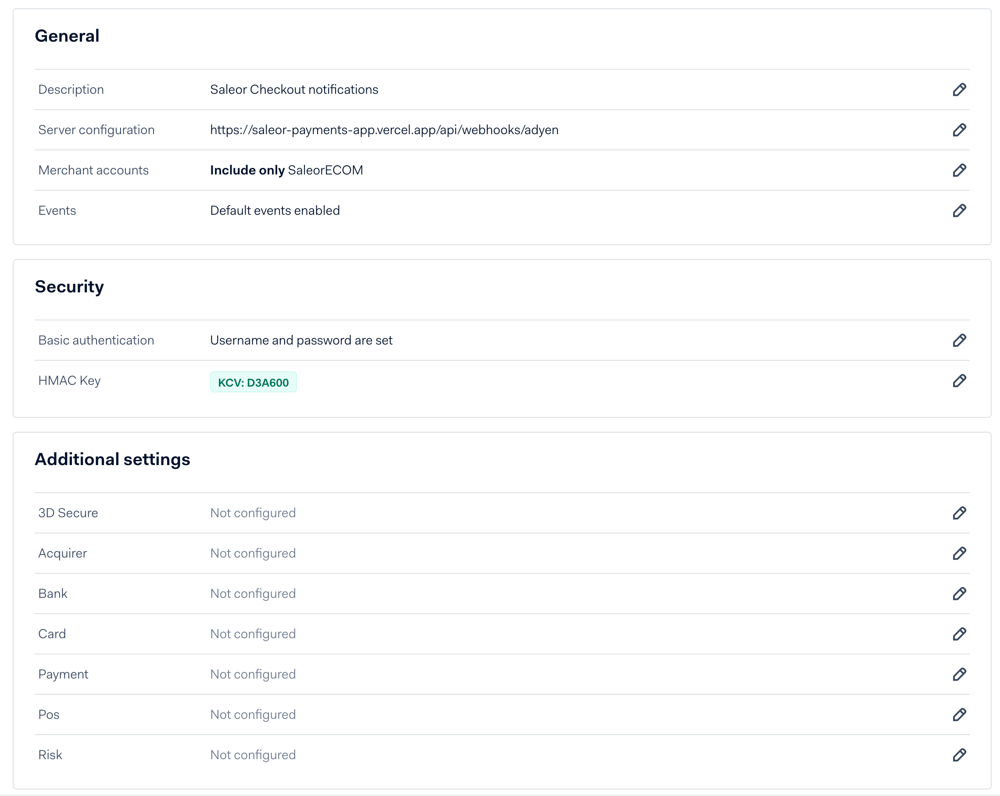

This is how your Checkout App configuration should look like in Saleor dashboard:

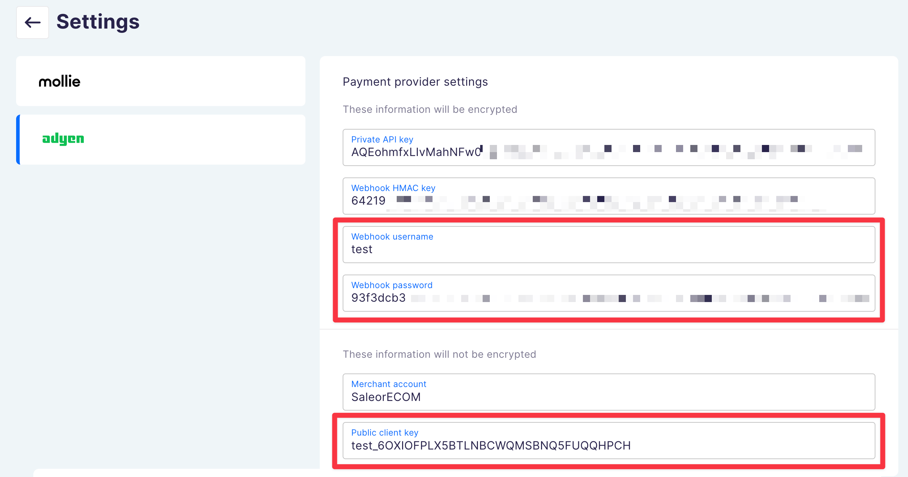

9. Save settings in Adyen and in Checkout App configuration

10. Test webhook configuration in Adyen

Click "Test configuration" button after you've saved the configuration.

Select **"AUTHORISATION"** from the list and click "Test"

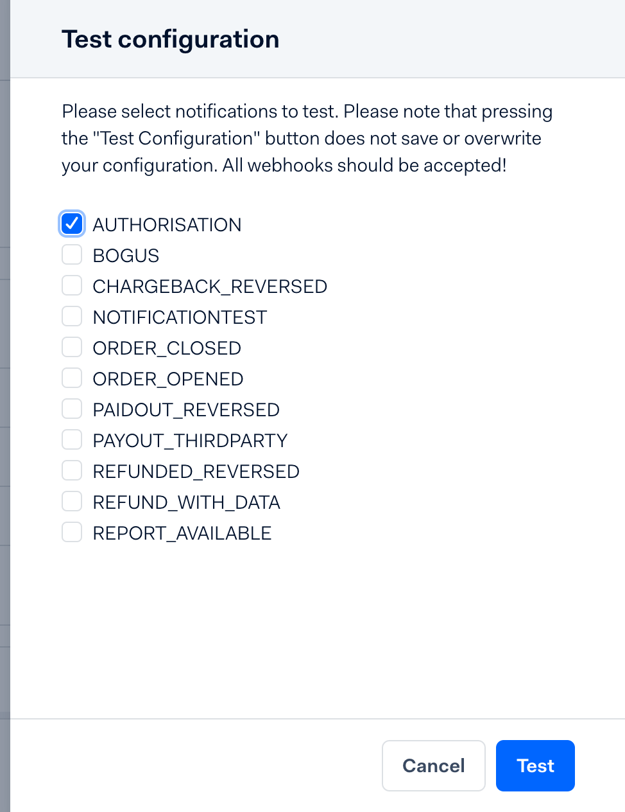

Adyen will make a call to your webhook. If everything is configured properly you'll see that the test was successful:

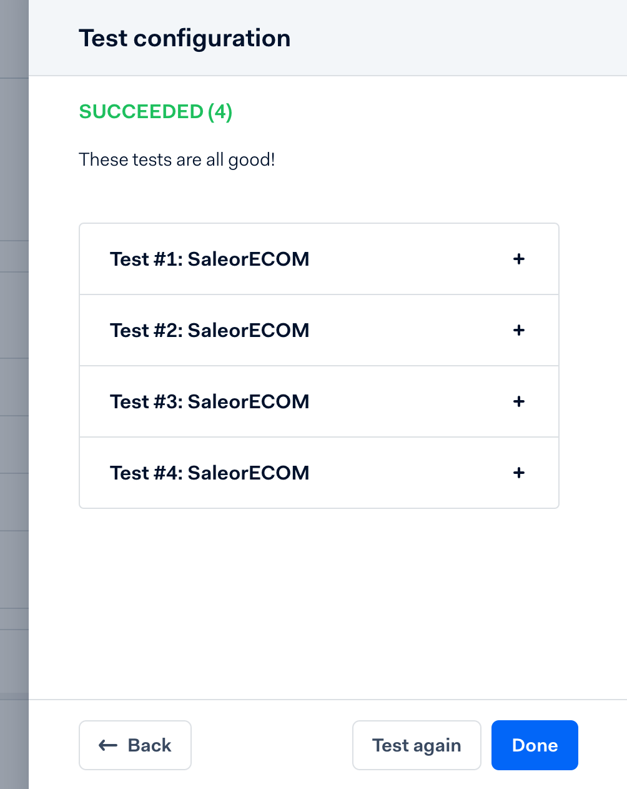

> Note: It can take a while for your webhook configuration to propagate in Adyen after you save it. If the test failed, give it a few minutes before you try again

If the response failed because of invalid configuration in Adyen, Checkout App will return the reason in response:

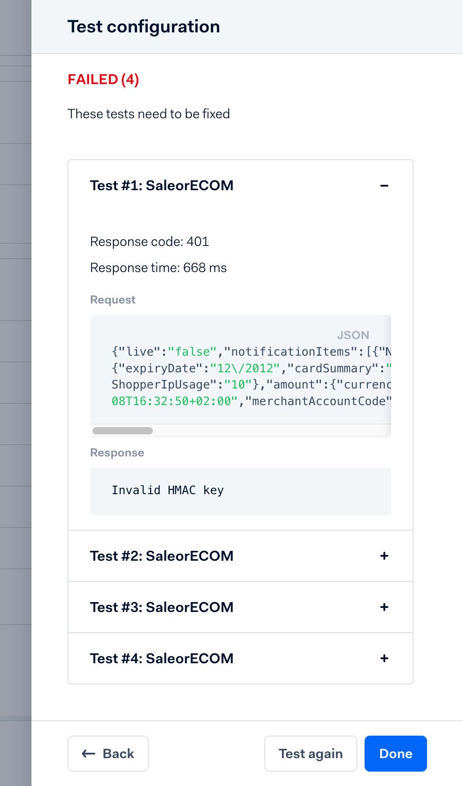

11. After you've tested your webhook, enable it, by clicking the toggle button

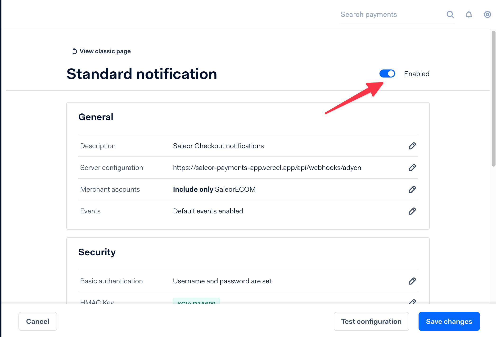

12. 🥳 Congrats! You've finished configuration of Adyen payment gateway
