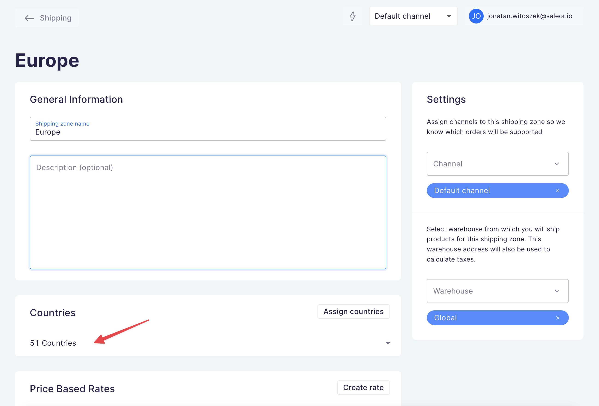
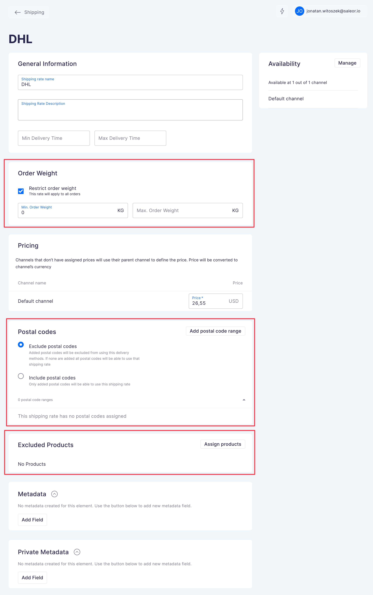
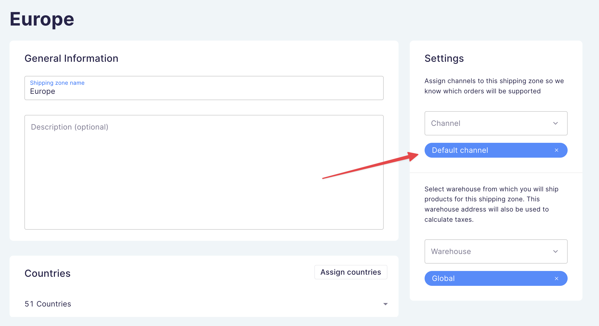
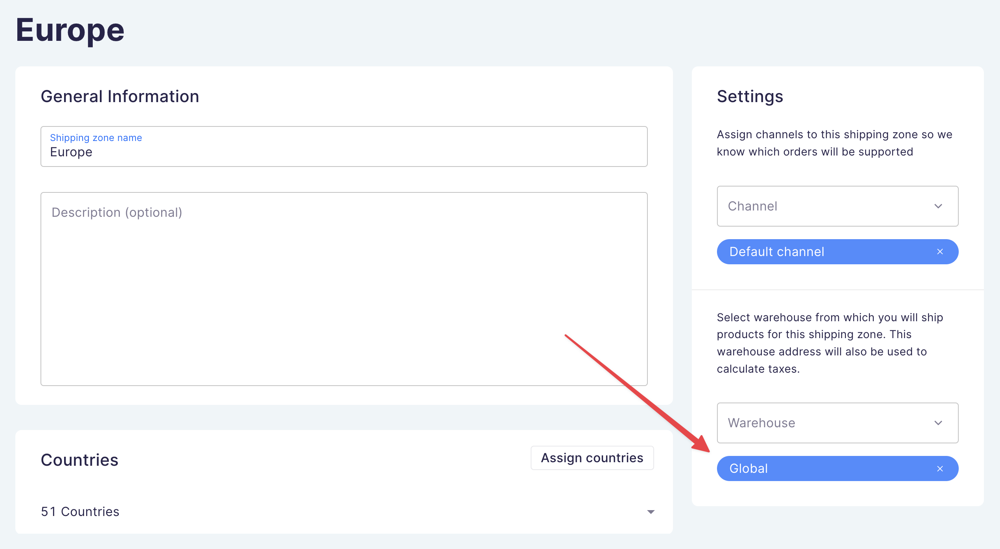
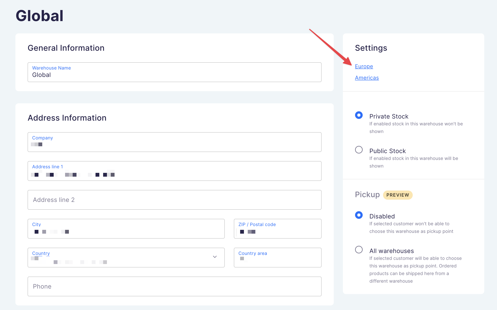
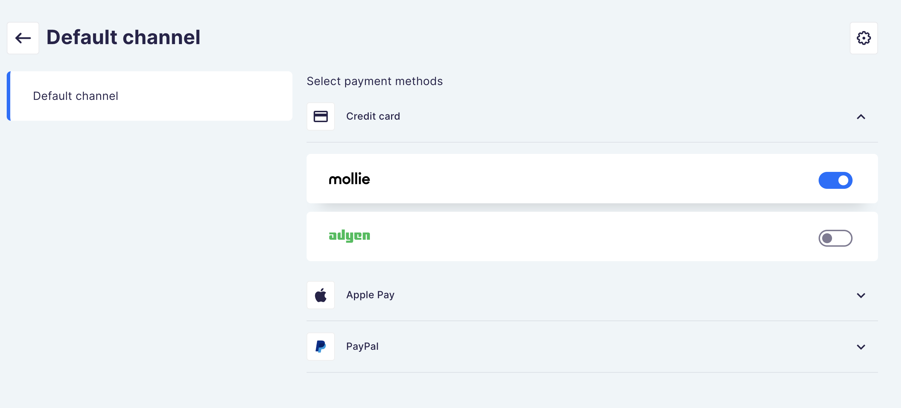
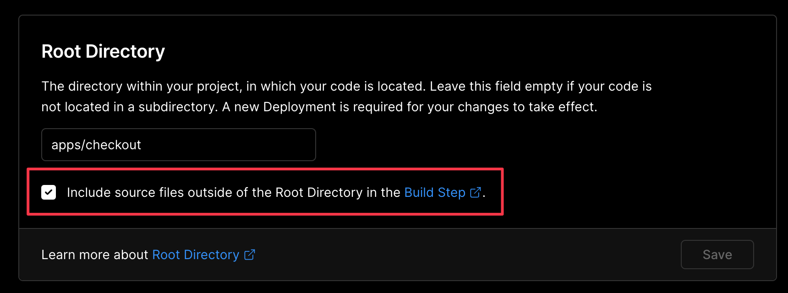

# FAQ

## I get "Unauthorized" error message in Saleor Dashboard

- Make sure you're still signed in into Saleor by refreshing the page
- Make sure you're using correct App token in your Vercel configuration
  - You have to generate the app token as described in the [Vercel deployment guide](./vercel.md#5-generate-app-token)
  - You cannot use the token from "Local apps", the token has to be connected with your installed Checkout App
- Reinstall the app in Saleor
  1. Uninstall the app in Saleor Dashboard
  2. [Install the app again](./vercel.md#4-install-the-app-in-saleor)
  3. [Generate new App token](./vercel.md#5-generate-app-token)
  4. [Update Vercel environment variables](./vercel.md#6-update-environment-variables-in-vercel) with new value of `SALEOR_APP_TOKEN`
  5. Redeploy the app, **don't use** the "Redeploy with existing Build Cache" option

## I get missing permission error

Check solutions for ["Unauthorized" error](#i-get-unauthorized-error-message-in-saleor-dashboard)

## I don't see any delivery methods

- Check country you're providing in checkout as shipping address
  - It must be assigned to a shipping zone
- Check your shipping zone (Dashboard > Configuration > Shipping Methods):
  - If it has a country assigned that you're using in checkout as shipping address
    
  - If it has any shipping rate configured that:
    - matches your product weight limit
    - doesn't have your product excluded
    - doesn't have your shipping address's postal code excluded
      
  - If it's assigned to the same channel as your checkout
    
    ```graphql
      mutation {
        checkoutCreate(
          input: {
            channel: "default-channel" # <- Channel slug must be the same as in shipping zone
            # ...
        ) {
          checkout {
            channel
          }
        }
      }
    ```
  - If it's assigned to the same warehouse as products in your checkout
    
- Check the warehouse that has the products from your checkout (Dashboard > Configuration > Warehouses)
  - If it has correctly assigned shipping zones
    

## I don't get any payment methods

- Make sure you've enabled payment methods in Checkout App configuration
  
- Make sure you've configured payment gateway API keys
  
- Make sure you're using correct App token in your Vercel configuration
  - Check solutions for ["Unauthorized" error](#i-get-unauthorized-error-message-in-saleor-dashboard)

## I get "Checkout not found" error after clicking "Pay"

The checkout was turned into an order in Saleor, thus deleting checkout session. You need to create a new checkout session.

## I get `No matching version found for checkout-app@* inside the workspace` in Vercel deployment

Check in your project settings if you have "Include source files outside of the Root Directory in the Build Step" option enabled:



## I get `"Error: No Output Directory named "build"` in my Vercel deployments.

Check in your project settings if you've correctly selected the Root Directory.

If you need to know what Root Directory should be set, check the [deployment guide](./vercel.md) for:

- [checkout](./vercel.md#2-configure-new-project-for-checkout)
- [checkout-app](./vercel.md#2-configuring-new-project-for-checkout-app)
