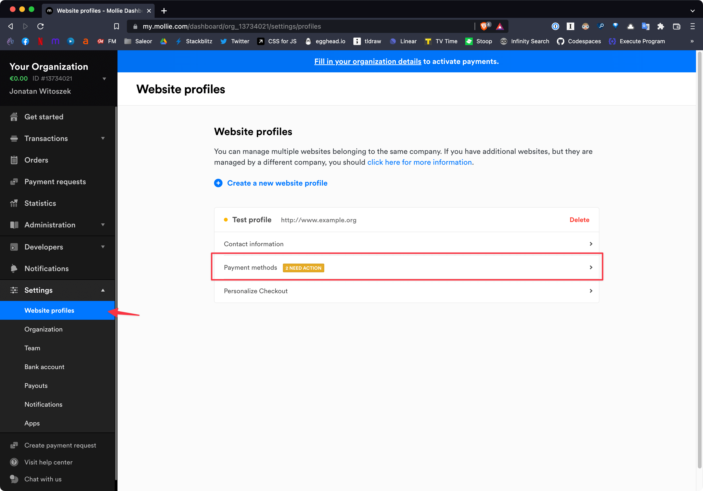
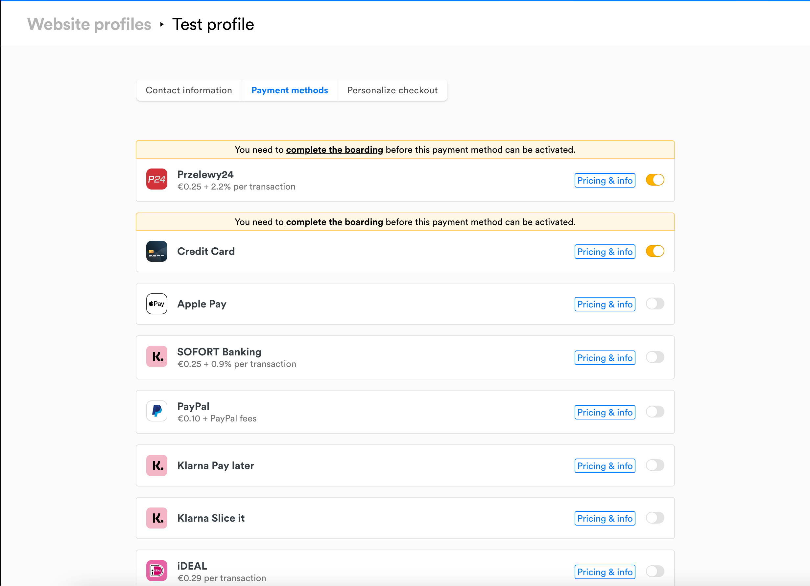
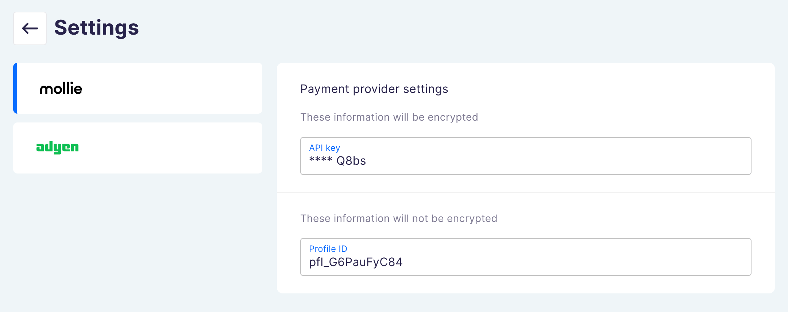

# Mollie setup guide

In this guide we'll setup [Mollie](https://www.mollie.com/en) payment gateway with Saleor Checkout.

## Setup

1. [Sign up for Mollie account](https://www.mollie.com/dashboard/signup?lang=en)

2. Make sure you've enabled at least 1 payment provider in Mollie dashboard (Settings > Website profiles > Payment methods):

> **Note** 
> Don't worry about "You need to complete the boarding before this payment method can be activated." message if you only want to test. Enabled payment methods will still work in test mode, even without completing verification of your Mollie account

3. In your Mollie dashboard, select: Developers > API keys and copy **API key** and **Profile ID**

- **Live API key** - for production environment
- **Test API key** - for development environment

4. Go to Checkout app configuration and enter the data you've just copied

Configuration page can be found in Saleor dashboard in: **Apps > Third party apps > Checkout**. Once you open the app, select one of the channels and click the gears icon:

To configure the API keys choose "Mollie" from left side navigation and paste what you've copied from Mollie dashboard:

5. 🏁 You've finished the configuration! Now you can enable Mollie for one of your Saleor channel in app configuration:

