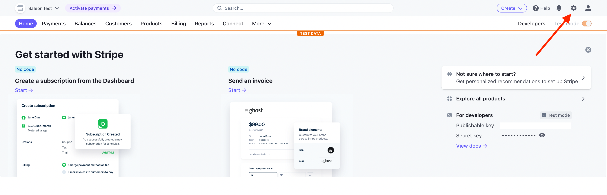
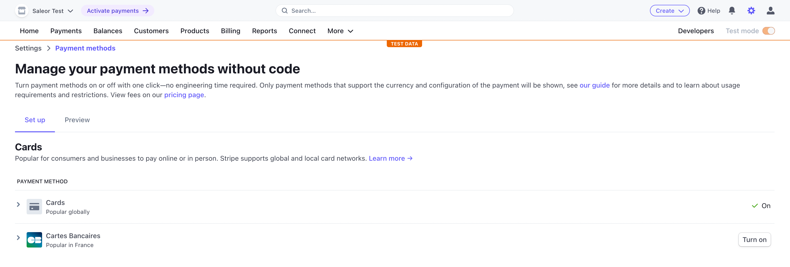
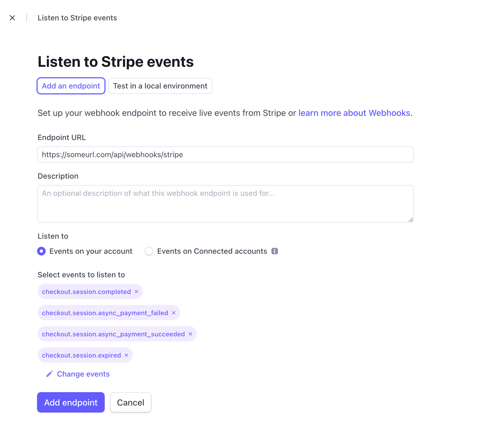
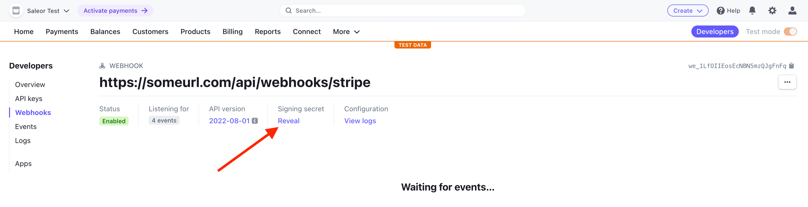
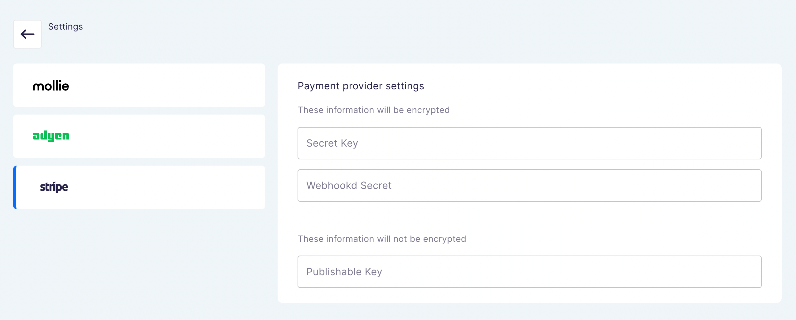

# Stripe setup guide

In this guide, we'll set up [Stripe](https://stripe.com) payment gateway with Saleor Checkout.

## Setup

1. [Sign up for a Stripe account](https://dashboard.stripe.com/register)

2. Make sure you've enabled at least 1 payment method in the Stripe dashboard (Settings > Payment methods):

> Note: Don't worry about the "Activation required Please activate your account before accepting live payments with any of the below payment methods." message if you only want to test. Enabled payment methods will still work in test mode, even without completing verification of your Stripe account.

3. In your Stripe dashboard, select: Developers -> API keys and copy **Publishable key** and **Secret key**

- **Live API key** - for the production environment
- **Test API key** - for the development environment

4. Go to the Webhooks section in the Stripe dashboard (Developers -> Webhooks). You can configure webhooks for your live environment or test them locally.

- For local development, follow the instructions you see on the screen. You will need to install the`stripe` CLI.
- For the live environment, you'll need to configure webhooks manually. Click **Add an endpoint** and fill out the form. The endpoint for Stripe webhooks is `<YOUR_CHECKOUT_APP_URL>/api/webhooks/stripe/`.

> **Note** 
> Trailing slash is required in webhook URL.

- Make sure you add the following events:
  - `checkout.session.completed`
  - `checkout.session.async_payment_failed`
  - `checkout.session.async_payment_succeeded`
  - `checkout.session.expired`

5. Click "Add endpoint" and then "Reveal secret" to get the webhook secret. You'll need it in the next step.

6. Go to Checkout app configuration and enter the data you've just copied

You can find the configuration page in the Saleor dashboard in: **Apps > Third party apps > Checkout**. Once you open the app, select one of the channels and click the gears icon:

To configure the API keys choose "Stripe" from the left side navigation and paste what you've copied from the Stripe dashboard:

7. 🏁 You've finished the configuration! Now you can enable Stripe for one of your Saleor channels in the app configuration screen:

