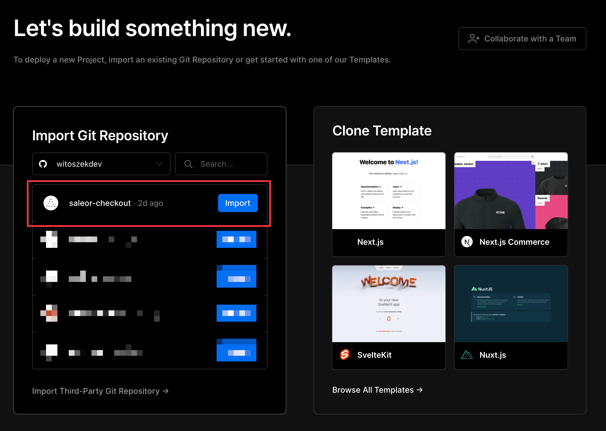
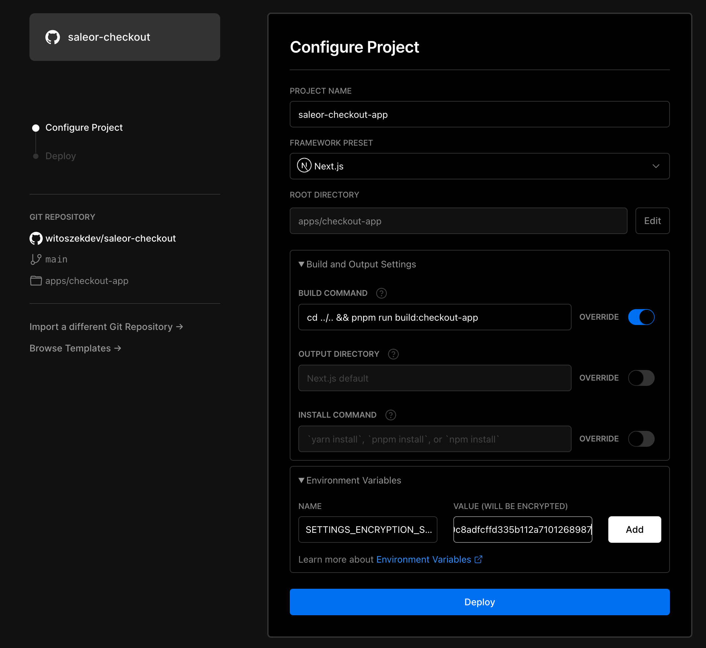
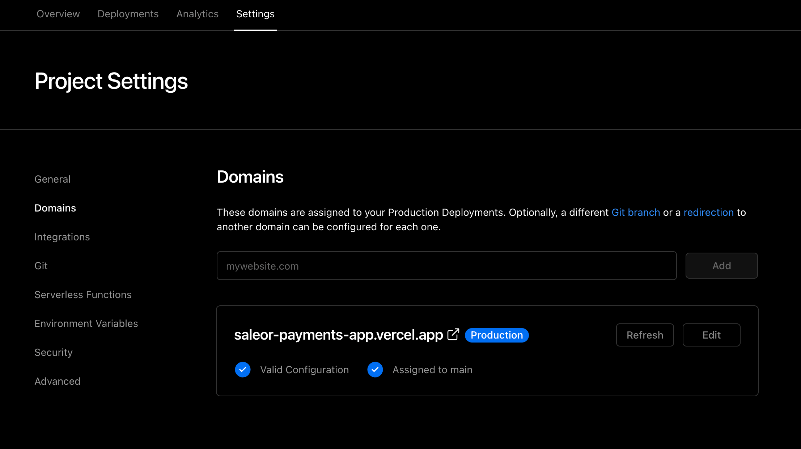
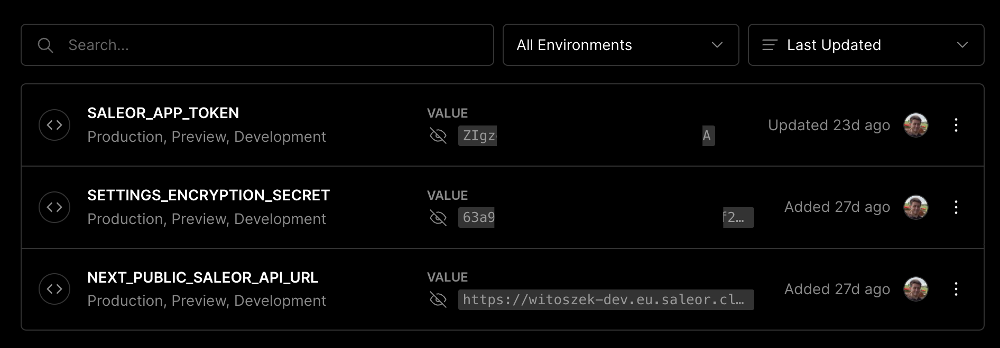

# Vercel deployment guide

In this guide we'll deploy Saleor Checkout to production and host it on Vercel.

## Preparations

We assume you've already configured environment variables except `CHECKOUT_APP_URL`, as described [in README](../README.md#env-variables)

The repo needs to be hosted on GitHub or some other git repository. Before you start, fork the repo to your account or organization.

- Authenticate the Turborepo CLI with your Vercel account

```
pnpm dlx turbo login
```

- Link the repo to a Vercel scope to enable the Remote Caching feature

```
pnpm dlx turbo link
```

> Remote Caching drastically reduces build times if you work in a team. Learn more about it at [Turborepo documentation](https://turborepo.org/docs/core-concepts/remote-caching) and [Vercel documentation](https://vercel.com/docs/concepts/monorepos/remote-caching)

## Deploying Checkout App

### 1. Create new project

Start by [creating new project](https://vercel.com/docs/concepts/projects/overview#creating-a-project) on Vercel and select your forked GitHub repo

> Note: Vercel doesn't support importing the entire monorepo at the moment, you will need to set up a project yourself for each app inside `/apps` folder



### 2. Configuring new project

On the configuration page:

- Provide your project name (for example `saleor-checkout-app`)
- Select framework to Next.js
- Choose the root directory to be `apps/checkout-app`
- Override the build command to:

```bash
cd ../.. && pnpm run build:checkout-app
```

- Add environment variables:
  - `SETTINGS_ENCRYPTION_SECRET` — Random string used for encrypting apps configuration (you can generate it using `openssl rand -hex 256`)
  - _Optional_: `NEXT_PUBLIC_SALEOR_API_URL` — if you want to override the value of `SALEOR_API_URL` stored inside `.env` file in the root of the repository

Here's the final result on configuration page:



Click deploy and wait until the app is deployed

### 3. Update environment variables in repository

Update `CHECKOUT_APP_URL` in `.env` file located at the root of monorepo to be your deployment URL

Example:

```
CHECKOUT_APP_URL=https://saleor-checkout-app.vercel.app
```

### 4. Install the app in Saleor

Grab the deployed app URL from Vercel and add `/api/manifest`. This URL points to the manifest file that is required for installing the app in Saleor

> Example manifest URL:
>
> ```
> https://saleor-checkout-xyz-myusername.vercel.app/api/manifest
> ```

You can install the app by using:

- [Saleor Dashboard](https://github.com/saleor/saleor-dashboard)

```
http://<YOUR_SALEOR_URL>/dashboard/apps/install?manifestUrl=<YOUR_MANIFEST_URL>
```

- [Saleor CLI](https://github.com/saleor/saleor-cli)

```
saleor app install
```

- [Saleor Core manage.py script](https://docs.saleor.io/docs/3.x/developer/extending/apps/installing-apps#installing-third-party-apps)
- [Saleor GraphQL API](https://docs.saleor.io/docs/3.x/developer/extending/apps/installing-apps#installation-using-graphql-api)

> **PROTIP 💡**: If you want your app to automatically update whenever you push changes to the `main` branch, make sure to use **production** domain from Vercel (not deployment domain) for your manifest URL.
>
> ❌ Deployment domain (won't update app after push):
>
> ```
> https://saleor-checkout-app-jluy793b2-myusername.vercel.app/api/manifest
> ```
>
> ✅ Production domain:
>
> ```
> https://saleor-checkout-app.vercel.app/api/manifest
> ```
>
> To see which domain is used for production go to [Vercel Dashboard](https://vercel.com) > Settings > Domains:
> 

### 5. Generate app token

After the app was installed, generate it's `authToken`

- [Saleor CLI](https://github.com/saleor/saleor-cli)

```
saleor app token
```

- [Saleor GraphQL API](https://docs.saleor.io/docs/3.x/developer/api-reference/mutations/app-token-create)

```graphql
mutation {
  appTokenCreate(input: { name: "Vercel", app: "<MY_APP_ID>" }) {
    authToken
  }
}
```

Where `<MY_APP_ID>` is the app `id`. You can retrieve the `id` by using this GraphQL query:

```graphql
query {
  apps(first: 10) {
    edges {
      node {
        id
        name
      }
    }
  }
}
```

outputs this:

```jsonc
{
  "data": {
    "apps": {
      "edges": [
        {
          "node": {
            "id": "QXBwOjQ=", // <- this is the app id
            "name": "Checkout"
          }
        }
      ]
    }
  }
}
```

### 6. Update environment variables in Vercel

You have to add additional environment variables for Checkout App in Vercel:

- `SALEOR_APP_TOKEN` — Token you've just generated

> 🚨 These values are secrets — don't store them inside your git repository

Make sure that you also have "Automatically expose System Environment Variables" **selected** ✅

Here's how the configuration should look like in the end:


After you're done, re-deploy the app

> ⚠️ Make sure that you **didn't** select the "Redeploy with existing Build Cache." option

7. 🥳 Congrats! Payment app is now ready to be used!

## Deploying Checkout SPA

### 1. Create another project on Vercel

Start by creating another project on Vercel, just like we did in [Checkout App setup](#checkout-app), select the same repository

### 2. Configure new project

On the configuration page:

- Provide your project name (for example `saleor-checkout`)
- Select framework to Create React App
- Choose the root directory to be `apps/checkout`
- Override the build command to:

```bash
cd ../.. && pnpm run build:checkout
```

- _Optional_: customise [environment variables](../apps/checkout/README.md#env-variables):
  - `REACT_APP_CHECKOUT_APP_URL` — URL of the deployed [Checkout App](#checkout-app).
  - `REACT_APP_SALEOR_API_URL` — URL of Saleor GraphQL API endpoint

> By default, those environment variables are taken from [`.env`](../.env) file in root of the monorepo. You don't need to provide env variables in Vercel if you want to use the values from `.env` file.

Here's the final result on configuration page:


Click deploy and wait until the app is deployed
