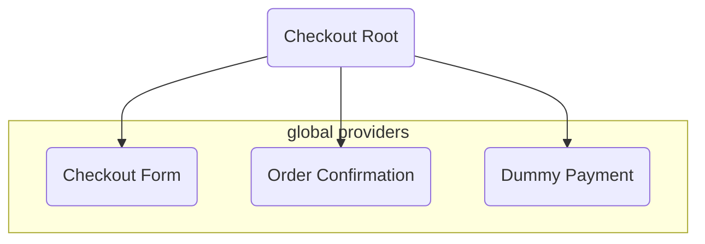
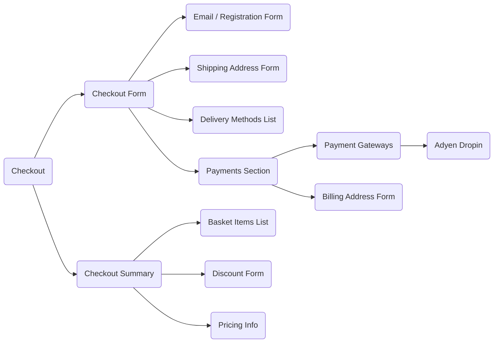
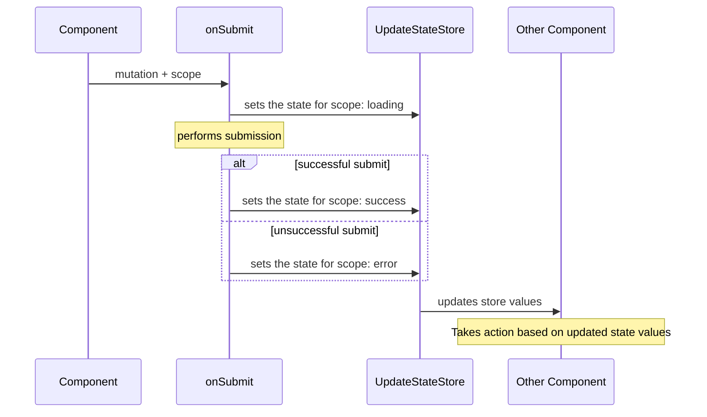
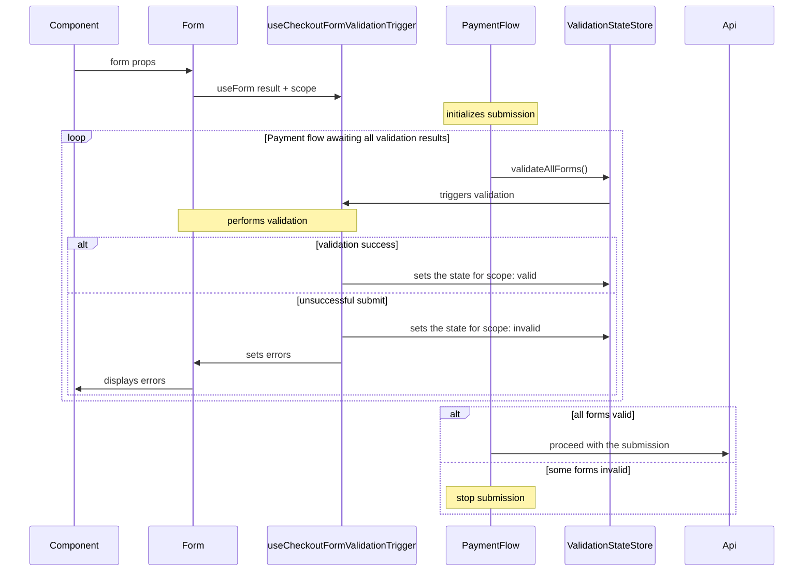
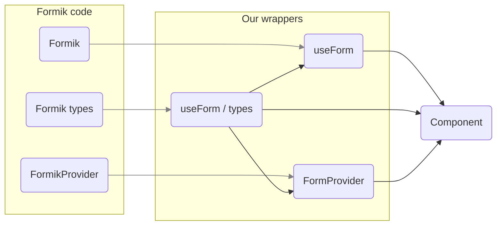
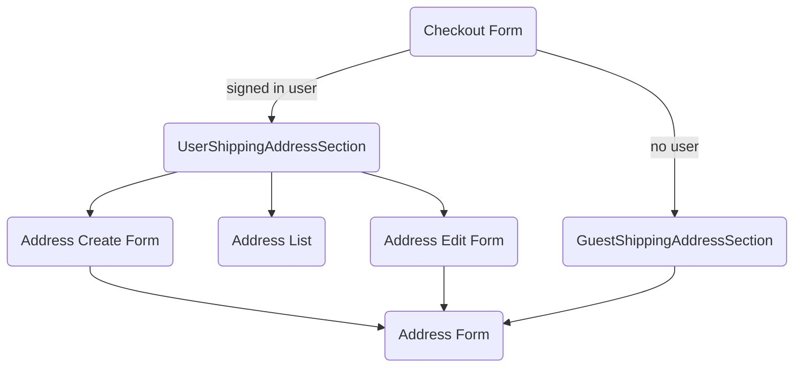
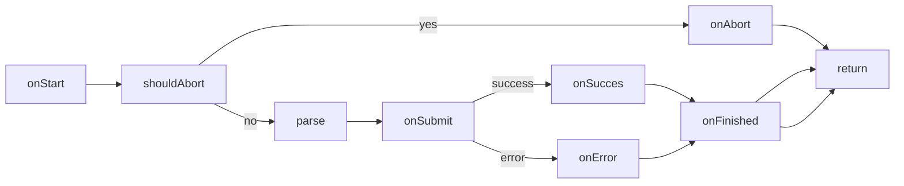

# Saleor Checkout

Checkout Storefront is a component used for connecting Saleor-based storefronts with checkout logic.

### URL structure

| Query param (raw) | Casted name        | Type / value                                       | Required | What does it do                                                                                                                                                                    |     |
| ----------------- | ------------------ | -------------------------------------------------- | -------- | ---------------------------------------------------------------------------------------------------------------------------------------------------------------------------------- | --- |
| checkout          | checkoutId         | String (checkout id)                               | yes      | Tells the API which checkout you'd like to handle                                                                                                                                  |     |
| saleorApiUrl      | saleorApiUrl       | String                                             | yes      | Tells the checkout which Saleor environment to use                                                                                                                                 |     |
| locale            | locale             | Locale (defined in apps/storefront/lib/regions.ts) | no       | Tells the checkout which locale to use on the site. That'll mean the automatically selected address for the guest checkout address form and auto-selected language of the checkout |     |
| order             | orderId            | String (order id)                                  | no       | Tells the checkout to show order confirmation for the order instead                                                                                                                |     |
| email             | passwordResetEmail | String                                             | no       | Email that Saleor API adds to the URL when requested account password change                                                                                                       |     |
| token             | passwordResetToken | String                                             | no       | Token that Saleor API adds to the URL when requested account password change                                                                                                       |     |
| transaction       | transaction        | String (transaction id)                            | no       | Added by the checkout in payment flow to be able to finish up the transaction after redirects                                                                                      |     |
| processingPayment | processingPayment  | Boolean                                            | no       | Added by the checkout in payment flow for the Payment processing screen to be able to display                                                                                      |     |

> ⚠ Please note that there are more query params than mentioned here, that come from specific payment gateways. All can be found in `src/lib/utils/url.ts`

### API requests and types

Checkout uses `urql` for all GraphQL queries and mutations. Queries and mutations are split between `checkout.graphql`, and `order.graphql`. To add a query or mutation, go to the respective file and add your code there. Then generate typescript types by running:

```bash
$ pnpm generate
```

Use fragments for repetitive data or fragment types generation e.g. `AddressFragment`.

Rest requests are defined in `src/fetch/requests.ts` and all use the `useFetch` hook defined in `hooks` directory.

### Theming and styles

You can configure your styling (colours, font sizes, etc.) in your `checkout configuration app` (called saleor-app-checkout in this repository). The branding config is being fetched from the checkout app in `AppConfigProvider` as an `AppConfig` object. Then the styles are parsed and injected into the CSS. Check implementation of AppConfigProvider.

Checkout uses [tailwindcss](https://tailwindcss.com/) for styling. You can find the Tailwind config in `tailwind.config.js`. In the config, the CSS variables are mapped to Tailwind styles like so:

```js
border: {
  primary: "rgba(var(--border-color-primary-rgb), 0.4)",
  secondary: "rgba(var(--border-color-primary-rgb), 0.15)",
}
```

## Project structure



### Checkout form consists of smaller forms:



## Checkout update state

Because many checkout elements depend on one another, we use `CheckoutUpdateStateStore`. It keeps the information about the progress of mutations and their outcome.
Each mutation in the `updateState` part of the store can have a value of `success` `error` or `loading`. We later use these props e.g. for showing skeletons instead of certain sections of checkout that depend on given mutations. What's more important, we use them to let checkout finalization flow know if it should wait for some mutations to finish before the finalization can take place.
The store also contains a `changingBillingCountry` boolean prop, that is used to tell the payment section to show a skeleton in case the billing address country is being updated.



## Checkout validation state

We use a separate store for keeping information about the current validation status of some of the forms. Since we don't want to proceed with payment in case e.g. the user forgot to put in his email or shipping address, we need to be able to trigger the validation on submission initialization and wait for all of these to finish, without some hardcore prop drilling. Hence comes the `CheckoutValidationStateStore` and [useCheckoutFormValidationTrigger hook](#useCheckoutFormValidationTrigger).



## Forms

Each component containing a form logic has a corresponding form-wrapping hook. So for instance `GuestShippingAddressForm` has a corresponding hook called `useGuestShippingAddressForm`. This approach makes it predictable and keeps the UX related logic of components and forms separated.

For handling forms, we use Formik. Since the library is not maintained anymore, we have our wrapper to handle some of the bugs as well as a little bit of our custom logic and improved typings. Each form should be created using our `useForm` and if needed passed down to `FormProvider` which is a wrapper for Formik's `FormikProvider`. We have also overwritten the `useField` hook and types for the forms, so Formik's original types should only be used in `hooks/useForm/types` for extending and exporting from that file.



### Shipping and billing forms

In previous versions, we kept the logic for guest and signed-in user address forms intertwined, however, it made the code spaghetti-like, so despite a little more boilerplate, we now keep them separated, with as many reusable parts extracted to hooks as possible. The chart below presents the shipping address form flow - the billing one works the same way.



Because both guest billing and shipping address forms are autosaving data under the hook, there is a `useAutoSaveAddressForm` that handles the necessary logic. Both `useGuestBillingAddressForm` and `useGuestShippingAddressForm` hooks use it.

Because the billing address may depend on the shipping address if `use billing same as shipping` checkbox is selected, we use `useBillingSameAsShippingForm` to handle the necessary updates in that regard.

## useSubmit

To reuse the common submitting logic as well as reduce boilerplate for those, we use `useSubmit` hook, as well as the corresponding `useFormSubmit` when passing on to `useForm`. UseFormSubmit is a wrapper around useSubmit, with only one difference. While most callbacks supplied to useSubmit pass on the `CallbackProps` object that has one property inside - `formData`, useFormSubmit also adds `formHelpers`.

**`useSubmit<TData, TMutationFn, TErrorCodes>(props: UseSubmitProps<TData, TMutationFn, TErrorCodes>) => SimpleSubmitFn<TData, TErrorCodes>`**

The simplified flow is as follows:



| Prop name           | Type                                                                                                         | Required | What is it                                                                                                                                                                                 |
| ------------------- | ------------------------------------------------------------------------------------------------------------ | -------- | ------------------------------------------------------------------------------------------------------------------------------------------------------------------------------------------ |
| onSubmit            | (vars: MutationVars<TMutationFn>) => Promise<MutationData<TMutationFn>>                                      | yes      | Mutation function. Usually the result of urql mutation generated hook. e.g `const [, `**`userRegister`**`] = useUserRegisterMutation()`                                                    |
| scope               | CheckoutUpdateStateScope                                                                                     | no       | Scope for the useSubmit to set in the update state reducer. If not provided, no update state will be set.                                                                                  |
| onStart             | (props: CallbackProps<TData>) => void                                                                        | no       | Callback on submission start (happens before any other action takes place, even aborting). If supplied, will be run every time the submission is triggered.                                |
| shouldAbort         | (props: CallbackProps) => Promise<boolean> \| (props: CallbackProps<TData>) => boolean)                      | no       | Function to determine if the submission should be aborted. Happens after onStart callback.                                                                                                 |
| onAbort             | (props: CallbackProps) => void                                                                               | no       | Callback on submission abort.                                                                                                                                                              |
| onSuccess           | (props: CallbackProps<TData> & { data: MutationSuccessData<TMutationFn> }) => void                           | no       | Callback on submission success. Will return the extracted result.[mutationName].data.                                                                                                      |
| onError             | (props: CallbackProps & { errors: ApiErrors; customErrors: any[]; graphqlErrors: CombinedError[]; }) => void | no       | Callback on submission error. Will extract mutation.errors as `graphqlErrors`, mutation.[mutationName].errors as `apiErrors` and `customErrors` if `extractCustomErrors` prop is provided. |
| extractCustomErrors | (data: MutationData) => any[]                                                                                | no       | Used for extracting payment gateway errors.                                                                                                                                                |
| onFinished          | () => void                                                                                                   | no       | Similar to onStart, except happens after all the action is finished.                                                                                                                       |
| hideAlerts          | boolean                                                                                                      | no       | By default, useSubmit will show alerts from extracted API errors if the mutation fails. Set to `false` to disable. You can still show errors manually in `onError` callback.               |
| parse               | ParserFunction<TData, TMutationFn>                                                                           | no       | Takes in form data and returns parsed variables, ready for submission. If not supplied, the contents of form data will be passed as variables.                                             |

## Other useful hooks:

### **useFormattedMessages**

**`useFormattedMessages() => (message: MessageDescriptor, values?: Record<string, number | string>) => string`**

Used for translations. Uses react-intl under the hood.

### **useErrorMessages**

**`useErrorMessages<TKey extends string = ErrorCode>(customMessages?: Record<TKey, MessageDescriptor>) => { errorMessages, getMessageByErrorCode,}`**

Used for providing an easier way to translate error messages. Without provided customMessages prop it'll return generic error messages for `required`, `missing` etc. form fields. For e.g AdyenDropin component, we provide custom messages so we can later show translated error messages specifically for adyen without wrapping each message into `formatMessage`

### **useUrlChange**

**`useUrlChange = (onLocationChange: ({ queryParams }: UrlChangeHandlerArgs) => void`**

Used to handle URL changes in components.

### **useLocale**

**`useLocale() => () => UseLocale`**

```js
interface UseLocale {
  locale: Locale;
  countryCode: CountryCode;
  channel: string;
  messages: typeof localeToMessages[keyof typeof localeToMessages];
}
```

The returned messages are all translated messages supplied in `Root.tsx` to the `IntlProvider`.

### **useOrder**

**`useOrder() => { order: OrderFragment, loading: boolean }`**

Used on OrderConfirmation page.

### **useCheckout**

**`useCheckout() => { checkout: CheckoutFragment, loading: boolean }`**

### **useUser**

**`useUser() => { user: UserFragment, loading: boolean, authenticated: boolean }`**

Returns currently signed-in user.

### **useCheckoutFormValidationTrigger**

**`useCheckoutFormValidationTrigger = <TData extends FormDataBase>({ scope, form, skip = false, }: { scope: CheckoutFormScope; form: UseFormReturn<TData>; skip?: boolean;}) => void`**

Attached to a form, it'll run validation once `validateAllForms` method is run on `checkoutValidationStateStore`. It'll change the state of validation forms to `validating`. Then it'll run the validation and set either `valid` or `invalid` on each one.
