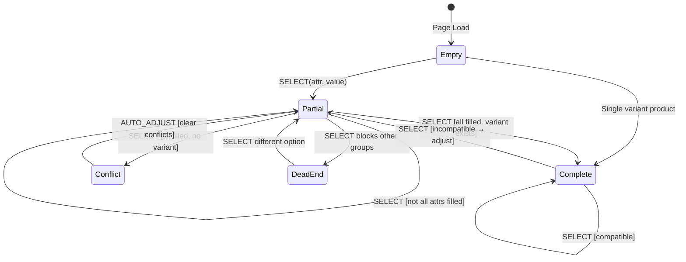

# Saleor Paper Storefront

**Version 1.0.0**  
Saleor Paper  
February 2026

> **Note:**  
> This document is mainly for agents and LLMs to follow when maintaining,  
> generating, or refactoring this Saleor storefront codebase. Humans  
> may also find it useful, but guidance here is optimized for automation  
> and consistency by AI-assisted workflows.

---

## Abstract

Comprehensive guide for AI agents and LLMs maintaining the Saleor Paper storefront — a Next.js 16 e-commerce application with TypeScript, Tailwind CSS, and the Saleor GraphQL API. Covers 13 rules across 6 categories: data layer (caching, GraphQL), product pages (PDP, variants, filtering), checkout flow, UI components, SEO, and development practices. Each rule includes architecture diagrams, code examples, file locations, and anti-patterns.

---

## Table of Contents

1. [Data Layer](#1-data-layer) — **CRITICAL**
   - 1.1 [Caching Strategy](#11-caching-strategy)
   - 1.2 [GraphQL Workflow](#12-graphql-workflow)
2. [Product Pages](#2-product-pages) — **HIGH**
   - 2.1 [Product Detail Page](#21-product-detail-page)
   - 2.2 [Variant Selection](#22-variant-selection)
   - 2.3 [Product Filtering](#23-product-filtering)
3. [Checkout Flow](#3-checkout-flow) — **HIGH**
   - 3.1 [Checkout Management](#31-checkout-management)
   - 3.2 [Checkout Components](#32-checkout-components)
4. [UI & Channels](#4-ui--channels) — **MEDIUM**
   - 4.1 [UI Components](#41-ui-components)
   - 4.2 [Channels & Multi-Currency](#42-channels--multi-currency)
5. [SEO](#5-seo) — **MEDIUM**
   - 5.1 [SEO & Metadata](#51-seo--metadata)
6. [Development](#6-development) — **MEDIUM**
   - 6.1 [Saleor API Investigation](#61-saleor-api-investigation)

---

## 1. Data Layer

**Impact: CRITICAL**

The data layer controls caching, GraphQL type generation, and API communication. Getting this wrong causes stale content, type errors, or permission failures.

### 1.1 Caching Strategy

Understanding the caching architecture, Cache Components (PPR), and revalidation mechanisms ensures correct data freshness, avoids stale content, and enables targeted cache invalidation when Saleor data changes.

> **Reference**: [Next.js Cache Components](https://nextjs.org/docs/app/getting-started/cache-components) — the official documentation for `use cache`, `cacheLife`, `cacheTag`, and Partial Prerendering.

## Data Freshness Model

### The Key Principle

> **Display pages are cached for performance. Transactional flows are always real-time.**

| Page/Component                | Data Source                                 | Freshness              | Why                         |
| ----------------------------- | ------------------------------------------- | ---------------------- | --------------------------- |
| **PDP (Product Detail)**      | `getProductData()`                          | ⚠️ Cached (5 min TTL)  | Performance - instant loads |
| **Category/Collection pages** | `getCategoryData()` / `getCollectionData()` | ⚠️ Cached (5 min TTL)  | Performance                 |
| **Homepage**                  | `getFeaturedProducts()`                     | ⚠️ Cached (5 min TTL)  | Performance                 |
| **Navigation**                | `NavLinks`                                  | ⚠️ Cached (1 hour TTL) | Rarely changes              |
| **Cart Drawer**               | `Checkout.find()`                           | ✅ Always fresh        | Uses `cache: "no-cache"`    |
| **Checkout Page**             | `useCheckoutQuery()`                        | ✅ Always fresh        | Direct API call via urql    |
| **Add to Cart action**        | Saleor mutation                             | ✅ Always fresh        | Saleor calculates price     |

### Price Flow Diagram

```
┌─────────────────────────────────────────────────────────────────────┐
│                         PRICE FLOW                                  │
├─────────────────────────────────────────────────────────────────────┤
│                                                                     │
│   PDP Display          Cart/Checkout          Payment               │
│   ────────────         ─────────────          ───────               │
│                                                                     │
│   ┌───────────┐        ┌───────────┐         ┌───────────┐         │
│   │  Cached   │───────▶│  FRESH    │────────▶│  FRESH    │         │
│   │  $29.99   │  Add   │  $35.99   │  Pay    │  $35.99   │         │
│   └───────────┘  to    └───────────┘         └───────────┘         │
│                  Cart                                               │
│   "use cache"          cache:"no-cache"      Saleor validates       │
│   5 min TTL            Always from API       at checkout            │
│                                                                     │
└─────────────────────────────────────────────────────────────────────┘

⚠️ User may see different price in cart than on PDP if price changed.
✅ User CANNOT checkout at stale price - Saleor always uses current price.
```

### Why This Is Safe

1. **Saleor is the source of truth**: When you call `checkoutLinesAdd`, Saleor calculates the price server-side using current data
2. **Cart always fetches fresh**: `Checkout.find()` uses `cache: "no-cache"`
3. **Checkout validates**: `checkoutComplete` will fail if something is wrong
4. **Webhooks enable instant updates**: When configured, price changes trigger immediate cache invalidation

## Cache Components Architecture

### What It Is

Cache Components enable **Partial Prerendering (PPR)** - mixing static, cached, and dynamic content in a single route. The static shell is served instantly from CDN, while dynamic parts stream in via Suspense.

### Current Status: ✅ ENABLED (Experimental)

> ⚠️ **Note**: Cache Components are still marked **experimental** in Next.js. The patterns are functional but evolving. See [Disabling Cache Components](#disabling-cache-components) if you need to rollback.

Cache Components are enabled in `next.config.js`:

```javascript
const config = {
	cacheComponents: true,
};
```

### How It Works

```
┌─────────────────────────────────────────────────────────────────┐
│  STATIC SHELL (Instant from CDN)                                │
│  ┌─────────────────────────────────────────────────────────┐   │
│  │  Header skeleton, layout, cached product data            │   │
│  │  Source: "use cache" functions (getProductData, etc.)    │   │
│  └─────────────────────────────────────────────────────────┘   │
│                                                                 │
│  ┌─────────────────────────────────────────────────────────┐   │
│  │  <Suspense fallback={<Skeleton />}>                     │   │
│  │    Dynamic content (streams in after initial render)     │   │
│  │    - Variant selection (reads searchParams)              │   │
│  │    - Logo, NavLinks (use usePathname)                    │   │
│  │    - Cart count (reads cookies)                          │   │
│  │  </Suspense>                                             │   │
│  └─────────────────────────────────────────────────────────┘   │
└─────────────────────────────────────────────────────────────────┘
```

### Cached Functions with Tags

Each cached function has a **tag** for targeted invalidation:

```typescript
// src/app/[channel]/(main)/products/[slug]/page.tsx
async function getProductData(slug: string, channel: string) {
	"use cache";
	cacheLife("minutes"); // 5 min default TTL
	cacheTag(`product:${slug}`); // Tag for webhook invalidation

	return executePublicGraphQL(ProductDetailsDocument, {
		variables: { slug, channel },
	});
}
```

### Tag Registry

| Tag Pattern         | Used By                                        | Invalidated When          |
| ------------------- | ---------------------------------------------- | ------------------------- |
| `product:{slug}`    | `getProductData()`                             | Product updated in Saleor |
| `category:{slug}`   | `getCategoryData()`                            | Category updated          |
| `collection:{slug}` | `getCollectionData()`, `getFeaturedProducts()` | Collection updated        |
| `navigation`        | `NavLinks`                                     | Menu structure changed    |
| `footer-menu`       | `getFooterMenu()`                              | Footer menu changed       |
| `channels`          | `getChannels()`                                | Channel list changed      |

## Key Patterns

### 1. Suspense Around Dynamic Content

Any component accessing runtime data must be wrapped in Suspense.

**What counts as "dynamic data" (triggers Suspense requirement):**

| Data Access                 | Why It's Dynamic    |
| --------------------------- | ------------------- |
| `cookies()`                 | Per-request         |
| `headers()`                 | Per-request         |
| `searchParams`              | URL-dependent       |
| `usePathname()`             | Client-side routing |
| `useParams()`               | Client-side routing |
| `Date.now()`                | Time-dependent      |
| Server Actions              | Form submissions    |
| `cache: "no-cache"` fetches | Always fresh        |

```tsx
// Layout wraps children in Suspense
<main className="flex-1">
  <Suspense>{props.children}</Suspense>
</main>

// Header wraps NavLinks in Suspense (uses usePathname for active state)
<Suspense fallback={<NavLinksSkeleton />}>
  <NavLinks channel={channel} />
</Suspense>
```

### 2. Sync Page Shell Pattern (CRITICAL)

Page components that use `"use cache"` data must be **synchronous** and wrap their async content in a **dedicated Suspense boundary**. This prevents the cached async work from flowing through the layout's main Suspense, which can cause hydration/reconciliation issues.

```tsx
// ✅ CORRECT - Page is sync, async content has its own Suspense
export default function Page(props: PageProps) {
	return (
		<Suspense fallback={<PageSkeleton />}>
			<PageContent params={props.params} />
		</Suspense>
	);
}

async function PageContent({ params: paramsPromise }) {
	const params = await paramsPromise;
	const data = await getCachedData(params.slug, params.channel);
	return <ProductList products={data} />;
}
```

```tsx
// ❌ BAD - async Page relies on layout's Suspense for streaming
export default async function Page(props: PageProps) {
	const params = await props.params;
	const data = await getCachedData(params.slug, params.channel);
	return <ProductList products={data} />;
}
```

**Why**: When Cache Components are enabled, the boundary between the static shell and streamed content is determined by Suspense boundaries. If the page itself is async and relies on the layout's `<Suspense>{children}</Suspense>`, the reconciliation between the static shell and the streamed RSC payload happens at the layout level, which can cause DOM structure mismatches and memory issues. A dedicated page-level Suspense isolates this boundary.

All page routes in this project follow this pattern:

- `src/app/[channel]/(main)/page.tsx` (homepage)
- `src/app/[channel]/(main)/categories/[slug]/page.tsx`
- `src/app/[channel]/(main)/collections/[slug]/page.tsx`
- `src/app/[channel]/(main)/products/[slug]/page.tsx`

### 3. Public vs Authenticated Queries

Two explicit GraphQL helpers:

- `executePublicGraphQL` - Safe inside `"use cache"` (no cookies needed)
- `executeAuthenticatedGraphQL` - NOT safe inside `"use cache"` (requires cookies)

```typescript
import { executePublicGraphQL, executeAuthenticatedGraphQL } from "@/lib/graphql";

// ✅ Public data - safe inside "use cache"
async function getProductData(slug: string, channel: string) {
	"use cache";
	return executePublicGraphQL(ProductDetailsDocument, {
		variables: { slug, channel },
	});
}

// ✅ User data - NOT inside "use cache" (requires cookies)
const { me } = await executeAuthenticatedGraphQL(CurrentUserDocument, {
	cache: "no-cache",
});
```

### 4. Don't Use `searchParams` Inside `"use cache"`

```typescript
// ❌ BAD - searchParams is runtime data
export async function generateMetadata(props) {
	"use cache";
	const searchParams = await props.searchParams; // Error!
}

// ✅ GOOD - Only access params (becomes cache key)
export async function generateMetadata(props) {
	"use cache";
	const params = await props.params; // OK
}

// ✅ GOOD - Access searchParams outside cache scope
export async function generateMetadata(props) {
	const searchParams = await props.searchParams; // No "use cache"
}
```

### 5. CSS Order Pattern for Mixed Static/Dynamic Layouts

When you need dynamic content to appear **above** static content visually, use CSS `order`:

```tsx
// PDP: Category (dynamic) appears above Product Name (static)
<div className="flex flex-col gap-3">
	{/* Static shell - renders first but order:2 */}
	<h1 className="order-2">{product.name}</h1>

	{/* Dynamic - streams in, order:1 appears above h1 */}
	<Suspense fallback={<Skeleton className="order-1" />}>
		<VariantSection /> {/* Contains order-1 and order-3 elements */}
	</Suspense>

	{/* Static - order:4 appears last */}
	<div className="order-4">
		<ProductAttributes />
	</div>
</div>
```

**Visual result:**

```
1. Category + Sale badge  (dynamic, order-1)
2. Product Name           (static, order-2)
3. Variant selectors      (dynamic, order-3)
4. Product details        (static, order-4)
```

This keeps `<h1>` in the static shell for SEO while allowing dynamic content to appear above it.

### 6. GraphQL Auth Defaults

Two explicit GraphQL helpers ensure you always know what data access level you're using:

- `executePublicGraphQL` - Public queries only (products, menus, categories)
- `executeAuthenticatedGraphQL` - Requires user session cookies (checkout, user data)

This ensures:

- Only publicly visible products are fetched
- No user cookies in cache scope (safe for `"use cache"`)
- No "Signature has expired" errors on public pages

```typescript
import { executePublicGraphQL, executeAuthenticatedGraphQL } from "@/lib/graphql";

// ✅ Public data (menus, products) - no auth, only public data
const menu = await executePublicGraphQL(MenuDocument, {
	variables: { slug: "footer" },
});

// ✅ User data - requires session cookies
let user = null;
try {
	const result = await executeAuthenticatedGraphQL(CurrentUserDocument, {
		cache: "no-cache",
	});
	user = result.me;
} catch {
	// Expired token = treat as not logged in
}

// ✅ Checkout/cart - requires session cookies
await executeAuthenticatedGraphQL(CheckoutAddLineDocument, {
	variables: { id: checkoutId, productVariantId: variantId },
	cache: "no-cache",
});

// ✅ App token (server-side only) - explicit header
const channels = await executePublicGraphQL(ChannelsListDocument, {
	headers: {
		Authorization: `Bearer ${process.env.SALEOR_APP_TOKEN}`,
	},
});
```

## Cache Invalidation

### Automatic via Webhooks (Recommended)

When configured, Saleor sends webhooks on data changes, triggering instant invalidation.

**Setup in Saleor Dashboard:**

1. Go to **Configuration → Webhooks**
2. Create webhook pointing to: `https://your-site.com/api/revalidate`
3. Subscribe to events:
   - `PRODUCT_CREATED`, `PRODUCT_UPDATED`, `PRODUCT_DELETED`
   - `CATEGORY_CREATED`, `CATEGORY_UPDATED`, `CATEGORY_DELETED`
   - `COLLECTION_CREATED`, `COLLECTION_UPDATED`, `COLLECTION_DELETED`
4. Copy the **secret key** to `SALEOR_WEBHOOK_SECRET` env var

**What happens on webhook:**

```typescript
// Product update webhook triggers:
revalidateTag(`product:${slug}`, "minutes"); // Invalidates "use cache" data
revalidatePath(`/channel/products/${slug}`); // Invalidates ISR page
```

### Manual Invalidation

```bash
# Invalidate a specific product (both tag and path)
curl "https://store.com/api/revalidate?secret=xxx&tag=product:blue-hoodie&path=/default-channel/products/blue-hoodie"

# Invalidate just the cached function data
curl "https://store.com/api/revalidate?secret=xxx&tag=product:blue-hoodie"

# Invalidate navigation (uses "hours" profile)
curl "https://store.com/api/revalidate?secret=xxx&tag=navigation&profile=hours"
```

### No Webhooks? TTL Takes Over

| Data        | Default TTL |
| ----------- | ----------- |
| Products    | 5 minutes   |
| Categories  | 5 minutes   |
| Collections | 5 minutes   |
| Navigation  | 1 hour      |

## Environment Variables

```env
# Cache invalidation
REVALIDATE_SECRET=your-secret       # Manual revalidation (GET requests)
SALEOR_WEBHOOK_SECRET=webhook-hmac  # Saleor webhook HMAC verification
```

## Debugging Stale Content

### Checklist

1. **Is the webhook configured?**

   - Check Saleor Dashboard → Webhooks → Deliveries

2. **Did the webhook fire?**

   - Check server logs for `[Revalidate]` entries

3. **Is the tag correct?**

   - Product slugs must match exactly: `product:blue-hoodie`

4. **Force manual revalidation:**

   ```bash
   curl "https://store.com/api/revalidate?secret=xxx&tag=product:my-product"
   ```

5. **Check browser cache:**
   - Hard refresh: Cmd+Shift+R / Ctrl+Shift+R

## Anti-patterns

❌ **Don't use `cache: "no-cache"` for display pages** - Destroys performance
❌ **Don't skip webhook setup in production** - Users see stale prices
❌ **Don't access cookies/searchParams inside `"use cache"`** - Will error
❌ **Don't use `executeAuthenticatedGraphQL` inside `"use cache"`** - Requires cookies
❌ **Don't expose `REVALIDATE_SECRET`** - Keep it server-side only
❌ **Don't make page components async when using `"use cache"` data** - Use the sync page shell pattern (see Key Pattern #2) to avoid reconciliation issues with the layout's main Suspense boundary

## Disabling Cache Components

If you need to rollback to standard ISR caching:

### Step 1: Disable in Config

```javascript
// next.config.js
const config = {
	cacheComponents: false, // or comment out entirely
};
```

### Step 2: Remove Cache Directives

Remove `"use cache"`, `cacheLife()`, and `cacheTag()` from these files:

| File                                                   | What to Remove                           |
| ------------------------------------------------------ | ---------------------------------------- |
| `src/app/[channel]/(main)/products/[slug]/page.tsx`    | `getProductData()` cache directives      |
| `src/app/[channel]/(main)/categories/[slug]/page.tsx`  | `getCategoryData()` cache directives     |
| `src/app/[channel]/(main)/collections/[slug]/page.tsx` | `getCollectionData()` cache directives   |
| `src/app/[channel]/(main)/page.tsx`                    | `getFeaturedProducts()` cache directives |
| `src/ui/components/nav/components/nav-links.tsx`       | Navigation cache directives              |

### Step 3: Update Revalidation

```typescript
// src/app/api/revalidate/route.ts
// Change from:
revalidateTag(`product:${slug}`, "minutes");
// To:
revalidateTag(`product:${slug}`); // Remove second argument
```

### What You Can Keep

- **Suspense boundaries** - Still useful for loading states
- **CSS order layout** - Pure CSS, no impact
- **`executeAuthenticatedGraphQL`** - Good separation regardless
- **ISR via `revalidate` option** - Works as fallback

## Files Reference

| File                                                   | Purpose                                  |
| ------------------------------------------------------ | ---------------------------------------- |
| `src/app/api/revalidate/route.ts`                      | Webhook endpoint and manual revalidation |
| `src/app/[channel]/(main)/products/[slug]/page.tsx`    | PDP with "use cache"                     |
| `src/app/[channel]/(main)/categories/[slug]/page.tsx`  | Category with "use cache"                |
| `src/app/[channel]/(main)/collections/[slug]/page.tsx` | Collection with "use cache"              |
| `src/app/[channel]/(main)/page.tsx`                    | Homepage with "use cache"                |
| `src/ui/components/pdp/variant-section-dynamic.tsx`    | Dynamic variant section                  |
| `src/ui/components/header.tsx`                         | Header with Suspense boundaries          |
| `src/lib/checkout.ts`                                  | Cart operations (always fresh)           |
| `next.config.js`                                       | `cacheComponents: true`                  |

### 1.2 GraphQL Workflow

Modifying GraphQL queries and regenerating types correctly ensures type safety, avoids permission errors, and keeps storefront and checkout data in sync with the Saleor schema.

> **Sources**:
>
> - [Saleor API Reference](https://docs.saleor.io/api-reference) - GraphQL schema and field permissions
> - [graphql-codegen](https://the-guild.dev/graphql/codegen) - Type generation

## File Locations

| Purpose                           | Location                         | Generated Types                   | Regenerate With          |
| --------------------------------- | -------------------------------- | --------------------------------- | ------------------------ |
| Storefront (products, cart, etc.) | `src/graphql/*.graphql`          | `src/gql/`                        | `pnpm generate`          |
| Checkout flow                     | `src/checkout/graphql/*.graphql` | `src/checkout/graphql/generated/` | `pnpm generate:checkout` |

> **Note**: Checkout uses urql (client-side), storefront uses Next.js fetch (server-side). That's why they have separate codegen setups.

## Making Changes

Edit the `.graphql` file. Example - adding a field:

```graphql
query ProductDetails($slug: String!, $channel: String!) {
	product(slug: $slug, channel: $channel) {
		id
		name
		newField # Add your field here
	}
}
```

## Regenerating Types (CRITICAL)

```bash
# For storefront queries (src/graphql/*.graphql)
pnpm run generate

# For checkout queries (src/checkout/graphql/*.graphql)
pnpm run generate:checkout
```

This regenerates TypeScript types. **Always run the appropriate command after any GraphQL change.**

- `src/gql/` - Storefront types (DO NOT EDIT)
- `src/checkout/graphql/generated/` - Checkout types (DO NOT EDIT)

## Using the Types

```typescript
import { ProductDetailsDocument } from "@/gql/graphql";
import { executePublicGraphQL } from "@/lib/graphql";

const { product } = await executePublicGraphQL(ProductDetailsDocument, {
	variables: { slug, channel },
	revalidate: 60,
});
// TypeScript now recognizes product.newField
```

## Checking the Saleor Schema

To confirm field names, types, nullability, or enum values, search the generated types file:

```bash
# Full schema types, generated from your running Saleor instance
grep -A 20 "^export type Product " src/gql/graphql.ts

# Check an enum
grep -A 10 "^export enum StockAvailability" src/gql/graphql.ts

# Check an input type
grep -A 30 "^export type ProductFilterInput" src/gql/graphql.ts
```

This file is generated by `pnpm generate` via API introspection, so it always matches your exact Saleor version. It contains the **full schema** (all types, enums, inputs), not just the ones used in declared queries.

## Common Issues

### Permission Errors

If you see:

```
"To access this path, you need one of the following permissions: MANAGE_..."
```

The field requires admin permissions and isn't available to anonymous/customer tokens. Either remove it from the storefront query, or fetch it server-side with `SALEOR_APP_TOKEN` and the required permission.

### Nullable Fields

Saleor's schema has many nullable fields. Handle nulls intentionally -- use optional chaining with a fallback for display values, but guard or throw when null signals a real problem:

```typescript
// Display value with fallback
const name = product.category?.name ?? "Uncategorized";

// Guard when null means something is wrong
if (!product.defaultVariant) {
	throw new Error(`Product ${product.slug} has no default variant`);
}
```

## Anti-patterns

❌ **Don't edit generated files** (`src/gql/` or `src/checkout/graphql/generated/`)  
❌ **Don't forget to regenerate types** - Run the appropriate `generate` command  
❌ **Don't assume fields are non-null** - Check generated types and handle nulls explicitly  
❌ **Don't mix up the two codegen setups** - Storefront ≠ Checkout

---

## 2. Product Pages

**Impact: HIGH**

Product pages are the core shopping experience. PDP layout, variant selection, and filtering directly affect conversion and usability.

### 2.1 Product Detail Page

Product Detail Page architecture, image gallery/carousel, caching, and add-to-cart flow. Ensures correct PDP layout, variant-aware gallery, LCP optimization, and resilient error handling.

> **Sources**: [Next.js Caching](https://nextjs.org/docs/app/building-your-application/caching) · [Server Actions](https://nextjs.org/docs/app/building-your-application/data-fetching/server-actions-and-mutations) · [Suspense](https://react.dev/reference/react/Suspense)

For variant selection logic specifically, see [2.2 Variant Selection](#22-variant-selection).

> **Start here:** Read the [Data Flow](#data-flow) section first - it explains how everything connects.

## Architecture Overview

```
┌─────────────────────────────────────────────────────────────────┐
│ page.tsx (Server Component)                                     │
├─────────────────────────────────────────────────────────────────┤
│                                                                 │
│  ┌──────────────────┐    ┌────────────────────────────────────┐ │
│  │ ProductGallery   │    │ Product Info Column                │ │
│  │ (Client)         │    │                                    │ │
│  │                  │    │  <h1>Product Name</h1>  ← Static   │ │
│  │ • Swipe/arrows   │    │                                    │ │
│  │ • Thumbnails     │    │  ┌────────────────────────────┐   │ │
│  │ • LCP optimized  │    │  │ ErrorBoundary              │   │ │
│  │                  │    │  │  ┌──────────────────────┐  │   │ │
│  │                  │    │  │  │ Suspense             │  │   │ │
│  │                  │    │  │  │  VariantSection ←────│──│── Dynamic
│  │                  │    │  │  │  (Server Action)     │  │   │ │
│  │                  │    │  │  └──────────────────────┘  │   │ │
│  │                  │    │  └────────────────────────────┘   │ │
│  │                  │    │                                    │ │
│  │                  │    │  ProductAttributes  ← Static       │ │
│  └──────────────────┘    └────────────────────────────────────┘ │
│                                                                 │
│  Data: getProductData() with "use cache"  ← Cached 5 min       │
└─────────────────────────────────────────────────────────────────┘
```

### Key Principles

1. **Page is a sync shell** - Returns immediately with a `<Suspense>` boundary (see Key Pattern #2 in Caching)
2. **Product data is cached** - `getProductData()` uses `"use cache"` (5 min)
3. **Variant section is dynamic** - Reads `searchParams`, streams via Suspense
4. **Gallery shows variant images** - Changes based on `?variant=` URL param
5. **Errors are contained** - ErrorBoundary prevents full page crash

### Data Flow

**Read this first** - understanding how data flows makes everything else click:

```
URL: /us/products/blue-shirt?variant=abc123
                │
                ▼
┌───────────────────────────────────────────────────────────────────┐
│ page.tsx                                                          │
│                                                                   │
│   1. getProductData("blue-shirt", "us")                           │
│      └──► "use cache" ──► GraphQL ──► Returns product + variants  │
│                                                                   │
│   2. searchParams.variant = "abc123"                              │
│      └──► Find variant ──► Get variant.media ──► Gallery images   │
│                                                                   │
│   3. Render page with:                                            │
│      • Gallery ──────────────────► Shows variant images           │
│      • <Suspense> ──► VariantSection streams in                   │
│                       └──► Reads searchParams (makes it dynamic)  │
│                       └──► Server Action: addToCart()             │
└───────────────────────────────────────────────────────────────────┘
                │
                ▼
┌───────────────────────────────────────────────────────────────────┐
│ User selects different variant (e.g., "Red")                      │
│                                                                   │
│   router.push("?variant=xyz789")                                  │
│      └──► URL changes                                             │
│      └──► Page re-renders with new searchParams                   │
│      └──► Gallery shows red variant images                        │
│      └──► VariantSection shows red variant selected               │
└───────────────────────────────────────────────────────────────────┘
                │
                ▼
┌───────────────────────────────────────────────────────────────────┐
│ User clicks "Add to bag"                                          │
│                                                                   │
│   <form action={addToCart}>                                       │
│      └──► Server Action executes                                  │
│      └──► Creates/updates checkout                                │
│      └──► revalidatePath("/cart")                                 │
│      └──► Cart drawer updates                                     │
└───────────────────────────────────────────────────────────────────┘
```

**Why this matters:**

- Product data is **cached** (fast loads)
- URL is the **source of truth** for variant selection
- Gallery reacts to URL changes **without client state**
- Server Actions handle mutations **without API routes**

## File Structure

```
src/app/[channel]/(main)/products/[slug]/
└── page.tsx                          # Main PDP page

src/ui/components/pdp/
├── index.ts                          # Public exports
├── product-gallery.tsx               # Gallery wrapper
├── variant-section-dynamic.tsx       # Variant selection + add to cart
├── variant-section-error.tsx         # Error fallback (Client Component)
├── add-to-cart.tsx                   # Add to cart button
├── sticky-bar.tsx                    # Mobile sticky add-to-cart
├── product-attributes.tsx            # Description/details accordion
└── variant-selection/                # Variant selection system
    └── ...                           # See product-variants rule

src/ui/components/ui/
├── carousel.tsx                      # Embla carousel primitives
└── image-carousel.tsx                # Reusable image carousel
```

## Image Gallery

### Features

- **Mobile**: Horizontal swipe (Embla Carousel) + dot indicators
- **Desktop**: Arrow navigation (hover) + thumbnail strip
- **LCP optimized**: First image server-rendered via `ProductGalleryImage`
- **Variant-aware**: Shows variant-specific images when selected

### How Variant Images Work

```tsx
// In page.tsx
const selectedVariant = searchParams.variant
	? product.variants?.find((v) => v.id === searchParams.variant)
	: null;

const images = getGalleryImages(product, selectedVariant);
// Priority: variant.media → product.media → thumbnail
```

### Customizing Gallery

```tsx
// image-carousel.tsx props
<ImageCarousel
	images={images}
	productName="..."
	showArrows={true} // Desktop arrow buttons
	showDots={true} // Mobile dot indicators
	showThumbnails={true} // Desktop thumbnail strip
	onImageClick={(i) => {}} // For future lightbox
/>
```

### Adding Zoom/Lightbox (Future)

Use the `onImageClick` callback:

```tsx
<ImageCarousel images={images} onImageClick={(index) => openLightbox(index)} />
```

## Caching Strategy

### Data Fetching

```tsx
async function getProductData(slug: string, channel: string) {
	"use cache";
	cacheLife("minutes"); // 5 minute cache
	cacheTag(`product:${slug}`); // For on-demand revalidation

	return await executePublicGraphQL(ProductDetailsDocument, {
		variables: { slug, channel },
	});
}
```

**Note:** `executePublicGraphQL` fetches only publicly visible data, which is safe inside `"use cache"` functions. For user-specific queries, use `executeAuthenticatedGraphQL` (but NOT inside `"use cache"`).

### What's Cached vs Dynamic

| Part                     | Cached? | Why                            |
| ------------------------ | ------- | ------------------------------ |
| Product data             | ✅ Yes  | `"use cache"` directive        |
| Gallery images           | ✅ Yes  | Derived from cached data       |
| Product name/description | ✅ Yes  | Static content                 |
| Variant section          | ❌ No   | Reads `searchParams` (dynamic) |
| Prices                   | ❌ No   | Part of variant section        |

### On-Demand Revalidation

```bash
# Revalidate specific product
curl "/api/revalidate?tag=product:my-product-slug"
```

## Error Handling

### ErrorBoundary Pattern

```tsx
<ErrorBoundary FallbackComponent={VariantSectionError}>
  <Suspense fallback={<VariantSectionSkeleton />}>
    <VariantSectionDynamic ... />
  </Suspense>
</ErrorBoundary>
```

**Why**: If variant section throws, user still sees:

- Product images ✅
- Product name ✅
- Description ✅
- "Unable to load options. Try again." message

### Server Action Error Handling

```tsx
async function addToCart() {
	"use server";
	try {
		// ... checkout logic
	} catch (error) {
		console.error("Add to cart failed:", error);
		// Graceful failure - no crash
	}
}
```

## Add to Cart Flow

```
User clicks "Add to bag"
        │
        ▼
┌─────────────────────┐
│ form action={...}   │ ← HTML form submission
└─────────────────────┘
        │
        ▼
┌─────────────────────┐
│ addToCart()         │ ← Server Action
│ "use server"        │
│                     │
│ • Find/create cart  │
│ • Add line item     │
│ • revalidatePath()  │
└─────────────────────┘
        │
        ▼
┌─────────────────────┐
│ useFormStatus()     │ ← Shows "Adding..." state
│ pending: true       │
└─────────────────────┘
        │
        ▼
   Cart drawer updates (via revalidation)
```

## Common Tasks

### Add new product attribute display

1. Check `ProductDetails.graphql` for field
2. If missing, add and run `pnpm run generate`
3. Extract in `page.tsx` helper function
4. Pass to `ProductAttributes` component

### Change gallery thumbnail size

Edit `image-carousel.tsx`:

```tsx
<button className="relative h-20 w-20 ...">  {/* Change h-20 w-20 */}
```

### Change sticky bar scroll threshold

Edit `sticky-bar.tsx`:

```tsx
const SCROLL_THRESHOLD = 500; // Change this value
```

### Add product badges (New, Sale, etc.)

Badges are in `VariantSectionDynamic`:

```tsx
{
	isOnSale && <Badge variant="destructive">Sale</Badge>;
}
```

## GraphQL

### Key Queries

- `ProductDetails.graphql` - Main product query
- `VariantDetailsFragment.graphql` - Variant data including media

### After GraphQL Changes

```bash
pnpm run generate  # Regenerate types
```

## Testing

```bash
pnpm test src/ui/components/pdp  # Run PDP tests
```

### Manual Testing Checklist

- [ ] Gallery swipe works on mobile
- [ ] Arrows appear on desktop hover
- [ ] Variant selection updates URL
- [ ] Variant images change when variant selected
- [ ] Add to cart shows pending state
- [ ] Sticky bar appears after scroll
- [ ] Error boundary catches failures

## Anti-patterns

❌ **Don't pass Server Component functions to Client Components**

```tsx
// ❌ Bad - VariantSectionError defined in Server Component file
<ErrorBoundary FallbackComponent={VariantSectionError}>

// ✅ Good - VariantSectionError in separate file with "use client"
// See variant-section-error.tsx
```

❌ **Don't read searchParams in cached functions**

```tsx
// ❌ Bad - breaks caching
async function getProductData(slug: string, searchParams: SearchParams) {
  "use cache";
  const variant = searchParams.variant; // Dynamic data in cache!
}

// ✅ Good - read searchParams in page, pass result to cached function
const product = await getProductData(slug, channel);
const variant = searchParams.variant ? product.variants.find(...) : null;
```

❌ **Don't use useState for variant selection**

```tsx
// ❌ Bad - client state, not shareable, lost on refresh
const [selectedVariant, setSelectedVariant] = useState(null);

// ✅ Good - URL is source of truth
router.push(`?variant=${variantId}`);
// Read from searchParams on server
```

❌ **Don't skip ErrorBoundary around Suspense**

```tsx
// ❌ Bad - error crashes entire page
<Suspense fallback={<Skeleton />}>
  <DynamicComponent />
</Suspense>

// ✅ Good - error contained, rest of page visible
<ErrorBoundary FallbackComponent={ErrorFallback}>
  <Suspense fallback={<Skeleton />}>
    <DynamicComponent />
  </Suspense>
</ErrorBoundary>
```

❌ **Don't use index as key for images**

```tsx
// ❌ Bad - breaks React reconciliation when images change
{images.map((img, index) => <Image key={index} ... />)}

// ✅ Good - stable key
{images.map((img) => <Image key={img.url} ... />)}
```

### 2.2 Variant Selection

Variant and attribute selection on product detail pages. Ensures correct "Add to Cart" button state, option availability, discount badges, and URL-driven selection.

> **Source**: [Saleor Docs - Attributes](https://docs.saleor.io/developer/attributes/overview) - How product/variant attributes work

## Core Concept: Variants, Not Products

**You add VARIANTS to cart, not products.** Each variant is a specific attribute combination:

| Product | Attributes     | Variant ID |
| ------- | -------------- | ---------- |
| T-Shirt | Black + Medium | `abc123`   |
| T-Shirt | Black + Large  | `def456`   |
| T-Shirt | White + Medium | `ghi789`   |

The `checkoutLinesAdd` mutation requires a specific `variantId`. Without selecting ALL attributes, there's no variant to add.

## Two Types of Variant Attributes

Saleor distinguishes between two types of variant attributes:

| Type              | `variantSelection`      | Purpose                                | UI                  | Passed to Cart?           |
| ----------------- | ----------------------- | -------------------------------------- | ------------------- | ------------------------- |
| **Selection**     | `VARIANT_SELECTION`     | Identify which variant (color, size)   | Interactive picker  | No - just the `variantId` |
| **Non-Selection** | `NOT_VARIANT_SELECTION` | Describe the variant (material, brand) | Display-only badges | No - already on variant   |

**Key insight:** Neither type is "passed" to checkout. You only pass the `variantId`. All attributes are already stored on the variant in Saleor.

```graphql
# GraphQL queries use the variantSelection filter:
selectionAttributes: attributes(variantSelection: VARIANT_SELECTION) { ... }
nonSelectionAttributes: attributes(variantSelection: NOT_VARIANT_SELECTION) { ... }
```

Non-selection attributes are **display-only** - shown as informational badges, not interactive selectors.

## File Structure

```
src/ui/components/pdp/variant-selection/
├── index.ts                      # Public exports
├── types.ts                      # TypeScript interfaces
├── utils.ts                      # Data transformation & logic
├── variant-selector.tsx          # Single attribute selector
├── variant-selection-section.tsx # Main container
├── optional-attributes.tsx       # Non-selection attribute badges
└── renderers/
    ├── color-swatch-option.tsx   # Color swatch (circular)
    └── button-option.tsx         # Button for size/text (unified)
```

## Key Functions in `utils.ts`

| Function                        | Purpose                                          |
| ------------------------------- | ------------------------------------------------ |
| `groupVariantsByAttributes()`   | Extract unique attribute values from variants    |
| `findMatchingVariant()`         | Find variant matching ALL selected attributes    |
| `getOptionsForAttribute()`      | Get options with availability/compatibility info |
| `getAdjustedSelections()`       | Clear conflicting selections when needed         |
| `getUnavailableAttributeInfo()` | Detect dead-end selections                       |

## Option States

| State            | Meaning                                   | Visual        | Clickable?        |
| ---------------- | ----------------------------------------- | ------------- | ----------------- |
| **Available**    | In stock                                  | Normal        | ✓                 |
| **Incompatible** | No variant with this + current selections | Dimmed        | ✓ (clears others) |
| **Out of stock** | Variant exists but quantity = 0           | Strikethrough | ✗                 |

## URL Parameter Pattern

Selections are stored in URL params:

```
?color=black&size=m&variant=abc123
  ↑           ↑       ↑
Color sel  Size sel  Matching variant (set automatically)
```

The `variant` param is only set when ALL attributes are selected.

## Discount Badges

Options can show discount percentages:

```typescript
// In utils.ts
interface VariantOption {
	id: string;
	name: string;
	available: boolean;
	hasDiscount?: boolean; // Any variant with this option is discounted
	discountPercent?: number; // Max discount percentage
	// ...
}
```

The renderers display a small badge when `discountPercent` is set.

## Examples

### Smart Selection Adjustment

When user selects an incompatible option:

```
State: ?color=red (Red only exists in Size S)
User clicks: Size L
Result: ?size=l (Red is cleared, not blocked)
```

Users are never "stuck" - they can always explore all options.

### Dead End Detection

```typescript
const deadEnd = getUnavailableAttributeInfo(variants, groups, selections);
// Returns: { slug: "size", name: "Size", blockedBy: "Red" }
// UI shows: "No size available in Red"
```

### Custom Renderers

```tsx
<VariantSelectionSection
	variants={variants}
	renderers={{
		color: MyCustomColorPicker,
		size: MySizeChart,
	}}
/>
```

## State Machine

The selection system has 5 states with automatic conflict resolution. See the full state diagram below.

**Quick reference:**

| State        | Add to Cart | Description                   |
| ------------ | ----------- | ----------------------------- |
| **Empty**    | ❌          | No selections                 |
| **Partial**  | ❌          | Some attributes selected      |
| **Complete** | ✅          | All selected, variant found   |
| **Conflict** | —           | Auto-clears to Partial        |
| **DeadEnd**  | ❌          | Selection blocks other groups |

**Key behavior:** When user selects an incompatible option, other selections are cleared automatically (not blocked). Users can always explore all options.

## Anti-patterns

❌ **Don't enable "Add to Cart" without full selection** - Needs variant ID  
❌ **Don't block incompatible options** - Let users click, clear others  
❌ **Don't assume single attribute** - Products can have multiple  
❌ **Don't use `0` in boolean checks for prices** - Use `typeof === "number"`  
❌ **Don't make non-selection attributes interactive** - They're display-only (badges, not toggles)

#### Appendix: Variant Selection State Machine

> State machines clarify complex interactive features. For multi-state UI with non-obvious transitions (like auto-adjustment here), a diagram prevents edge case bugs and helps AI agents reason about the system correctly.

## State Diagram



## States

| State        | URL Params                        | Add to Cart | Description                         |
| ------------ | --------------------------------- | ----------- | ----------------------------------- |
| **Empty**    | `?`                               | No          | No selections                       |
| **Partial**  | `?color=black`                    | No          | Some attributes selected            |
| **Complete** | `?color=black&size=m&variant=abc` | Yes         | All selected, variant found         |
| **Conflict** | (transient)                       | --          | Impossible combination, auto-clears |
| **DeadEnd**  | `?color=black`                    | No          | Selection blocks other groups       |

## Example User Flow

```
1. User lands on product page
   State: Empty -> URL: /products/t-shirt

2. User clicks "Black" color
   State: Partial -> URL: ?color=black

3. User clicks "Medium" size
   State: Complete -> URL: ?color=black&size=medium&variant=abc123
   -> Add to Cart enabled

4. User clicks "XL" (but Black/XL doesn't exist)
   State: Conflict -> AUTO_ADJUST -> Partial
   -> URL: ?size=xl (color cleared)
   -> User can now pick a color that has XL
```

This "smart adjustment" pattern ensures users are never stuck. They can always explore all options.

## Transition Rules

### SELECT Action

When user clicks an option:

1. **If variant exists with new selection** -- Update selection, keep others
2. **If no variant exists** -- Clear conflicting selections (AUTO_ADJUST)
3. **If all attributes now filled and variant exists** -- Set `variant` param

### AUTO_ADJUST Logic

Implemented in `getAdjustedSelections()`:

```typescript
function getAdjustedSelections(variants, currentSelections, newAttr, newValue) {
	const newSelections = { ...currentSelections, [newAttr]: newValue };

	if (findMatchingVariant(variants, newSelections)) {
		return newSelections;
	}

	return { [newAttr]: newValue };
}
```

## Dead End Detection

A "dead end" occurs when a selection makes ALL options in another attribute group unavailable.

Example: Red only exists in Size S. User selects Red -- Size dropdown shows only S (or shows "No sizes available in Red").

Detected via `getUnavailableAttributeInfo()`:

```typescript
const deadEnd = getUnavailableAttributeInfo(variants, groups, selections);
// Returns: { slug: "size", name: "Size", blockedBy: "Red" }
```

#### Appendix: Variant Selection Utilities Reference

Detailed reference for functions in `src/ui/components/pdp/variant-selection/utils.ts`.

## Core Functions

### `groupVariantsByAttributes(variants)`

Extracts unique attribute values from all variants.

**Input**: Array of Saleor variants with attributes
**Output**: Map of attribute slugs to value arrays

```typescript
const groups = groupVariantsByAttributes(variants);
// {
//   color: [{ id: "1", name: "Black", slug: "black" }, ...],
//   size: [{ id: "2", name: "Medium", slug: "m" }, ...]
// }
```

### `findMatchingVariant(variants, selections)`

Finds a variant that matches ALL selected attribute values.

**Input**:

- `variants`: All product variants
- `selections`: `Record<attributeSlug, valueSlug>` (e.g., `{ color: "black", size: "m" }`)

**Output**: Matching variant or `undefined`

```typescript
const variant = findMatchingVariant(variants, { color: "black", size: "m" });
if (variant) {
	// Can add to cart with variant.id
}
```

### `getOptionsForAttribute(variants, attributeSlug, selections)`

Gets options for a single attribute with availability/compatibility info.

**Output**: Array of `VariantOption`:

```typescript
interface VariantOption {
	id: string;
	name: string;
	slug: string;
	available: boolean; // At least one variant in stock
	compatible: boolean; // Works with current selections
	hasDiscount?: boolean; // Any variant with this option is discounted
	discountPercent?: number; // Max discount percentage
}
```

### `getAdjustedSelections(variants, currentSelections, attributeSlug, value)`

Returns new selections after user picks an option, auto-clearing conflicts.

**Logic**:

1. Add new selection to current selections
2. If valid variant exists -- return updated selections
3. If no valid variant -- return only the new selection (clear others)

### `getUnavailableAttributeInfo(variants, groups, selections)`

Detects "dead end" selections where an attribute group has no valid options.

**Output**: `{ slug, name, blockedBy }` or `null`

```typescript
const deadEnd = getUnavailableAttributeInfo(variants, groups, { color: "red" });
if (deadEnd) {
	// Show: "No {deadEnd.name} available in {deadEnd.blockedBy}"
}
```

## Discount Detection

### How Discounts Are Detected

A variant has a discount when `undiscountedPrice > price`:

```typescript
const hasDiscount = variant.pricing?.priceUndiscounted?.gross?.amount > variant.pricing?.price?.gross?.amount;
```

### Discount Percentage Calculation

```typescript
const discountPercent = Math.round(((undiscounted - price) / undiscounted) * 100);
```

### Option-Level Discount Aggregation

When building options, we aggregate discounts across all variants with that option:

```typescript
// For color "Black", check all Black variants
// hasDiscount = true if ANY Black variant is discounted
// discountPercent = MAX discount among Black variants
```

## Type Definitions

See `src/ui/components/pdp/variant-selection/types.ts`:

```typescript
export interface VariantOption {
	id: string;
	name: string;
	slug: string;
	available: boolean;
	compatible: boolean;
	hasDiscount?: boolean;
	discountPercent?: number;
}

export interface AttributeGroup {
	slug: string;
	name: string;
	values: VariantOption[];
}

export type Selections = Record<string, string>;
```

### 2.3 Product Filtering

Product list filtering and sorting architecture. Ensures correct server-side vs client-side filtering, category resolution, static price ranges, and filter UI behavior.

> **Source**: [Saleor API - ProductFilterInput](https://docs.saleor.io/api-reference/products/inputs/product-filter-input) - Available server-side filter options

## Filter Architecture

| Filter         | Processing     | Why                                           |
| -------------- | -------------- | --------------------------------------------- |
| **Categories** | ✅ Server-side | Uses Saleor's `ProductFilterInput.categories` |
| **Price**      | ✅ Server-side | Uses Saleor's `ProductFilterInput.price`      |
| **Sort**       | ✅ Server-side | Uses Saleor's `ProductOrder`                  |
| **Colors**     | ❌ Client-side | Saleor needs attribute IDs                    |
| **Sizes**      | ❌ Client-side | Same as colors                                |

## Key Files

| File                                           | Purpose                                |
| ---------------------------------------------- | -------------------------------------- |
| `src/ui/components/plp/filter-utils.ts`        | All filter utilities (server + client) |
| `src/ui/components/plp/filter-bar.tsx`         | Filter UI (dropdowns, mobile sheet)    |
| `src/ui/components/plp/use-product-filters.ts` | Hook consolidating filter logic        |

## Server-Side Filtering

Category slugs in URL are resolved to IDs:

```typescript
// In page.tsx (server component)
import { resolveCategorySlugsToIds, buildFilterVariables } from "@/ui/components/plp/filter-utils";

const categorySlugs = searchParams.categories?.split(",") || [];
const categoryMap = await resolveCategorySlugsToIds(categorySlugs);
const categoryIds = Array.from(categoryMap.values()).map((c) => c.id);

const filter = buildFilterVariables({
	priceRange: searchParams.price,
	categoryIds,
});

// Pass to GraphQL query
const { products } = await executePublicGraphQL(ProductListDocument, {
	variables: { channel, filter },
});
```

## Client-Side Filtering

Colors and sizes are filtered after fetch:

```typescript
import { filterProducts, extractColorOptions } from "@/ui/components/plp/filter-utils";

// Extract available options
const colorOptions = extractColorOptions(products, selectedColors);

// Apply filters
const filtered = filterProducts(products, {
	colors: selectedColors,
	sizes: selectedSizes,
});
```

## Using the Hook

The `useProductFilters` hook consolidates all filter logic:

```tsx
"use client";
import { useProductFilters } from "@/ui/components/plp/use-product-filters";

function ProductsClient({ products, resolvedCategories }) {
	const {
		filteredProducts,
		colorOptions,
		sizeOptions,
		selectedColors,
		handleColorToggle,
		handleSortChange,
		activeFilters,
	} = useProductFilters({
		products,
		resolvedCategories,
		enableCategoryFilter: true,
	});

	return (
		<FilterBar
			colorOptions={colorOptions}
			selectedColors={selectedColors}
			onColorToggle={handleColorToggle}
			// ...
		/>
	);
}
```

## Static Price Ranges

Price ranges are static to avoid UI flicker when filtering:

```typescript
import { STATIC_PRICE_RANGES_WITH_COUNT } from "@/ui/components/plp/filter-utils";

// Returns: [
//   { label: "Under $50", value: "0-50", count: 0 },
//   { label: "$50 - $100", value: "50-100", count: 0 },
//   ...
// ]
```

## Examples

### Adding a New Server-Side Filter

1. Update `buildFilterVariables` in `filter-utils.ts`:

```typescript
export function buildFilterVariables(params: {
	priceRange?: string | null;
	categoryIds?: string[];
	inStock?: boolean; // New filter
}): ProductFilterInput | undefined {
	// ... existing code ...

	if (params.inStock) {
		filter.stockAvailability = "IN_STOCK";
		hasFilter = true;
	}
}
```

2. Parse from URL in page.tsx and pass to the function.

## Anti-patterns

❌ **Don't filter categories client-side** - Use server-side with IDs  
❌ **Don't generate dynamic price ranges** - Use static ranges  
❌ **Don't hide selected filters** - Always show so users can deselect

---

## 3. Checkout Flow

**Impact: HIGH**

Checkout handles payment and order completion. Bugs here directly cause lost revenue and poor user experience.

### 3.1 Checkout Management

Understanding checkout session lifecycle, storage, and debugging prevents payment failures, hydration mismatches, and "CHECKOUT_NOT_FULLY_PAID" errors. Use live checkout data for payment amounts and handle stale checkouts gracefully.

## Overview

This skill covers how checkout sessions are created, stored, and managed in the Saleor storefront.

## Checkout ID Storage

Checkout IDs are stored in **two places**:

### 1. Cookie (Primary Storage)

```
Cookie name: checkoutId-{channel}
Example: checkoutId-default-channel
```

The cookie is set in `src/lib/checkout.ts`:

```typescript
export async function saveIdToCookie(channel: string, checkoutId: string) {
	const cookieName = `checkoutId-${channel}`;
	(await cookies()).set(cookieName, checkoutId, {
		sameSite: "lax",
		secure: shouldUseHttps,
	});
}
```

### 2. URL Query Parameter

```
URL: /checkout?checkout=Q2hlY2tvdXQ6YThjN2Y4YjgtZmU0NS00ZTRkLThhZmItZDdjYWI2YTM5MTdm
```

The checkout ID is a base64-encoded Saleor global ID.

## Checkout Lifecycle

### Creation

A new checkout is created when:

- User adds first item to an empty cart
- No valid checkout ID exists in cookie
- Existing checkout is not found in Saleor

```typescript
// src/lib/checkout.ts
export async function findOrCreate({ channel, checkoutId }) {
	if (!checkoutId) {
		return (await create({ channel })).checkoutCreate?.checkout;
	}
	const checkout = await find(checkoutId);
	return checkout || (await create({ channel })).checkoutCreate?.checkout;
}
```

### Persistence

The checkout persists across:

- Page refreshes
- Browser sessions (cookie-based)
- Cart modifications

### Completion

When `checkoutComplete` mutation succeeds:

- Checkout is converted to an Order
- The checkout ID becomes invalid
- A new checkout should be created for future purchases

## Common Issues

### Hydration Mismatch with Checkout ID

**Problem**: `extractCheckoutIdFromUrl()` called during SSR reads an empty URL, causing React hydration mismatch and "PageNotFound" flash.

**Symptom**: Checkout page briefly shows error then loads correctly on refresh.

**Fix**: Delay extraction until after client-side mount:

```tsx
const [mounted, setMounted] = useState(false);
useEffect(() => setMounted(true), []);
const id = useMemo(() => (mounted ? extractCheckoutIdFromUrl() : null), [mounted]);
```

See `src/checkout/hooks/use-checkout.ts` for the full implementation.

### Stale Checkout with Failed Transactions

**Problem**: If payment fails multiple times, the checkout accumulates partial transactions. Subsequent payment attempts may fail with:

```
CHECKOUT_NOT_FULLY_PAID: The authorized amount doesn't cover the checkout's total amount.
```

**Solutions**:

1. **Clear cookies** - Delete `checkoutId-{channel}` cookie
2. **Use incognito** - Test in a private browser window
3. **Remove URL param** - Navigate to checkout without `?checkout=XXX`

### Checkout Amount Mismatch

**Problem**: Checkout total changes after transactions are initialized (e.g., shipping added).

**Solution**: Always use live checkout data via `useCheckout()` hook before payment:

```typescript
const { checkout: liveCheckout } = useCheckout();
const checkout = liveCheckout || initialCheckout;
const totalAmount = checkout.totalPrice.gross.amount;
```

## Key Files

| File                                 | Purpose                              |
| ------------------------------------ | ------------------------------------ |
| `src/lib/checkout.ts`                | Checkout creation, cookie management |
| `src/checkout/hooks/use-checkout.ts` | React hook for checkout data         |
| `src/checkout/lib/utils/url.ts`      | URL query param extraction           |
| `src/graphql/CheckoutCreate.graphql` | Checkout creation mutation           |

## Debugging Checkout Issues

### 1. Check Current Checkout ID

```javascript
// In browser console
document.cookie.split(";").find((c) => c.includes("checkoutId"));
```

### 2. Decode Checkout ID

```javascript
// Base64 decode the checkout ID from URL
atob("Q2hlY2tvdXQ6YThjN2Y4YjgtZmU0NS00ZTRkLThhZmItZDdjYWI2YTM5MTdm");
// Returns: "Checkout:a8c7f8b8-fe45-4e4d-8afb-d7cab6a3917f"
```

### 3. Query Checkout in Saleor

Use GraphQL playground to inspect checkout state:

```graphql
query {
	checkout(id: "Q2hlY2tvdXQ6...") {
		id
		totalPrice {
			gross {
				amount
				currency
			}
		}
		transactions {
			id
			chargedAmount {
				amount
			}
			authorizedAmount {
				amount
			}
		}
	}
}
```

## Payment App Issues

### Transaction Fails with "AUTHORIZATION_FAILURE"

**Symptom**: Transaction is created but fails immediately:

```json
{
	"transaction": { "id": "...", "actions": [] },
	"transactionEvent": {
		"message": "Failed to delivery request.",
		"type": "AUTHORIZATION_FAILURE"
	}
}
```

**Cause**: The payment app (e.g., Dummy Gateway, Stripe, Adyen) is not responding.

**Solutions**:

1. Check **Saleor Dashboard → Apps** - is the payment app active/healthy?
2. Check if the payment app URL is accessible
3. Restart the payment app if self-hosted
4. Check Saleor Cloud status if using cloud-hosted apps

### "CHECKOUT_NOT_FULLY_PAID" Error

**Symptom**: `checkoutComplete` fails with:

```
The authorized amount doesn't cover the checkout's total amount.
```

**Causes**:

1. **Payment app is down** - transaction was created but authorization failed
2. **Stale checkout** - previous partial transactions exist
3. **Amount mismatch** - checkout total changed after transaction init

**Debug steps**:

1. Check `[Payment] Transaction init result:` logs for `transactionEvent.type`
2. If `AUTHORIZATION_FAILURE` → payment app is down/unreachable
3. If transaction succeeded but amount is wrong → checkout data is stale

## Best Practices

1. **Always use live checkout data** for payment amounts
2. **Handle checkout not found** gracefully (create new checkout)
3. **Clear checkout after completion** to avoid stale data
4. **Test with fresh checkouts** when debugging payment issues
5. **Check payment app health** when transactions fail with `AUTHORIZATION_FAILURE`

### 3.2 Checkout Components

Reusable checkout UI components for contact, address, and payment flows. Composing these components in checkout steps keeps the flow consistent and maintainable.

## Component Locations

```
src/checkout/components/
├── contact/              # Authentication & user display
├── shipping-address/     # Address selection & display
├── payment/              # Payment method & billing
└── address-form/         # Form utilities (existing)
```

## Contact Components

```tsx
import {
	SignInForm, // Email + password + forgot password
	SignedInUser, // Logged-in user display with sign out
	ResetPasswordForm, // New password form (reset callback)
	GuestContact, // Email input + create account checkbox
} from "@/checkout/components/contact";
```

| Component           | Props                                                          | Use Case                 |
| ------------------- | -------------------------------------------------------------- | ------------------------ |
| `SignInForm`        | `initialEmail?`, `channelSlug`, `onSuccess`, `onGuestCheckout` | Sign-in form             |
| `SignedInUser`      | `user`, `onSignOut`                                            | Show logged-in user info |
| `ResetPasswordForm` | `onSuccess`, `onBackToSignIn`                                  | Password reset callback  |
| `GuestContact`      | `email`, `onEmailChange`, `emailError?`, `onSignInClick`       | Guest email entry        |

## Address Components

```tsx
import {
	AddressSelector, // Radio list for saved addresses
	AddressDisplay, // Read-only address card
} from "@/checkout/components/shipping-address";

// Also re-exported from AddressFormFields:
import { AddressFields, FormInput, FormSelect, FieldError } from "@/checkout/components/shipping-address";
```

| Component         | Props                                                                             | Use Case                     |
| ----------------- | --------------------------------------------------------------------------------- | ---------------------------- |
| `AddressSelector` | `addresses`, `selectedAddressId`, `onSelectAddress`, `defaultAddressId?`, `name?` | Pick from saved addresses    |
| `AddressDisplay`  | `address`, `title?`, `onEdit?`                                                    | Show address read-only       |
| `AddressFields`   | `orderedFields`, `formData`, `errors`, `onFieldChange`, etc.                      | Dynamic country-aware fields |

## Payment Components

```tsx
import {
	PaymentMethodSelector, // Card/PayPal/iDEAL tabs
	BillingAddressSection, // Same-as-shipping toggle + form
	isCardDataValid, // Helper function
	type PaymentMethodType, // "card" | "paypal" | "ideal"
	type CardData, // { cardNumber, expiry, cvc, nameOnCard }
	type BillingAddressData, // { countryCode, formData, selectedAddressId? }
} from "@/checkout/components/payment";
```

| Component               | Props                                                                                                 | Use Case                      |
| ----------------------- | ----------------------------------------------------------------------------------------------------- | ----------------------------- |
| `PaymentMethodSelector` | `value`, `onChange`, `cardData?`, `onCardDataChange?`                                                 | Payment method picker         |
| `BillingAddressSection` | `billingAddress?`, `shippingAddress?`, `userAddresses?`, `isShippingRequired?`, `errors?`, `onChange` | Billing with same-as-shipping |

## Usage Pattern

Steps import and compose these components:

```tsx
// In InformationStep.tsx
import { SignInForm, SignedInUser, GuestContact } from "@/checkout/components/contact";
import { AddressSelector } from "@/checkout/components/shipping-address";

// Orchestrate based on auth state
{
	authenticated ? (
		<SignedInUser user={user} onSignOut={handleSignOut} />
	) : contactSection === "signIn" ? (
		<SignInForm onSuccess={handleSignInSuccess} />
	) : (
		<GuestContact email={email} onEmailChange={setEmail} />
	);
}
```

## When to Create New Components

Extract into `components/` when:

- Used in **2+ places**
- **Self-contained** with clear props interface
- **100+ lines** that can be isolated

Keep inline when:

- **One-off** UI specific to that step
- Tightly coupled to step's state machine

---

## 4. UI & Channels

**Impact: MEDIUM**

UI components and channel configuration control the visual layer and multi-currency support.

### 4.1 UI Components

Create and style UI components with design tokens and shadcn/ui primitives.

> **Source**: [shadcn/ui](https://ui.shadcn.com/) - Component patterns and primitives used in this project

## Component Location

| Type                       | Location                  |
| -------------------------- | ------------------------- |
| Shared components          | `src/ui/components/`      |
| Product page components    | `src/ui/components/pdp/`  |
| Product listing components | `src/ui/components/plp/`  |
| Base primitives            | `src/ui/components/ui/`   |
| Navigation                 | `src/ui/components/nav/`  |
| Cart                       | `src/ui/components/cart/` |

## Design Tokens

Use semantic Tailwind classes that reference CSS variables from `src/styles/brand.css`:

```tsx
// ✅ Good - uses design tokens
<div className="bg-background text-foreground border-border">
<button className="bg-primary text-primary-foreground">
<span className="text-muted-foreground">

// ❌ Bad - hardcoded colors
<div className="bg-white text-black border-gray-200">
```

Available tokens:

- `background`, `foreground` - Main bg/text
- `primary`, `primary-foreground` - Primary actions
- `secondary`, `secondary-foreground` - Secondary elements
- `muted`, `muted-foreground` - Subdued elements
- `border` - Border color
- `destructive` - Error/danger states

## Using shadcn/ui Primitives

Import from `@/ui/components/ui/`:

```tsx
import { Button } from "@/ui/components/ui/button";
import { Badge } from "@/ui/components/ui/badge";
import { Sheet, SheetContent, SheetTrigger } from "@/ui/components/ui/sheet";
import { DropdownMenu, DropdownMenuContent, DropdownMenuTrigger } from "@/ui/components/ui/dropdown-menu";
```

## Export Pattern

If component is in a subdirectory, export from index:

```typescript
// src/ui/components/pdp/index.ts
export { NewComponent } from "./NewComponent";
```

## Examples

### Basic Component

```tsx
import { cn } from "@/lib/utils";

interface CardProps {
	title: string;
	children: React.ReactNode;
	className?: string;
}

export function Card({ title, children, className }: CardProps) {
	return (
		<div className={cn("rounded-lg border border-border bg-card p-4", className)}>
			<h3 className="font-medium text-foreground">{title}</h3>
			<div className="mt-2 text-muted-foreground">{children}</div>
		</div>
	);
}
```

## Anti-patterns

❌ **Don't use hardcoded colors** - Use design tokens  
❌ **Don't add `"use client"` unless needed** - Prefer Server Components  
❌ **Don't create new primitives** - Use existing shadcn/ui components  
❌ **Don't use inline styles** - Use Tailwind classes

### 4.2 Channels & Multi-Currency

Configure multi-channel and multi-currency support. This storefront supports multiple Saleor channels, each with its own currency. Understanding the underlying fulfillment model helps debug "product not purchasable" issues.

> **Source**: [Saleor Docs - Stock Overview](https://docs.saleor.io/developer/stock/overview) - Fulfillment triangle and stock allocation

## How Channels Work

```
URL: /uk/products/...  →  Channel "uk" (GBP)
URL: /us/products/...  →  Channel "us" (USD)
```

- Currency comes from the channel settings in Saleor
- Channel selector appears in the footer (shows currency codes)
- Checkout inherits the channel from where the cart was created

## Saleor Commerce Model

Channels don't exist in isolation. Product purchasability depends on three connected entities:

```
        CHANNEL                 SHIPPING ZONE              WAREHOUSE
     (sales storefront)       (delivery region)         (inventory location)
            │                        │                        │
            ├────── assigned to ─────┤                        │
            │                        ├──── fulfills from ─────┤
            ├──────────── assigned to ────────────────────────┤
```

**All three connections must exist for a product to be purchasable.**

### Purchasability Checklist

When debugging why a product can't be purchased in a channel, verify all 7 conditions:

1. Product is **published** in the channel
2. Product is **available for purchase** in the channel
3. At least one variant has a **price** in the channel
4. Channel has at least one active **shipping zone**
5. That shipping zone has at least one **warehouse**
6. That warehouse has **stock** for the variant
7. That warehouse is also **assigned to the channel**

### Unreachable Stock

A warehouse assigned to a channel but **not** to any shipping zone for that channel results in "unreachable" stock -- it exists in the system but customers cannot buy it. This is the most common cause of confusing `isAvailable: false` on products that appear to have inventory.

### Why Products Differ Across Channels

The same product can be purchasable in one channel and not another because:

- **Different warehouses** are assigned to each channel
- **Different shipping zones** cover different countries per channel
- **Stock levels** vary per warehouse
- **Pricing** may only be set in certain channels

## Environment Setup

### Required for Channel Selector

The channel selector requires `SALEOR_APP_TOKEN` to fetch the channels list.

```env
# .env.local (keep secret, never commit)
SALEOR_APP_TOKEN=your-app-token
```

**Security:** This token is used server-side only. Keep it in `.env.local` for development and set it as a secret environment variable in production (e.g., Vercel environment variables).

**Without this token:** The channel list cannot be fetched. Channels would need to be hardcoded in `src/config/static-pages.ts` or the selector won't appear.

### Creating the App Token

The `channels` query requires an authenticated app token. No specific permission is needed just to list channels.

1. Open **Saleor Dashboard**
2. Go to **Extensions → Add extension → "Provide details manually"**
3. Fill in:
   - Name: `Storefront` (or any name)
   - Permissions: none required for channel listing
4. Save and copy the generated token
5. Add to `.env.local` as `SALEOR_APP_TOKEN`

## Architecture

### Storefront (channel in URL)

```
src/app/[channel]/          # All routes are channel-scoped
src/app/[channel]/(main)/   # Main store pages
```

Channel is read from URL params and passed to GraphQL queries.

### Checkout (channel from checkout object)

```
src/app/checkout/           # NOT under [channel]
```

Checkout gets channel from `checkout.channel.slug` (set when cart was created).

### Channel Selector

```
src/ui/components/channel-select.tsx  # The <select> component
src/ui/components/footer.tsx          # Where it's rendered
```

Requires `SALEOR_APP_TOKEN` to fetch channel list via `ChannelsListDocument` query.

## Key Files

| File                                   | Purpose                              |
| -------------------------------------- | ------------------------------------ |
| `src/app/[channel]/layout.tsx`         | Generates static params for channels |
| `src/ui/components/channel-select.tsx` | Channel switcher dropdown            |
| `src/ui/components/footer.tsx`         | Renders channel selector             |
| `src/graphql/ChannelsList.graphql`     | Query for fetching channels          |
| `src/app/config.ts`                    | `DefaultChannelSlug` fallback        |

## Locale Considerations

Currently, number/date formatting uses a single locale (`localeConfig.default`), regardless of channel. For true per-channel locale:

```typescript
// Potential future enhancement
const channelLocales: Record<string, string> = {
	uk: "en-GB",
	us: "en-US",
	de: "de-DE",
};
```

This is NOT implemented - formatting is currently `en-US` for all channels.

## Anti-patterns

❌ **Don't assume stock means purchasable** - Warehouse must be in both the channel AND a shipping zone for that channel
❌ **Don't debug availability client-side only** - Check the 7-point purchasability checklist in Saleor Dashboard first
❌ **Don't hardcode channel slugs without fallback** - Use `DefaultChannelSlug` from config

---

## 5. SEO

**Impact: MEDIUM**

Search engine optimization, structured data, and social sharing metadata help drive organic traffic and improve click-through rates.

### 5.1 SEO & Metadata

Add page metadata, JSON-LD structured data, and OG images.

> **Sources**:
>
> - [Next.js Metadata](https://nextjs.org/docs/app/building-your-application/optimizing/metadata) - Metadata API
> - [Schema.org Product](https://schema.org/Product) - JSON-LD structured data format

## Configuration

All SEO settings are in `src/lib/seo/config.ts`:

```typescript
export const seoConfig = {
	siteName: "Saleor Store",
	description: "...",
	twitterHandle: null, // Set to enable Twitter cards
	enableJsonLd: true,
	enableOpenGraph: true,
	enableTwitterCards: true,
	noIndexPaths: ["/checkout"], // Excluded from crawlers
};
```

## File Structure

```
src/lib/seo/
├── index.ts      # Public exports
├── config.ts     # Configuration
├── metadata.ts   # Page metadata helpers
└── json-ld.ts    # Structured data helpers
```

## Root Layout Metadata

```typescript
// src/app/layout.tsx
import { rootMetadata } from "@/lib/seo";
export const metadata = rootMetadata;
```

## Page Metadata

```typescript
import { buildPageMetadata } from "@/lib/seo";

export async function generateMetadata() {
	return buildPageMetadata({
		title: "Page Title",
		description: "Page description",
		image: "/og-image.jpg",
		url: "/page-path",
	});
}
```

## Product JSON-LD

```typescript
import { buildProductJsonLd } from "@/lib/seo";

const jsonLd = buildProductJsonLd({
  name: product.name,
  description: product.description,
  price: { amount: 29.99, currency: "USD" },
  inStock: true,
  images: [product.thumbnail?.url],
});

// In JSX:
{jsonLd && (
  <script
    type="application/ld+json"
    dangerouslySetInnerHTML={{ __html: JSON.stringify(jsonLd) }}
  />
)}
```

## Dynamic OG Images

The `/api/og` route generates branded images:

```
/api/og?title=Product%20Name&price=€29.99
```

Use in metadata:

```typescript
buildPageMetadata({
	title: product.name,
	image: `/api/og?title=${encodeURIComponent(product.name)}`,
});
```

## Examples

### Complete Product Page SEO

```typescript
// src/app/[channel]/(main)/products/[slug]/page.tsx

export async function generateMetadata({ params }) {
  const product = await fetchProduct(params.slug);

  return buildPageMetadata({
    title: product.name,
    description: product.seoDescription || product.description,
    image: product.thumbnail?.url,
    url: `/${params.channel}/products/${params.slug}`,
  });
}

export default async function ProductPage({ params }) {
  const product = await fetchProduct(params.slug);

  const jsonLd = buildProductJsonLd({
    name: product.name,
    price: product.pricing?.priceRange?.start?.gross,
    inStock: product.isAvailable,
  });

  return (
    <>
      {jsonLd && (
        <script type="application/ld+json"
          dangerouslySetInnerHTML={{ __html: JSON.stringify(jsonLd) }}
        />
      )}
      <ProductContent product={product} />
    </>
  );
}
```

## Disabling SEO

To remove SEO features entirely:

1. Delete `src/lib/seo/` folder
2. Remove `rootMetadata` import from layout
3. Remove `buildPageMetadata`/`buildProductJsonLd` from pages
4. Delete `src/app/api/og/`

## Anti-patterns

❌ **Don't hardcode metadata** - Use the helpers  
❌ **Don't skip JSON-LD on product pages** - Important for search  
❌ **Don't forget `noIndexPaths`** - Exclude checkout, cart

---

## 6. Development

**Impact: MEDIUM**

Investigation skills help diagnose Saleor API behavior when documentation is unclear.

### 6.1 Saleor API Investigation

Investigate Saleor API behavior by checking source code when documentation is unclear or you need to understand exact data models.

## Step 1: Check the Generated Types (Schema)

The fastest way to confirm any type, field, enum, or input is the generated types file in this repo:

```bash
# src/gql/graphql.ts — full schema generated from your running Saleor instance
grep -A 20 "^export type Product " src/gql/graphql.ts
grep -A 10 "^export enum StockAvailability" src/gql/graphql.ts
grep -A 30 "^export type ProductFilterInput" src/gql/graphql.ts
```

This file contains the **full Saleor schema** as TypeScript types (all types, enums, inputs -- not just the ones used in declared queries). Generated by `pnpm generate` via API introspection, so it always matches your exact Saleor version.

If the types confirm what you need, stop here.

## Step 2: Check Saleor Source for Behavior

Types tell you _what_ fields exist. For _how_ they behave (permission checks, filtering logic, side effects), check the Saleor core source:

- [Saleor API Reference](https://docs.saleor.io/api-reference) - Online docs
- [Saleor Developer Docs](https://docs.saleor.io/developer) - Guides and concepts

If the Saleor core repo is available locally (e.g. `../saleor/`), or clone it:

```bash
cd /tmp && git clone --depth 1 https://github.com/saleor/saleor.git saleor-core
```

| Path                       | Purpose                     |
| -------------------------- | --------------------------- |
| `saleor/graphql/product/`  | Resolvers, permission logic |
| `saleor/product/models.py` | Django models               |

## Examples

### Example: Does `product.attributes` filter by `visibleInStorefront`?

**Investigation** in `saleor/graphql/product/resolvers.py`:

```python
def resolve_product_attributes(root, info, *, limit):
    if requestor_has_access_to_all_attributes(info.context):
        dataloader = AttributesByProductIdAndLimitLoader        # Admin: ALL
    else:
        dataloader = AttributesVisibleToCustomerByProductIdAndLimitLoader  # Customer: FILTERED
```

**Conclusion**: Yes, storefront users only see `visibleInStorefront=True` attributes. No client-side filtering needed.

### Example: Token-Based Data Filtering

Saleor filters data based on authentication:

| Token                      | `product.attributes` returns    |
| -------------------------- | ------------------------------- |
| None (anonymous)           | Only `visibleInStorefront=True` |
| Customer JWT               | Only `visibleInStorefront=True` |
| App with `MANAGE_PRODUCTS` | ALL attributes                  |

This applies to many "visible in storefront" flags across Saleor.

## Key Insights

### Storefront Auto-Filtering

When building storefront features, you typically don't need to:

- Fetch `visibleInStorefront` field
- Filter data client-side

The API already returns only what's meant to be shown based on your token.

### Product Types Control Variant Attributes

Which attributes appear on variants is configured at the **ProductType** level:

Dashboard → Configuration → Product Types → [Type] → Variant Attributes

If an attribute doesn't appear in `variant.attributes`, check the ProductType configuration.

## Anti-patterns

❌ **Don't guess API behavior** - Check the source  
❌ **Don't filter `visibleInStorefront` client-side** - API does it  
❌ **Don't assume attribute presence** - Check ProductType config

#### Appendix: Saleor Core Key Directories

Reference for navigating the Saleor source code when investigating API **behavior** (permission checks, filtering logic, side effects).

> **For schema types**, use `src/gql/graphql.ts` in this repo first -- it contains the full Saleor schema as TypeScript types, generated from your running instance via `pnpm generate`. Only use the Saleor core source when you need to understand how resolvers work.

## Clone Command

```bash
cd /tmp && git clone --depth 1 https://github.com/saleor/saleor.git saleor-core
```

## Directory Structure

| Path                        | Purpose                                |
| --------------------------- | -------------------------------------- |
| `saleor/graphql/`           | Resolvers, type definitions, mutations |
| `saleor/graphql/product/`   | Product queries/mutations              |
| `saleor/graphql/attribute/` | Attribute handling                     |
| `saleor/graphql/checkout/`  | Checkout operations                    |
| `saleor/graphql/order/`     | Order processing                       |
| `saleor/graphql/account/`   | User/authentication                    |
| `saleor/product/models.py`  | Product Django models                  |
| `saleor/attribute/models/`  | Attribute Django models                |
| `saleor/checkout/models.py` | Checkout Django models                 |
| `saleor/order/models.py`    | Order Django models                    |

## Common Investigation Patterns

### Finding a Resolver

```bash
# Find where a field is resolved
grep -r "def resolve_" saleor/graphql/product/
```

### Understanding Permission Logic

```bash
# Find permission checks
grep -r "has_perm" saleor/graphql/product/resolvers.py

# Find permission decorators
grep -r "@permission_required" saleor/graphql/
```

### Finding Mutation Logic

```bash
# Find mutation perform methods
grep -r "def perform_mutation" saleor/graphql/checkout/
```

### Tracing Data Loaders

```bash
# Find data loader definitions
grep -r "class.*Loader" saleor/graphql/product/dataloaders/
```

## Key Files by Feature

### Products

- `saleor/graphql/product/types/products.py` - Product type definition
- `saleor/graphql/product/resolvers.py` - Product query resolvers
- `saleor/graphql/product/mutations/` - Product mutations (channels.py, attributes.py, digital_contents.py)

### Attributes

- `saleor/graphql/attribute/types.py` - Attribute types
- `saleor/graphql/attribute/resolvers.py` - Attribute resolvers
- `saleor/attribute/models/base.py` - Core attribute model

### Checkout

- `saleor/graphql/checkout/types.py` - Checkout type
- `saleor/graphql/checkout/mutations/` - Checkout mutations
- `saleor/checkout/calculations.py` - Price calculations

### Permissions

- `saleor/graphql/core/enums.py` - Permission enum definitions
- `saleor/permission/enums.py` - Backend permission enums

## Token-Based Data Filtering

Saleor filters data based on authentication:

| Token Type              | What's Returned                          |
| ----------------------- | ---------------------------------------- |
| None (anonymous)        | Only public, `visibleInStorefront` items |
| Customer JWT            | Same as anonymous + user's own data      |
| App with specific perms | Based on granted permissions             |
| App with `MANAGE_*`     | ALL data for that domain                 |

This applies to many "visible in storefront" flags across Saleor.

---

## Project-Specific Gotchas

### React Anti-patterns Seen in This Codebase

**State-to-state sync in effects:**

```tsx
// BAD - derived state in effect
useEffect(() => {
	setDerivedValue(computeFrom(sourceValue));
}, [sourceValue]);

// GOOD - compute inline or in the handler
const derivedValue = computeFrom(sourceValue);
```

**Child updating parent state via effect:**

```tsx
// BAD - child uses effect to update parent
useEffect(() => {
	onLayoutChange(true); // parent setState
}, []);

// GOOD - parent derives state from what it knows, or callback on user action
```

These patterns cause extra renders and make data flow hard to trace.

---

## References

1. [Saleor API Reference](https://docs.saleor.io/api-reference)
2. [Next.js Documentation](https://nextjs.org/docs)
3. [React Documentation](https://react.dev)
4. [Agent Skills Specification](https://agentskills.io)
