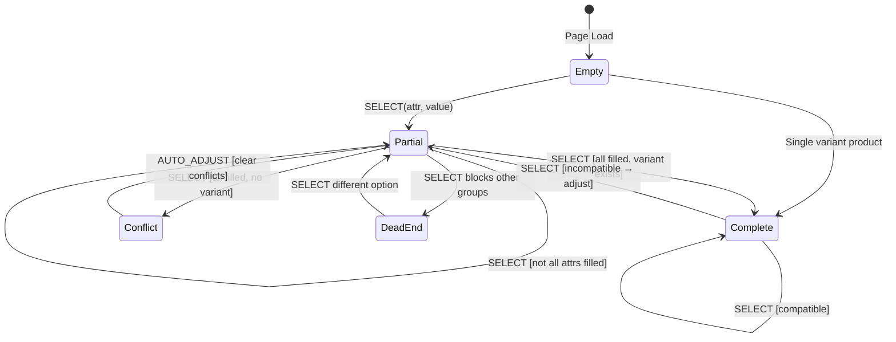
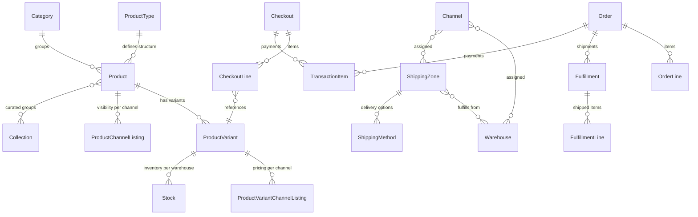

# Saleor Paper Storefront — Agent Reference (v4.1.0)

This is a compiled, self-contained reference document for AI agents working on the Saleor Paper Storefront. It concatenates all 16 rule files and all 5 reference files from the `saleor-paper-storefront` skill into a single document.

**For agents that support the skill/rules system**, use the individual rule files in `rules/` and `references/` instead — they are the canonical source.

---

## Table of Contents

### Data Layer (CRITICAL)

- [Data Caching](#data-caching)
- [Data GraphQL](#data-graphql)
- [Data Error Handling](#data-error-handling)
- [Auth Patterns](#auth-patterns)
- [Webhook Handlers](#webhook-handlers)

### Product Pages (HIGH)

- [Product Detail Page](#product-detail-page)
- [Variant Selection](#variant-selection)
- [Product Filtering](#product-filtering)

### Checkout Flow (HIGH)

- [Checkout Management](#checkout-management)
- [Cart Management](#cart-management)

### UI & Channels (MEDIUM)

- [UI Components](#ui-components)
- [Channels & Multi-Currency](#channels--multi-currency)

### SEO (MEDIUM)

- [SEO & Metadata](#seo--metadata)

### Development (MEDIUM)

- [Saleor API Investigation](#saleor-api-investigation)
- [Testing Strategy & Conventions](#testing-strategy--conventions)
- [Adding a New Page](#adding-a-new-page)

### References

- [Saleor Domain Model](#saleor-domain-model)
- [Saleor Glossary](#saleor-glossary)
- [Saleor Core Key Directories](#saleor-core-key-directories)
- [Variant Selection State Machine](#variant-selection-state-machine)
- [Variant Selection Utilities Reference](#variant-selection-utilities-reference)

---

---

# Data Layer (CRITICAL)

---

## Data Caching

Understanding the caching architecture, Cache Components (PPR), and revalidation mechanisms ensures correct data freshness, avoids stale content, and enables targeted cache invalidation when Saleor data changes.

> **Reference**: [Next.js Cache Components](https://nextjs.org/docs/app/getting-started/cache-components) — the official documentation for `use cache`, `cacheLife`, `cacheTag`, and Partial Prerendering.

---

### Data Freshness Model

#### The Key Principle

> **Display pages are cached for performance. Transactional flows are always real-time.**

| Page/Component                | Data Source                                 | Freshness              | Why                         |
| ----------------------------- | ------------------------------------------- | ---------------------- | --------------------------- |
| **PDP (Product Detail)**      | `getProductData()`                          | ⚠️ Cached (5 min TTL)  | Performance - instant loads |
| **Category/Collection pages** | `getCategoryData()` / `getCollectionData()` | ⚠️ Cached (5 min TTL)  | Performance                 |
| **Homepage**                  | `getFeaturedProducts()`                     | ⚠️ Cached (5 min TTL)  | Performance                 |
| **Navigation**                | `NavLinks`                                  | ⚠️ Cached (1 hour TTL) | Rarely changes              |
| **Cart Drawer**               | `Checkout.find()`                           | ✅ Always fresh        | Uses `cache: "no-cache"`    |
| **Checkout Page**             | `useCheckoutQuery()`                        | ✅ Always fresh        | Direct API call via urql    |
| **Add to Cart action**        | Saleor mutation                             | ✅ Always fresh        | Saleor calculates price     |

#### Price Flow Diagram

```
┌─────────────────────────────────────────────────────────────────────┐
│                         PRICE FLOW                                  │
├─────────────────────────────────────────────────────────────────────┤
│                                                                     │
│   PDP Display          Cart/Checkout          Payment               │
│   ────────────         ─────────────          ───────               │
│                                                                     │
│   ┌───────────┐        ┌───────────┐         ┌───────────┐         │
│   │  Cached   │───────▶│  FRESH    │────────▶│  FRESH    │         │
│   │  $29.99   │  Add   │  $35.99   │  Pay    │  $35.99   │         │
│   └───────────┘  to    └───────────┘         └───────────┘         │
│                  Cart                                               │
│   "use cache"          cache:"no-cache"      Saleor validates       │
│   5 min TTL            Always from API       at checkout            │
│                                                                     │
└─────────────────────────────────────────────────────────────────────┘

⚠️ User may see different price in cart than on PDP if price changed.
✅ User CANNOT checkout at stale price - Saleor always uses current price.
```

#### Why This Is Safe

1. **Saleor is the source of truth**: When you call `checkoutLinesAdd`, Saleor calculates the price server-side using current data
2. **Cart always fetches fresh**: `Checkout.find()` uses `cache: "no-cache"`
3. **Checkout validates**: `checkoutComplete` will fail if something is wrong
4. **Webhooks enable instant updates**: When configured, price changes trigger immediate cache invalidation

---

### Cache Components Architecture

#### What It Is

Cache Components enable **Partial Prerendering (PPR)** - mixing static, cached, and dynamic content in a single route. The static shell is served instantly from CDN, while dynamic parts stream in via Suspense.

#### Current Status: ✅ ENABLED (Experimental)

> ⚠️ **Note**: Cache Components are still marked **experimental** in Next.js. The patterns are functional but evolving. See [Disabling Cache Components](#disabling-cache-components) if you need to rollback.

Cache Components are enabled in `next.config.js`:

```javascript
const config = {
	cacheComponents: true,
};
```

#### How It Works

```
┌─────────────────────────────────────────────────────────────────┐
│  STATIC SHELL (Instant from CDN)                                │
│  ┌─────────────────────────────────────────────────────────┐   │
│  │  Header skeleton, layout, cached product data            │   │
│  │  Source: "use cache" functions (getProductData, etc.)    │   │
│  └─────────────────────────────────────────────────────────┘   │
│                                                                 │
│  ┌─────────────────────────────────────────────────────────┐   │
│  │  <Suspense fallback={<Skeleton />}>                     │   │
│  │    Dynamic content (streams in after initial render)     │   │
│  │    - Variant selection (reads searchParams)              │   │
│  │    - Logo, NavLinks (use usePathname)                    │   │
│  │    - Cart count (reads cookies)                          │   │
│  │  </Suspense>                                             │   │
│  └─────────────────────────────────────────────────────────┘   │
└─────────────────────────────────────────────────────────────────┘
```

#### Cached Functions with Tags

Each cached function has a **tag** for targeted invalidation:

```typescript
// src/app/[channel]/(main)/products/[slug]/page.tsx
async function getProductData(slug: string, channel: string) {
	"use cache";
	cacheLife("minutes"); // 5 min default TTL
	cacheTag(`product:${slug}`); // Tag for webhook invalidation

	return executePublicGraphQL(ProductDetailsDocument, {
		variables: { slug, channel },
	});
}
```

#### Tag Registry

| Tag Pattern         | Used By                                        | Invalidated When          |
| ------------------- | ---------------------------------------------- | ------------------------- |
| `product:{slug}`    | `getProductData()`                             | Product updated in Saleor |
| `category:{slug}`   | `getCategoryData()`                            | Category updated          |
| `collection:{slug}` | `getCollectionData()`, `getFeaturedProducts()` | Collection updated        |
| `navigation`        | `NavLinks`                                     | Menu structure changed    |
| `footer-menu`       | `getFooterMenu()`                              | Footer menu changed       |
| `channels`          | `getChannels()`                                | Channel list changed      |

---

### Key Patterns

#### 1. Suspense Around Dynamic Content

Any component accessing runtime data must be wrapped in Suspense.

**What counts as "dynamic data" (triggers Suspense requirement):**

| Data Access                 | Why It's Dynamic    |
| --------------------------- | ------------------- |
| `cookies()`                 | Per-request         |
| `headers()`                 | Per-request         |
| `searchParams`              | URL-dependent       |
| `usePathname()`             | Client-side routing |
| `useParams()`               | Client-side routing |
| `Date.now()`                | Time-dependent      |
| Server Actions              | Form submissions    |
| `cache: "no-cache"` fetches | Always fresh        |

```tsx
// Layout wraps children in Suspense
<main className="flex-1">
  <Suspense>{props.children}</Suspense>
</main>

// Header wraps NavLinks in Suspense (uses usePathname for active state)
<Suspense fallback={<NavLinksSkeleton />}>
  <NavLinks channel={channel} />
</Suspense>
```

#### 2. Sync Page Shell Pattern (CRITICAL)

Page components that use `"use cache"` data must be **synchronous** and wrap their async content in a **dedicated Suspense boundary**. This prevents the cached async work from flowing through the layout's main Suspense, which can cause hydration/reconciliation issues.

```tsx
// ✅ CORRECT - Page is sync, async content has its own Suspense
export default function Page(props: PageProps) {
	return (
		<Suspense fallback={<PageSkeleton />}>
			<PageContent params={props.params} />
		</Suspense>
	);
}

async function PageContent({ params: paramsPromise }) {
	const params = await paramsPromise;
	const data = await getCachedData(params.slug, params.channel);
	return <ProductList products={data} />;
}
```

```tsx
// ❌ BAD - async Page relies on layout's Suspense for streaming
export default async function Page(props: PageProps) {
	const params = await props.params;
	const data = await getCachedData(params.slug, params.channel);
	return <ProductList products={data} />;
}
```

**Why**: When Cache Components are enabled, the boundary between the static shell and streamed content is determined by Suspense boundaries. If the page itself is async and relies on the layout's `<Suspense>{children}</Suspense>`, the reconciliation between the static shell and the streamed RSC payload happens at the layout level, which can cause DOM structure mismatches and memory issues. A dedicated page-level Suspense isolates this boundary.

All page routes in this project follow this pattern:

- `src/app/[channel]/(main)/page.tsx` (homepage)
- `src/app/[channel]/(main)/categories/[slug]/page.tsx`
- `src/app/[channel]/(main)/collections/[slug]/page.tsx`
- `src/app/[channel]/(main)/products/[slug]/page.tsx`

#### 3. Public vs Authenticated Queries

Two explicit GraphQL helpers:

- `executePublicGraphQL` - Safe inside `"use cache"` (no cookies needed)
- `executeAuthenticatedGraphQL` - NOT safe inside `"use cache"` (requires cookies)

```typescript
import { executePublicGraphQL, executeAuthenticatedGraphQL } from "@/lib/graphql";

// ✅ Public data - safe inside "use cache"
async function getProductData(slug: string, channel: string) {
	"use cache";
	return executePublicGraphQL(ProductDetailsDocument, {
		variables: { slug, channel },
	});
}

// ✅ User data - NOT inside "use cache" (requires cookies)
const { me } = await executeAuthenticatedGraphQL(CurrentUserDocument, {
	cache: "no-cache",
});
```

#### 4. Don't Use `searchParams` Inside `"use cache"`

```typescript
// ❌ BAD - searchParams is runtime data
export async function generateMetadata(props) {
	"use cache";
	const searchParams = await props.searchParams; // Error!
}

// ✅ GOOD - Only access params (becomes cache key)
export async function generateMetadata(props) {
	"use cache";
	const params = await props.params; // OK
}

// ✅ GOOD - Access searchParams outside cache scope
export async function generateMetadata(props) {
	const searchParams = await props.searchParams; // No "use cache"
}
```

#### 5. CSS Order Pattern for Mixed Static/Dynamic Layouts

When you need dynamic content to appear **above** static content visually, use CSS `order`:

```tsx
// PDP: Category (dynamic) appears above Product Name (static)
<div className="flex flex-col gap-3">
	{/* Static shell - renders first but order:2 */}
	<h1 className="order-2">{product.name}</h1>

	{/* Dynamic - streams in, order:1 appears above h1 */}
	<Suspense fallback={<Skeleton className="order-1" />}>
		<VariantSection /> {/* Contains order-1 and order-3 elements */}
	</Suspense>

	{/* Static - order:4 appears last */}
	<div className="order-4">
		<ProductAttributes />
	</div>
</div>
```

**Visual result:**

```
1. Category + Sale badge  (dynamic, order-1)
2. Product Name           (static, order-2)
3. Variant selectors      (dynamic, order-3)
4. Product details        (static, order-4)
```

This keeps `<h1>` in the static shell for SEO while allowing dynamic content to appear above it.

#### 6. GraphQL Auth Defaults

Two explicit GraphQL helpers ensure you always know what data access level you're using:

- `executePublicGraphQL` - Public queries only (products, menus, categories)
- `executeAuthenticatedGraphQL` - Requires user session cookies (checkout, user data)

This ensures:

- Only publicly visible products are fetched
- No user cookies in cache scope (safe for `"use cache"`)
- No "Signature has expired" errors on public pages

```typescript
import { executePublicGraphQL, executeAuthenticatedGraphQL } from "@/lib/graphql";

// ✅ Public data (menus, products) - no auth, only public data
const menu = await executePublicGraphQL(MenuDocument, {
	variables: { slug: "footer" },
});

// ✅ User data - requires session cookies
let user = null;
try {
	const result = await executeAuthenticatedGraphQL(CurrentUserDocument, {
		cache: "no-cache",
	});
	user = result.me;
} catch {
	// Expired token = treat as not logged in
}

// ✅ Checkout/cart - requires session cookies
await executeAuthenticatedGraphQL(CheckoutAddLineDocument, {
	variables: { id: checkoutId, productVariantId: variantId },
	cache: "no-cache",
});

// ✅ App token (server-side only) - explicit header
const channels = await executePublicGraphQL(ChannelsListDocument, {
	headers: {
		Authorization: `Bearer ${process.env.SALEOR_APP_TOKEN}`,
	},
});
```

---

### Cache Invalidation

#### Automatic via Webhooks (Recommended)

When configured, Saleor sends webhooks on data changes, triggering instant invalidation.

**Setup in Saleor Dashboard:**

1. Go to **Configuration → Webhooks**
2. Create webhook pointing to: `https://your-site.com/api/revalidate`
3. Subscribe to events:
   - `PRODUCT_CREATED`, `PRODUCT_UPDATED`, `PRODUCT_DELETED`
   - `CATEGORY_CREATED`, `CATEGORY_UPDATED`, `CATEGORY_DELETED`
   - `COLLECTION_CREATED`, `COLLECTION_UPDATED`, `COLLECTION_DELETED`
4. Copy the **secret key** to `SALEOR_WEBHOOK_SECRET` env var

**What happens on webhook:**

```typescript
// Product update webhook triggers:
revalidateTag(`product:${slug}`, "minutes"); // Invalidates "use cache" data
revalidatePath(`/channel/products/${slug}`); // Invalidates ISR page
```

#### Manual Invalidation

```bash
# Invalidate a specific product (both tag and path)
curl "https://store.com/api/revalidate?secret=xxx&tag=product:blue-hoodie&path=/default-channel/products/blue-hoodie"

# Invalidate just the cached function data
curl "https://store.com/api/revalidate?secret=xxx&tag=product:blue-hoodie"

# Invalidate navigation (uses "hours" profile)
curl "https://store.com/api/revalidate?secret=xxx&tag=navigation&profile=hours"
```

#### No Webhooks? TTL Takes Over

| Data        | Default TTL |
| ----------- | ----------- |
| Products    | 5 minutes   |
| Categories  | 5 minutes   |
| Collections | 5 minutes   |
| Navigation  | 1 hour      |

---

### Environment Variables

```env
# Cache invalidation
REVALIDATE_SECRET=your-secret       # Manual revalidation (GET requests)
SALEOR_WEBHOOK_SECRET=webhook-hmac  # Saleor webhook HMAC verification
```

---

### Debugging Stale Content

#### Checklist

1. **Is the webhook configured?**

   - Check Saleor Dashboard → Webhooks → Deliveries

2. **Did the webhook fire?**

   - Check server logs for `[Revalidate]` entries

3. **Is the tag correct?**

   - Product slugs must match exactly: `product:blue-hoodie`

4. **Force manual revalidation:**

   ```bash
   curl "https://store.com/api/revalidate?secret=xxx&tag=product:my-product"
   ```

5. **Check browser cache:**
   - Hard refresh: Cmd+Shift+R / Ctrl+Shift+R

---

### Anti-patterns

❌ **Don't use `cache: "no-cache"` for display pages** - Destroys performance  
❌ **Don't skip webhook setup in production** - Users see stale prices  
❌ **Don't access cookies/searchParams inside `"use cache"`** - Will error  
❌ **Don't use `executeAuthenticatedGraphQL` inside `"use cache"`** - Requires cookies  
❌ **Don't expose `REVALIDATE_SECRET`** - Keep it server-side only  
❌ **Don't make page components async when using `"use cache"` data** - Use the sync page shell pattern (see Key Pattern #2) to avoid reconciliation issues with the layout's main Suspense boundary

---

### Disabling Cache Components

If you need to rollback to standard ISR caching:

#### Step 1: Disable in Config

```javascript
// next.config.js
const config = {
	cacheComponents: false, // or comment out entirely
};
```

#### Step 2: Remove Cache Directives

Remove `"use cache"`, `cacheLife()`, and `cacheTag()` from these files:

| File                                                   | What to Remove                           |
| ------------------------------------------------------ | ---------------------------------------- |
| `src/app/[channel]/(main)/products/[slug]/page.tsx`    | `getProductData()` cache directives      |
| `src/app/[channel]/(main)/categories/[slug]/page.tsx`  | `getCategoryData()` cache directives     |
| `src/app/[channel]/(main)/collections/[slug]/page.tsx` | `getCollectionData()` cache directives   |
| `src/app/[channel]/(main)/page.tsx`                    | `getFeaturedProducts()` cache directives |
| `src/ui/components/nav/components/nav-links.tsx`       | Navigation cache directives              |

#### Step 3: Update Revalidation

```typescript
// src/app/api/revalidate/route.ts
// Change from:
revalidateTag(`product:${slug}`, "minutes");
// To:
revalidateTag(`product:${slug}`); // Remove second argument
```

#### What You Can Keep

- **Suspense boundaries** - Still useful for loading states
- **CSS order layout** - Pure CSS, no impact
- **`executeAuthenticatedGraphQL`** - Good separation regardless
- **ISR via `revalidate` option** - Works as fallback

---

### Files Reference

| File                                                   | Purpose                                  |
| ------------------------------------------------------ | ---------------------------------------- |
| `src/app/api/revalidate/route.ts`                      | Webhook endpoint and manual revalidation |
| `src/app/[channel]/(main)/products/[slug]/page.tsx`    | PDP with "use cache"                     |
| `src/app/[channel]/(main)/categories/[slug]/page.tsx`  | Category with "use cache"                |
| `src/app/[channel]/(main)/collections/[slug]/page.tsx` | Collection with "use cache"              |
| `src/app/[channel]/(main)/page.tsx`                    | Homepage with "use cache"                |
| `src/ui/components/pdp/variant-section-dynamic.tsx`    | Dynamic variant section                  |
| `src/ui/components/header.tsx`                         | Header with Suspense boundaries          |
| `src/lib/checkout.ts`                                  | Cart operations (always fresh)           |
| `next.config.js`                                       | `cacheComponents: true`                  |

---

## Data GraphQL

Modifying GraphQL queries and regenerating types correctly ensures type safety, avoids permission errors, and keeps storefront and checkout data in sync with the Saleor schema. The execution layer in `src/lib/graphql.ts` provides typed error handling, rate limiting, and retry logic.

> **Sources**:
>
> - [Saleor API Reference](https://docs.saleor.io/api-reference) - GraphQL schema and field permissions
> - [graphql-codegen](https://the-guild.dev/graphql/codegen) - Type generation

---

### File Locations

| Purpose                           | Location                         | Generated Types                   | Regenerate With          |
| --------------------------------- | -------------------------------- | --------------------------------- | ------------------------ |
| Storefront (products, cart, etc.) | `src/graphql/*.graphql`          | `src/gql/`                        | `pnpm generate`          |
| Checkout flow                     | `src/checkout/graphql/*.graphql` | `src/checkout/graphql/generated/` | `pnpm generate:checkout` |
| GraphQL execution & types         | `src/lib/graphql.ts`             | N/A (hand-written)                | N/A                      |
| Fetch retry (urql client)         | `src/lib/fetch-retry.ts`         | N/A                               | N/A                      |

> **Note**: Checkout uses urql (client-side), storefront uses Next.js fetch (server-side). That's why they have separate codegen setups.

---

### Making Changes

Edit the `.graphql` file. Example - adding a field:

```graphql
query ProductDetails($slug: String!, $channel: String!) {
	product(slug: $slug, channel: $channel) {
		id
		name
		newField # Add your field here
	}
}
```

---

### Regenerating Types (CRITICAL)

```bash
# For storefront queries (src/graphql/*.graphql)
pnpm run generate

# For checkout queries (src/checkout/graphql/*.graphql)
pnpm run generate:checkout
```

This regenerates TypeScript types. **Always run the appropriate command after any GraphQL change.**

- `src/gql/` - Storefront types (DO NOT EDIT)
- `src/checkout/graphql/generated/` - Checkout types (DO NOT EDIT)

---

### Execution Functions — Decision Tree

The project provides three execution functions. Choose based on context:

```
Need to run a GraphQL operation?
├─ Is this a server component or server action?
│   ├─ Does it need user authentication (checkout, orders, profile)?
│   │   └─ executeAuthenticatedGraphQL()
│   └─ Is it public data (products, categories, menus)?
│       └─ executePublicGraphQL()
└─ Is this an API route (src/app/api/)?
    └─ executeRawGraphQL()
```

#### `executePublicGraphQL` — Public data, no auth

```typescript
import { ProductDetailsDocument } from "@/gql/graphql";
import { executePublicGraphQL } from "@/lib/graphql";

const result = await executePublicGraphQL(ProductDetailsDocument, {
	variables: { slug, channel },
	revalidate: 60,
});

if (!result.ok) {
	// Handle error — see data-error-handling rule
	throw new Error(result.error.message);
}

const { product } = result.data;
```

Use for: product listings, product details, categories, collections, menus, search.

#### `executeAuthenticatedGraphQL` — User-scoped data, with auth

```typescript
import { CurrentUserDocument } from "@/gql/graphql";
import { executeAuthenticatedGraphQL } from "@/lib/graphql";

const result = await executeAuthenticatedGraphQL(CurrentUserDocument, {
	cache: "no-cache",
});

if (!result.ok) {
	// Auth failed or user not logged in — handle gracefully
	return null;
}

const { me } = result.data;
```

Use for: current user queries, orders, addresses, checkout mutations (add to cart, update lines).

**Auth fallback behavior**: If the server-side auth client throws a `DYNAMIC_SERVER_USAGE` error (e.g., during static generation when `cookies()` isn't available), it automatically falls back to an unauthenticated fetch. This prevents build failures for pages that may or may not have a logged-in user.

#### `executeRawGraphQL` — API routes without codegen

```typescript
import { executeRawGraphQL, asValidationError, getUserMessage } from "@/lib/graphql";

const result = await executeRawGraphQL<AccountRegisterResult>({
	query: REGISTER_MUTATION,
	variables: { input: { email, password, channel, redirectUrl } },
});

if (!result.ok) {
	return NextResponse.json(
		{ errors: [{ message: getUserMessage(result.error) }] },
		{ status: result.error.type === "network" ? 503 : 400 },
	);
}

// Check Saleor domain validation errors
const { accountRegister } = result.data;
if (accountRegister?.errors?.length) {
	const validationResult = asValidationError(accountRegister.errors);
	return NextResponse.json({ errors: validationResult.error.validationErrors }, { status: 400 });
}
```

Use for: auth API routes (`/api/auth/register`, `/api/auth/reset-password`, `/api/auth/set-password`) where inline GraphQL strings are used instead of codegen documents.

---

### GraphQLResult<T> — Typed Error Handling

All execution functions return `GraphQLResult<T>`, never throw. Always check `result.ok` before accessing data.

```typescript
type GraphQLResult<T> = GraphQLSuccess<T> | GraphQLFailure;

interface GraphQLSuccess<T> {
	ok: true;
	data: T;
}
interface GraphQLFailure {
	ok: false;
	error: GraphQLError;
}
```

The 4 error types (in order of occurrence):

| Type         | Meaning                            | `isRetryable`   | Example                          |
| ------------ | ---------------------------------- | --------------- | -------------------------------- |
| `network`    | Failed to reach server             | `true`          | Timeout, DNS, connection refused |
| `http`       | Server responded with error status | 5xx/429: `true` | HTTP 500, HTTP 429               |
| `graphql`    | Query syntax or validation errors  | `false`         | Unknown field, type mismatch     |
| `validation` | Saleor domain errors               | `false`         | "Email already exists"           |

Helper functions:

- `getUserMessage(error)` — Returns a user-friendly string for each error type
- `asValidationError(errors)` — Converts Saleor mutation `errors[]` into a `GraphQLFailure` with structured `validationErrors`

> **Full error handling patterns**: See `data-error-handling` rule

---

### Request Queue & Rate Limiting

All typed execution functions (`executePublicGraphQL`, `executeAuthenticatedGraphQL`) are automatically queued through a `RequestQueue`:

- **Max concurrent requests**: 3 (configurable via `SALEOR_MAX_CONCURRENT_REQUESTS`)
- **Min delay between requests**: 200ms (configurable via `SALEOR_MIN_REQUEST_DELAY_MS`)
- **Retry**: Exponential backoff on network errors, timeouts, HTTP 429/5xx
- **Timeout**: 15s per request (configurable via `SALEOR_REQUEST_TIMEOUT_MS`)
- **Build retries**: Override retry count with `NEXT_BUILD_RETRIES` env var

The retry logic respects `Retry-After` headers from Saleor's rate limiter.

> **Note**: `executeRawGraphQL` does NOT use the request queue — it's designed for API routes where the queue overhead isn't needed.

---

### Mutation Authoring Patterns

#### Checkout mutations (codegen)

Checkout mutations live in `src/checkout/graphql/*.graphql` and always include an `errors` block:

```graphql
mutation transactionInitialize(
	$checkoutId: ID!
	$action: TransactionFlowStrategyEnum
	$paymentGateway: PaymentGatewayToInitialize!
	$amount: PositiveDecimal
) {
	transactionInitialize(id: $checkoutId, action: $action, paymentGateway: $paymentGateway, amount: $amount) {
		transaction {
			id
			actions
		}
		transactionEvent {
			message
			type
		}
		data
		errors {
			field
			code
			message
		}
	}
}
```

#### API route mutations (raw)

API route mutations use inline strings with `executeRawGraphQL`:

```typescript
const REGISTER_MUTATION = `
  mutation AccountRegister($input: AccountRegisterInput!) {
    accountRegister(input: $input) {
      user { id email }
      errors { field message code }
    }
  }
`;
```

**Always include `errors { field message code }` in every mutation** — this is how Saleor reports domain validation errors (as opposed to GraphQL-level errors).

---

### Server Actions with GraphQL

Server Actions are the mutation layer for the storefront. They compose `executeAuthenticatedGraphQL` or `executePublicGraphQL` with cache revalidation.

#### Where Actions Live

| Pattern                    | Location                                                                | When to Use                                                        |
| -------------------------- | ----------------------------------------------------------------------- | ------------------------------------------------------------------ |
| Inline in Server Component | Same file as page/component                                             | One-off actions tied to a specific page (e.g., add-to-cart on PDP) |
| Separate `actions.ts` file | Co-located with page (e.g., `src/app/[channel]/(main)/cart/actions.ts`) | Shared across components or reused                                 |
| Root actions               | `src/app/actions.ts`                                                    | App-wide actions (e.g., logout)                                    |

#### Standard Pattern

```typescript
"use server";

import { revalidatePath } from "next/cache";
import { executeAuthenticatedGraphQL } from "@/lib/graphql";
import { SomeMutationDocument } from "@/gql/graphql";

export async function myAction(input: MyInput) {
	const result = await executeAuthenticatedGraphQL(SomeMutationDocument, {
		variables: { ...input },
		cache: "no-cache", // Always no-cache for mutations
	});

	if (!result.ok) {
		console.error("Action failed:", result.error.message);
		return; // Return nothing — UI updates via revalidation
	}

	revalidatePath("/affected-page");
}
```

Key conventions:

- Always pass `cache: "no-cache"` for mutations
- Check `result.ok` before accessing data
- Call `revalidatePath()` after successful mutations to sync cache
- Log errors server-side; return silently (UI updates via revalidation)
- Use `executeAuthenticatedGraphQL` for user-scoped mutations (cart, checkout, orders)

#### Inline Server Action (in Server Component)

```typescript
// src/ui/components/pdp/variant-section-dynamic.tsx
export async function VariantSectionDynamic({ product, channel }: Props) {
	async function addToCart() {
		"use server";

		const checkout = await Checkout.findOrCreate({
			checkoutId: await Checkout.getIdFromCookies(channel),
			channel,
		});
		if (!checkout) {
			console.error("Add to cart: Failed to create checkout");
			return;
		}

		const result = await executeAuthenticatedGraphQL(CheckoutAddLineDocument, {
			variables: { id: checkout.id, productVariantId: selectedVariantID },
			cache: "no-cache",
		});

		if (!result.ok) {
			console.error("Add to cart failed:", result.error.message);
			return;
		}

		revalidatePath("/cart");
	}

	return <form action={addToCart}>...</form>;
}
```

#### Calling Server Actions from Client Components

```typescript
// Pattern 1: Form action (simplest)
<form action={serverAction}>
	<button type="submit">Submit</button>
</form>

// Pattern 2: useTransition for loading state
"use client";
import { useTransition } from "react";
import { deleteCartLine } from "./actions";

function DeleteButton({ checkoutId, lineId }: Props) {
	const [isPending, startTransition] = useTransition();

	return (
		<button
			onClick={() => startTransition(() => deleteCartLine(checkoutId, lineId))}
			aria-disabled={isPending}
		>
			{isPending ? "Removing..." : "Remove"}
		</button>
	);
}
```

#### Revalidation After Mutations

```typescript
import { revalidatePath } from "next/cache";

// Revalidate specific pages affected by the mutation
revalidatePath("/cart"); // After cart modifications
revalidatePath("/"); // After changes that affect home page (cart badge count)
```

The webhook handler (`src/app/api/revalidate/`) also uses tag-based revalidation (`revalidateTag`) for Saleor-triggered cache invalidation — see `data-caching` rule.

---

### Checking the Saleor Schema

To confirm field names, types, nullability, or enum values, search the generated types file:

```bash
# Full schema types, generated from your running Saleor instance
grep -A 20 "^export type Product " src/gql/graphql.ts

# Check an enum
grep -A 10 "^export enum StockAvailability" src/gql/graphql.ts

# Check an input type
grep -A 30 "^export type ProductFilterInput" src/gql/graphql.ts
```

This file is generated by `pnpm generate` via API introspection, so it always matches your exact Saleor version. It contains the **full schema** (all types, enums, inputs), not just the ones used in declared queries.

### Common Issues

#### Permission Errors

If you see:

```
"To access this path, you need one of the following permissions: MANAGE_..."
```

The field requires admin permissions and isn't available to anonymous/customer tokens. Either remove it from the storefront query, or fetch it server-side with `SALEOR_APP_TOKEN` and the required permission.

#### Nullable Fields

Saleor's schema has many nullable fields. Handle nulls intentionally -- use optional chaining with a fallback for display values, but guard or throw when null signals a real problem:

```typescript
// Display value with fallback
const name = product.category?.name ?? "Uncategorized";

// Guard when null means something is wrong
if (!product.defaultVariant) {
	throw new Error(`Product ${product.slug} has no default variant`);
}
```

#### DYNAMIC_SERVER_USAGE During Build

If you see `DYNAMIC_SERVER_USAGE` errors during `next build`, it means a page using `executeAuthenticatedGraphQL` is being statically generated. The auth client calls `cookies()`, which requires dynamic rendering. The execution layer handles this automatically by falling back to unauthenticated fetch, but if you need auth data, ensure the page uses `export const dynamic = "force-dynamic"`.

---

### Anti-patterns

- **Don't edit generated files** (`src/gql/` or `src/checkout/graphql/generated/`)
- **Don't forget to regenerate types** - Run the appropriate `generate` command
- **Don't assume fields are non-null** - Check generated types and handle nulls explicitly
- **Don't mix up the two codegen setups** - Storefront ≠ Checkout
- **Don't destructure result directly** - Always check `result.ok` first: `if (!result.ok) { ... }`
- **Don't omit `errors { field message code }` from mutations** - This is how Saleor reports domain errors
- **Don't retry validation errors** - They are `isRetryable: false` by design

---

## Data Error Handling

Consistent, layered error handling prevents raw GraphQL errors from reaching users, ensures retryable failures are retried, and gives developers structured information for debugging. All GraphQL execution functions return `GraphQLResult<T>` — never throw.

> **Key file**: `src/lib/graphql.ts` — All types, helpers, and execution functions

---

### The 4 Error Layers

Errors occur in a strict order. Later layers only happen if earlier ones succeeded:

```
1. network  →  2. http  →  3. graphql  →  4. validation
   (fetch)      (status)    (GQL errors)   (domain errors)
```

| Layer        | When                                       | `isRetryable` | User Message                              |
| ------------ | ------------------------------------------ | ------------- | ----------------------------------------- |
| `network`    | Can't reach server (timeout, DNS, offline) | `true`        | "Unable to connect to the store..."       |
| `http`       | Server responded with 4xx/5xx              | 5xx/429 only  | Varies by status code                     |
| `graphql`    | Query syntax/validation errors in response | `false`       | "Something went wrong loading this page." |
| `validation` | Saleor domain errors (e.g. "email exists") | `false`       | The actual error message from Saleor      |

---

### Server-Side: GraphQLResult<T> Pattern

All three execution functions return `GraphQLResult<T>`:

```typescript
const result = await executePublicGraphQL(ProductDetailsDocument, {
	variables: { slug, channel },
});

// ALWAYS check result.ok first
if (!result.ok) {
	// result.error has: type, message, isRetryable, statusCode?, validationErrors?
	console.error(`GraphQL error (${result.error.type}):`, result.error.message);
	return null;
}

// Safe to access data
const { product } = result.data;
```

#### User-Facing Error Messages

Use `getUserMessage()` to convert technical errors into user-friendly text:

```typescript
import { getUserMessage } from "@/lib/graphql";

if (!result.ok) {
	const userMessage = getUserMessage(result.error);
	// Returns contextual messages like:
	// network  → "Unable to connect to the store. Please check your internet connection."
	// http 401 → "You don't have permission to view this content."
	// http 5xx → "The store is temporarily unavailable. Please try again in a moment."
	// graphql  → "Something went wrong loading this page."
	// validation → The actual error message (e.g. "Email already registered")
}
```

#### Handling Saleor Validation Errors

Saleor mutations return domain errors in the response `errors[]` field (not as GraphQL errors). Use `asValidationError()` to convert them:

```typescript
import { executeRawGraphQL, asValidationError, getUserMessage } from "@/lib/graphql";

const result = await executeRawGraphQL<AccountRegisterResult>({
	query: REGISTER_MUTATION,
	variables: { input: { email, password } },
});

// Step 1: Check for transport/GraphQL errors
if (!result.ok) {
	return NextResponse.json(
		{ errors: [{ message: getUserMessage(result.error) }] },
		{ status: result.error.type === "network" ? 503 : 400 },
	);
}

// Step 2: Check for Saleor domain validation errors
const { accountRegister } = result.data;
if (accountRegister?.errors?.length) {
	const validationResult = asValidationError(accountRegister.errors);
	// validationResult.error.validationErrors is a structured array:
	// [{ field: "email", message: "This email is already registered", code: "UNIQUE" }]
	return NextResponse.json({ errors: validationResult.error.validationErrors }, { status: 400 });
}
```

---

### Client-Side: Checkout Error Handling (urql)

The checkout flow uses urql (client-side) with a different error extraction pattern:

#### `extractMutationErrors` — urql mutation results

From `saleor-storefront/src/checkout/hooks/useSubmit/utils.ts`:

```typescript
const { hasErrors, apiErrors, graphqlErrors } = extractMutationErrors<FormData, typeof mutation>(result);

if (hasErrors) {
	// apiErrors: Saleor domain errors from mutation.errors[]
	// graphqlErrors: CombinedError from urql (network/schema errors)
}
```

#### `useErrorMessages` — Error code to message mapping

From `saleor-storefront/src/checkout/hooks/useErrorMessages/useErrorMessages.ts`:

Maps Saleor error codes to user-friendly strings:

| Error Code                 | Message                                       |
| -------------------------- | --------------------------------------------- |
| `invalid`                  | "Invalid value"                               |
| `required`                 | "Required field"                              |
| `passwordTooShort`         | "Password must be at least 8 characters."     |
| `insufficientStock`        | "Not enough of chosen item in stock."         |
| `invalidCredentials`       | "Invalid credentials provided at login."      |
| `quantityGreaterThanLimit` | "Chosen quantity is more than limit allowed." |

---

### Error Handling by Context

| Context                 | Function                      | Error Handling                               |
| ----------------------- | ----------------------------- | -------------------------------------------- |
| Server component        | `executePublicGraphQL`        | Check `result.ok`, show fallback UI          |
| Server action (cart)    | `executeAuthenticatedGraphQL` | Check `result.ok`, return error to client    |
| API route (auth)        | `executeRawGraphQL`           | Check `result.ok` + mutation `errors[]`      |
| Checkout (urql, client) | urql `useMutation`            | `extractMutationErrors` + `useErrorMessages` |

---

### Legacy Exports

```typescript
/** @deprecated Use Result pattern instead */
export class SaleorError extends Error { ... }
```

The `SaleorError` class is kept for gradual migration from throw-based to Result-based error handling. New code should use `GraphQLResult<T>`.

---

### Anti-patterns

- **Don't destructure result without checking `ok`** — `const { data } = await execute(...)` will crash on errors
- **Don't show raw GraphQL errors to users** — Use `getUserMessage()` for user-facing text
- **Don't retry validation errors** — They are `isRetryable: false`; the user must fix their input
- **Don't swallow errors silently** — Always log or surface them. A bare `catch {}` hides bugs
- **Don't check for errors inconsistently** — Every call site should handle both transport errors (`!result.ok`) and mutation validation errors (`data.mutationName.errors[]`)
- **Don't expose Saleor internals in API responses** — Log error details server-side, return `getUserMessage()` to the client

---

## Auth Patterns

Authentication spans client-side (urql + cookie storage) and server-side (Next.js cookies + `fetchWithAuth`). Understanding the token flow, cookie encoding, and auth fallback behavior prevents login bugs, stale sessions, and build failures.

> **Key dependency**: `@saleor/auth-sdk` — Provides `createSaleorAuthClient`, `SaleorAuthProvider`, `useAuthChange`

---

### Architecture Overview

```
┌──────────────────────────────────────────────────────────────────────┐
│                       AUTH ARCHITECTURE                               │
├──────────────────────────────────────────────────────────────────────┤
│                                                                      │
│   Client-Side (Browser)              Server-Side (Next.js)           │
│   ─────────────────────              ──────────────────────          │
│                                                                      │
│   SaleorAuthProvider                 getServerAuthClient()           │
│   ├─ createSaleorAuthClient()        ├─ createSaleorAuthClient()    │
│   ├─ clientCookieStorage             ├─ serverCookieStorage          │
│   │  (document.cookie)               │  (next/headers cookies())    │
│   └─ urql client with authFetch      └─ fetchWithAuth()             │
│                                                                      │
│   Shared: Same cookie names via encodeCookieName()                   │
│   Tokens: access (15min) + refresh (7 days) in cookies               │
│                                                                      │
└──────────────────────────────────────────────────────────────────────┘
```

---

### Key Files

| File                                       | Purpose                                      |
| ------------------------------------------ | -------------------------------------------- |
| `src/lib/auth/auth-provider.tsx`           | Client-side SaleorAuthProvider + urql client |
| `src/lib/auth/server.ts`                   | Server-side auth client with cookie storage  |
| `src/lib/auth/constants.ts`                | Token lifetimes, cookie name encoding        |
| `src/app/api/auth/register/route.ts`       | Registration API route                       |
| `src/app/api/auth/reset-password/route.ts` | Password reset request                       |
| `src/app/api/auth/set-password/route.ts`   | Set new password (from reset link)           |

---

### Token Flow

Auth tokens (access: 15min, refresh: 7 days) are stored in cookies. Cookie name encoding and flags are defined in `src/lib/auth/constants.ts`. Both client and server use the same encoding so cookies are shared seamlessly.

> **Security note**: Cookies are NOT HttpOnly because the SDK reads them client-side to set `Authorization` headers. Mitigate XSS risk with strong CSP headers.

---

### Client-Side Auth

#### Login Flow

```
User submits credentials
    → useSaleorAuthContext().signIn(email, password)
    → SDK stores tokens in cookies via clientCookieStorage
    → useAuthChange fires onSignedIn callback
    → New urql client created (picks up new tokens)
    → UI re-renders with authenticated state
```

The `AuthProvider` component (`src/lib/auth/auth-provider.tsx`) wraps the app:

```typescript
export function AuthProvider({ children }: { children: ReactNode }) {
	const [urqlClient, setUrqlClient] = useState<Client>(() => makeUrqlClient());

	useAuthChange({
		saleorApiUrl,
		onSignedOut: () => setUrqlClient(makeUrqlClient()),
		onSignedIn: () => setUrqlClient(makeUrqlClient()),
	});

	return (
		<SaleorAuthProvider client={saleorAuthClient}>
			<UrqlProvider value={urqlClient}>{children}</UrqlProvider>
		</SaleorAuthProvider>
	);
}
```

The urql client uses `saleorAuthClient.fetchWithAuth` wrapped with `withRetry` from `src/lib/fetch-retry.ts` for automatic retry on transient failures.

---

### Server-Side Auth

#### `executeAuthenticatedGraphQL`

Server components and server actions use `executeAuthenticatedGraphQL()`, which:

1. Dynamically imports `getServerAuthClient` from `src/lib/auth/server.ts`
2. Creates a server-side `SaleorAuthClient` with cookie-based storage
3. Uses `fetchWithAuth()` to automatically attach/refresh tokens

```typescript
const result = await executeAuthenticatedGraphQL(CurrentUserDocument, {
	cache: "no-cache",
});
```

#### DYNAMIC_SERVER_USAGE Fallback

During static generation (build time), `cookies()` isn't available. The execution layer catches this and falls back to an unauthenticated fetch:

```typescript
try {
	response = await (await getServerAuthClient()).fetchWithAuth(url, input);
} catch (authError) {
	const isDynamicServerError = /* check for DYNAMIC_SERVER_USAGE */;
	if (isDynamicServerError) {
		response = await fetchWithTimeout(url, input, timeoutMs); // Unauthenticated fallback
	} else {
		throw authError;
	}
}
```

This means pages using `executeAuthenticatedGraphQL` can still be statically generated — they just won't have auth data.

---

### Auth API Routes

Auth mutations use `executeRawGraphQL` (not codegen) because they're simple, standalone operations:

#### Registration (`/api/auth/register`)

```typescript
const result = await executeRawGraphQL<AccountRegisterResult>({
	query: REGISTER_MUTATION,
	variables: { input: { email, password, channel, redirectUrl } },
});
```

#### Password Reset (`/api/auth/reset-password`)

Returns success regardless of whether email exists — **prevents email enumeration**:

```typescript
// Always return success to prevent email enumeration
if (requestPasswordReset?.errors?.length) {
	console.error("Password reset validation errors");
	// Still return success
}
return NextResponse.json({ success: true });
```

#### Set Password (`/api/auth/set-password`)

Sets auth cookies on success (used after password reset via email link):

```typescript
if (setPassword?.token && setPassword?.refreshToken) {
	cookieStore.set("token", setPassword.token, { httpOnly: true, secure: isProduction, ... });
	cookieStore.set("refreshToken", setPassword.refreshToken, { httpOnly: true, secure: isProduction, ... });
}
```

---

### Anti-patterns

- **Don't store tokens in localStorage** — Use cookies (shared between client and server)
- **Don't skip email enumeration prevention** — Always return success for password reset requests
- **Don't make cookies HttpOnly** — The SDK needs client-side access (protect with CSP instead)
- **Don't forget to recreate the urql client on auth change** — Stale clients use old/no tokens
- **Don't call `cookies()` in statically generated pages without handling the fallback** — Use `executeAuthenticatedGraphQL` which handles this automatically

---

## Webhook Handlers

The revalidation webhook handler (`src/app/api/revalidate/route.ts`) receives Saleor webhook events and invalidates Next.js caches. Understanding its security model, rate limiting, and event handling is essential when adding new webhook events or debugging stale content.

---

### Key File

| File                              | Purpose                                            |
| --------------------------------- | -------------------------------------------------- |
| `src/app/api/revalidate/route.ts` | Webhook handler (POST) + manual revalidation (GET) |

---

### Supported Events

| Saleor Event                         | Payload Key           | Revalidation Target                        |
| ------------------------------------ | --------------------- | ------------------------------------------ |
| `PRODUCT_CREATED/UPDATED/DELETED`    | `data.product`        | PDP page, product listings, category page  |
| `PRODUCT_VARIANT_UPDATED`            | `data.productVariant` | PDP page (via `variant.product`), listings |
| `PRODUCT_VARIANT_STOCK_UPDATED`      | `data.productVariant` | PDP page (via `variant.product`), listings |
| `CATEGORY_CREATED/UPDATED/DELETED`   | `data.category`       | Category page                              |
| `COLLECTION_CREATED/UPDATED/DELETED` | `data.collection`     | Collection page                            |

For product events, the handler also revalidates the **category page** where the product appears (via `categorySlug`), ensuring PLP pages show updated pricing/badges.

#### Events NOT Yet Handled

These events are parsed as `type: "unknown"` and trigger a safe fallback (revalidate product listings):

- `ORDER_*` — Order status changes
- `CHECKOUT_*` — Checkout lifecycle events
- `ACCOUNT_*` — User account changes
- `MENU_*` — Navigation menu changes
- `FULFILLMENT_*` — Shipping/fulfillment events

#### Useful Variant Stock Events

`PRODUCT_VARIANT_OUT_OF_STOCK` and `PRODUCT_VARIANT_BACK_IN_STOCK` can drive real-time availability UI updates or "back in stock" notifications. Not currently handled but high-value candidates for extending.

---

### Security

#### HMAC Signature Verification

Saleor signs webhook payloads with HMAC-SHA256. The handler verifies this using timing-safe comparison:

```typescript
function verifyWebhookSignature(payload: string, signature: string | null): boolean {
	if (!WEBHOOK_SECRET || !signature) return false;

	const hmac = createHmac("sha256", WEBHOOK_SECRET);
	hmac.update(payload);
	const expectedSignature = hmac.digest("hex");

	return timingSafeEqual(Buffer.from(signature), Buffer.from(expectedSignature));
}
```

- **Header**: `saleor-signature` (sent by Saleor on every webhook call)
- **Secret**: `SALEOR_WEBHOOK_SECRET` env var (copied from Saleor Dashboard webhook config)
- **Fallback**: If HMAC fails, checks `x-revalidate-secret` header against `REVALIDATE_SECRET` env var (for manual testing)

#### Rate Limiting

In-memory rate limiting protects against webhook storms:

- **Window**: 60 seconds
- **Max requests**: 10 per IP per window
- **Storage**: In-memory `Map` (suitable for single-instance deployments)
- **Response**: HTTP 429 with `Retry-After` header

> **Note**: For multi-instance deployments (e.g., multiple Vercel serverless instances), replace with Redis-based rate limiting.

---

### Revalidation Strategy

The handler uses both **path-based** and **tag-based** revalidation:

```typescript
// Tag-based: Invalidates "use cache" function data
revalidateTag(`product:${slug}`, "minutes");

// Path-based: Invalidates ISR page cache
revalidatePath(`/${targetChannel}/products/${slug}`);
```

- **Tag-based**: Targets `cacheTag()` annotations in cached server functions (e.g., `getProductData`)
- **Path-based**: Targets Next.js ISR page cache for specific URLs
- The second argument to `revalidateTag()` must match the `cacheLife()` profile used in the cached function

---

### Manual Cache Clearing (GET endpoint)

For debugging or emergency cache clearing:

```bash
# Path-based revalidation
GET /api/revalidate?secret=xxx&path=/default-channel/products/my-product

# Tag-based revalidation
GET /api/revalidate?secret=xxx&tag=product:my-product

# Both at once
GET /api/revalidate?secret=xxx&path=/default-channel/products/my-product&tag=product:my-product

# Override cache profile (default: "minutes")
GET /api/revalidate?secret=xxx&tag=nav:main&profile=hours
```

Protected by `REVALIDATE_SECRET` env var.

---

### Adding a New Webhook Event

#### Step 1: Update `parseWebhookPayload`

Add a new case to extract the relevant data:

```typescript
// Example: Adding ORDER event handling
if (data.order && typeof data.order === "object") {
	const order = data.order as Record<string, unknown>;
	return {
		type: "order",
		// Extract relevant fields for revalidation
	};
}
```

#### Step 2: Add a `switch` case in the POST handler

```typescript
case "order":
	// Revalidate the user's order list page
	revalidatePath(`/${targetChannel}/orders`);
	revalidatedPaths.push(`/${targetChannel}/orders`);
	break;
```

#### Step 3: Update the return type of `parseWebhookPayload`

Add the new type to the union:

```typescript
type: "product" | "category" | "collection" | "order" | "unknown";
```

#### Step 4: Configure in Saleor Dashboard

1. Go to **Configuration → Webhooks**
2. Edit or create the webhook pointing to `https://your-site.com/api/revalidate`
3. Add the new event (e.g., `ORDER_UPDATED`)
4. Add a subscription query to control what data Saleor sends (see below)

#### Subscription Query Pattern

Subscription queries define exactly which fields appear in webhook payloads. Set them when creating/updating the webhook in Saleor Dashboard or via the API:

```graphql
subscription {
	event {
		... on OrderUpdated {
			order {
				id
				number
				user {
					id
				}
			}
		}
	}
}
```

This lets you pick exactly which data Saleor sends — avoids over-fetching in webhook payloads.

---

### Saleor Dashboard Webhook Configuration

1. **Configuration → Webhooks → Create Webhook**
2. Set target URL: `https://your-site.com/api/revalidate`
3. Copy the **Secret Key** and set as `SALEOR_WEBHOOK_SECRET` env var
4. Select events: `PRODUCT_UPDATED`, `PRODUCT_DELETED`, `CATEGORY_UPDATED`, `COLLECTION_UPDATED`, etc.
5. Optionally add subscription queries for specific payload fields

---

### Debugging

#### Check webhook deliveries

In Saleor Dashboard: **Configuration → Webhooks → [Your Webhook] → Deliveries**

Each delivery shows:

- Request payload
- Response status
- Response body

#### Log output

The handler logs:

- `[Revalidate] Raw payload:` — Full webhook payload (debug)
- `[Revalidate] Success:` — Type, slug, revalidated paths/tags
- `[Revalidate] Rate limited:` — When rate limit is hit
- `[Revalidate] Invalid signature or secret` — Auth failure

---

### Anti-patterns

- **Don't skip HMAC verification** — Always verify `saleor-signature` in production
- **Don't use in-memory rate limiting in multi-instance deployments** — Use Redis instead
- **Don't hardcode channel slugs** — see `ui-channels` rule
- **Don't forget both path AND tag revalidation** — Pages use ISR (path), cached functions use `cacheTag` (tag)
- **Don't log unsanitized webhook data** — The handler sanitizes slugs to prevent log injection

---

---

# Product Pages (HIGH)

---

## Product Detail Page

Product Detail Page architecture, image gallery/carousel, caching, and add-to-cart flow. Ensures correct PDP layout, variant-aware gallery, LCP optimization, and resilient error handling.

> **Sources**: [Next.js Caching](https://nextjs.org/docs/app/building-your-application/caching) · [Server Actions](https://nextjs.org/docs/app/building-your-application/data-fetching/server-actions-and-mutations) · [Suspense](https://react.dev/reference/react/Suspense)

For variant selection logic specifically, see `product-variants.md`.

> **Start here:** Read the [Data Flow](#data-flow) section first - it explains how everything connects.

### Architecture Overview

```
┌─────────────────────────────────────────────────────────────────┐
│ page.tsx (Server Component)                                     │
├─────────────────────────────────────────────────────────────────┤
│                                                                 │
│  ┌──────────────────┐    ┌────────────────────────────────────┐ │
│  │ ProductGallery   │    │ Product Info Column                │ │
│  │ (Client)         │    │                                    │ │
│  │                  │    │  <h1>Product Name</h1>  ← Static   │ │
│  │ • Swipe/arrows   │    │                                    │ │
│  │ • Thumbnails     │    │  ┌────────────────────────────┐   │ │
│  │ • LCP optimized  │    │  │ ErrorBoundary              │   │ │
│  │                  │    │  │  ┌──────────────────────┐  │   │ │
│  │                  │    │  │  │ Suspense             │  │   │ │
│  │                  │    │  │  │  VariantSection ←────│──│── Dynamic
│  │                  │    │  │  │  (Server Action)     │  │   │ │
│  │                  │    │  │  └──────────────────────┘  │   │ │
│  │                  │    │  └────────────────────────────┘   │ │
│  │                  │    │                                    │ │
│  │                  │    │  ProductAttributes  ← Static       │ │
│  └──────────────────┘    └────────────────────────────────────┘ │
│                                                                 │
│  Data: getProductData() with "use cache"  ← Cached 5 min       │
└─────────────────────────────────────────────────────────────────┘
```

#### Key Principles

1. **Product data is cached** - `getProductData()` uses `"use cache"` (5 min)
2. **Variant section is dynamic** - Reads `searchParams`, streams via Suspense
3. **Gallery shows variant images** - Changes based on `?variant=` URL param
4. **Errors are contained** - ErrorBoundary prevents full page crash

#### Data Flow

**Read this first** - understanding how data flows makes everything else click:

```
URL: /us/products/blue-shirt?variant=abc123
                │
                ▼
┌───────────────────────────────────────────────────────────────────┐
│ page.tsx                                                          │
│                                                                   │
│   1. getProductData("blue-shirt", "us")                           │
│      └──► "use cache" ──► GraphQL ──► Returns product + variants  │
│                                                                   │
│   2. searchParams.variant = "abc123"                              │
│      └──► Find variant ──► Get variant.media ──► Gallery images   │
│                                                                   │
│   3. Render page with:                                            │
│      • Gallery ──────────────────► Shows variant images           │
│      • <Suspense> ──► VariantSection streams in                   │
│                       └──► Reads searchParams (makes it dynamic)  │
│                       └──► Server Action: addToCart()             │
└───────────────────────────────────────────────────────────────────┘
                │
                ▼
┌───────────────────────────────────────────────────────────────────┐
│ User selects different variant (e.g., "Red")                      │
│                                                                   │
│   router.push("?variant=xyz789")                                  │
│      └──► URL changes                                             │
│      └──► Page re-renders with new searchParams                   │
│      └──► Gallery shows red variant images                        │
│      └──► VariantSection shows red variant selected               │
└───────────────────────────────────────────────────────────────────┘
                │
                ▼
┌───────────────────────────────────────────────────────────────────┐
│ User clicks "Add to bag"                                          │
│                                                                   │
│   <form action={addToCart}>                                       │
│      └──► Server Action executes                                  │
│      └──► Creates/updates checkout                                │
│      └──► revalidatePath("/cart")                                 │
│      └──► Cart drawer updates                                     │
└───────────────────────────────────────────────────────────────────┘
```

**Why this matters:**

- Product data is **cached** (fast loads)
- URL is the **source of truth** for variant selection
- Gallery reacts to URL changes **without client state**
- Server Actions handle mutations **without API routes**

### File Structure

```
src/app/[channel]/(main)/products/[slug]/
└── page.tsx                          # Main PDP page

src/ui/components/pdp/
├── index.ts                          # Public exports
├── product-gallery.tsx               # Gallery wrapper
├── variant-section-dynamic.tsx       # Variant selection + add to cart
├── variant-section-error.tsx         # Error fallback (Client Component)
├── add-to-cart.tsx                   # Add to cart button
├── sticky-bar.tsx                    # Mobile sticky add-to-cart
├── product-attributes.tsx            # Description/details accordion
└── variant-selection/                # Variant selection system
    └── ...                           # See product-variants rule

src/ui/components/ui/
├── carousel.tsx                      # Embla carousel primitives
└── image-carousel.tsx                # Reusable image carousel
```

### Image Gallery

#### Features

- **Mobile**: Horizontal swipe (Embla Carousel) + dot indicators
- **Desktop**: Arrow navigation (hover) + thumbnail strip
- **LCP optimized**: First image server-rendered via `ProductGalleryImage`
- **Variant-aware**: Shows variant-specific images when selected

#### How Variant Images Work

```tsx
// In page.tsx
const selectedVariant = searchParams.variant
	? product.variants?.find((v) => v.id === searchParams.variant)
	: null;

const images = getGalleryImages(product, selectedVariant);
// Priority: variant.media → product.media → thumbnail
```

#### Customizing Gallery

```tsx
// image-carousel.tsx props
<ImageCarousel
	images={images}
	productName="..."
	showArrows={true} // Desktop arrow buttons
	showDots={true} // Mobile dot indicators
	showThumbnails={true} // Desktop thumbnail strip
	onImageClick={(i) => {}} // For future lightbox
/>
```

#### Adding Zoom/Lightbox (Future)

Use the `onImageClick` callback:

```tsx
<ImageCarousel images={images} onImageClick={(index) => openLightbox(index)} />
```

### Caching Strategy

#### Data Fetching

```tsx
async function getProductData(slug: string, channel: string) {
	"use cache";
	cacheLife("minutes"); // 5 minute cache
	cacheTag(`product:${slug}`); // For on-demand revalidation

	return await executePublicGraphQL(ProductDetailsDocument, {
		variables: { slug, channel },
	});
}
```

**Note:** `executePublicGraphQL` fetches only publicly visible data, which is safe inside `"use cache"` functions. For user-specific queries, use `executeAuthenticatedGraphQL` (but NOT inside `"use cache"`).

#### What's Cached vs Dynamic

| Part                     | Cached? | Why                            |
| ------------------------ | ------- | ------------------------------ |
| Product data             | ✅ Yes  | `"use cache"` directive        |
| Gallery images           | ✅ Yes  | Derived from cached data       |
| Product name/description | ✅ Yes  | Static content                 |
| Variant section          | ❌ No   | Reads `searchParams` (dynamic) |
| Prices                   | ❌ No   | Part of variant section        |

#### On-Demand Revalidation

```bash
# Revalidate specific product
curl "/api/revalidate?tag=product:my-product-slug"
```

### Error Handling

#### ErrorBoundary Pattern

```tsx
<ErrorBoundary FallbackComponent={VariantSectionError}>
  <Suspense fallback={<VariantSectionSkeleton />}>
    <VariantSectionDynamic ... />
  </Suspense>
</ErrorBoundary>
```

**Why**: If variant section throws, user still sees:

- Product images ✅
- Product name ✅
- Description ✅
- "Unable to load options. Try again." message

#### Server Action Error Handling

```tsx
async function addToCart() {
	"use server";
	try {
		// ... checkout logic
	} catch (error) {
		console.error("Add to cart failed:", error);
		// Graceful failure - no crash
	}
}
```

### Add to Cart Flow

```
User clicks "Add to bag"
        │
        ▼
┌─────────────────────┐
│ form action={...}   │ ← HTML form submission
└─────────────────────┘
        │
        ▼
┌─────────────────────┐
│ addToCart()         │ ← Server Action
│ "use server"        │
│                     │
│ • Find/create cart  │
│ • Add line item     │
│ • revalidatePath()  │
└─────────────────────┘
        │
        ▼
┌─────────────────────┐
│ useFormStatus()     │ ← Shows "Adding..." state
│ pending: true       │
└─────────────────────┘
        │
        ▼
   Cart drawer updates (via revalidation)
```

### Anti-patterns

❌ **Don't pass Server Component functions to Client Components**

```tsx
// ❌ Bad - VariantSectionError defined in Server Component file
<ErrorBoundary FallbackComponent={VariantSectionError}>

// ✅ Good - VariantSectionError in separate file with "use client"
// See variant-section-error.tsx
```

❌ **Don't read searchParams in cached functions**

```tsx
// ❌ Bad - breaks caching
async function getProductData(slug: string, searchParams: SearchParams) {
  "use cache";
  const variant = searchParams.variant; // Dynamic data in cache!
}

// ✅ Good - read searchParams in page, pass result to cached function
const product = await getProductData(slug, channel);
const variant = searchParams.variant ? product.variants.find(...) : null;
```

❌ **Don't use useState for variant selection**

```tsx
// ❌ Bad - client state, not shareable, lost on refresh
const [selectedVariant, setSelectedVariant] = useState(null);

// ✅ Good - URL is source of truth
router.push(`?variant=${variantId}`);
// Read from searchParams on server
```

❌ **Don't skip ErrorBoundary around Suspense**

```tsx
// ❌ Bad - error crashes entire page
<Suspense fallback={<Skeleton />}>
  <DynamicComponent />
</Suspense>

// ✅ Good - error contained, rest of page visible
<ErrorBoundary FallbackComponent={ErrorFallback}>
  <Suspense fallback={<Skeleton />}>
    <DynamicComponent />
  </Suspense>
</ErrorBoundary>
```

❌ **Don't use index as key for images**

```tsx
// ❌ Bad - breaks React reconciliation when images change
{images.map((img, index) => <Image key={index} ... />)}

// ✅ Good - stable key
{images.map((img) => <Image key={img.url} ... />)}
```

---

## Variant Selection

Variant and attribute selection on product detail pages. Ensures correct "Add to Cart" button state, option availability, discount badges, and URL-driven selection.

> **Source**: [Saleor Docs - Attributes](https://docs.saleor.io/developer/attributes/overview) - How product/variant attributes work

### Core Concept: Variants, Not Products

**You add VARIANTS to cart, not products.** Each variant is a specific attribute combination:

| Product | Attributes     | Variant ID |
| ------- | -------------- | ---------- |
| T-Shirt | Black + Medium | `abc123`   |
| T-Shirt | Black + Large  | `def456`   |
| T-Shirt | White + Medium | `ghi789`   |

The `checkoutLinesAdd` mutation requires a specific `variantId`. Without selecting ALL attributes, there's no variant to add.

### Two Types of Variant Attributes

Saleor distinguishes between two types of variant attributes:

| Type              | `variantSelection`      | Purpose                                | UI                  | Passed to Cart?           |
| ----------------- | ----------------------- | -------------------------------------- | ------------------- | ------------------------- |
| **Selection**     | `VARIANT_SELECTION`     | Identify which variant (color, size)   | Interactive picker  | No - just the `variantId` |
| **Non-Selection** | `NOT_VARIANT_SELECTION` | Describe the variant (material, brand) | Display-only badges | No - already on variant   |

**Key insight:** Neither type is "passed" to checkout. You only pass the `variantId`. All attributes are already stored on the variant in Saleor.

```graphql
# GraphQL queries use the variantSelection filter:
selectionAttributes: attributes(variantSelection: VARIANT_SELECTION) { ... }
nonSelectionAttributes: attributes(variantSelection: NOT_VARIANT_SELECTION) { ... }
```

Non-selection attributes are **display-only** - shown as informational badges, not interactive selectors.

### File Structure

```
src/ui/components/pdp/variant-selection/
├── index.ts                      # Public exports
├── types.ts                      # TypeScript interfaces
├── utils.ts                      # Data transformation & logic
├── variant-selector.tsx          # Single attribute selector
├── variant-selection-section.tsx # Main container
├── optional-attributes.tsx       # Non-selection attribute badges
└── renderers/
    ├── color-swatch-option.tsx   # Color swatch (circular)
    └── button-option.tsx         # Button for size/text (unified)
```

### Key Functions in `utils.ts`

| Function                        | Purpose                                          |
| ------------------------------- | ------------------------------------------------ |
| `groupVariantsByAttributes()`   | Extract unique attribute values from variants    |
| `findMatchingVariant()`         | Find variant matching ALL selected attributes    |
| `getOptionsForAttribute()`      | Get options with availability/compatibility info |
| `getAdjustedSelections()`       | Clear conflicting selections when needed         |
| `getUnavailableAttributeInfo()` | Detect dead-end selections                       |

#### `VariantOption` Interface

```typescript
interface VariantOption {
	id: string;
	name: string;
	slug: string;
	available: boolean; // At least one variant in stock
	compatible: boolean; // Works with current selections
	hasDiscount?: boolean; // Any variant with this option is discounted
	discountPercent?: number; // Max discount percentage
}
```

#### Discount Detection

A variant has a discount when `undiscountedPrice > price`. Options aggregate discounts: `hasDiscount = true` if ANY variant with that option is discounted, `discountPercent` = MAX discount among matching variants.

### Option States

| State            | Meaning                                   | Visual        | Clickable?        |
| ---------------- | ----------------------------------------- | ------------- | ----------------- |
| **Available**    | In stock                                  | Normal        | ✓                 |
| **Incompatible** | No variant with this + current selections | Dimmed        | ✓ (clears others) |
| **Out of stock** | Variant exists but quantity = 0           | Strikethrough | ✗                 |

### URL Parameter Pattern

Selections are stored in URL params:

```
?color=black&size=m&variant=abc123
  ↑           ↑       ↑
Color sel  Size sel  Matching variant (set automatically)
```

The `variant` param is only set when ALL attributes are selected.

### Discount Badges

Options can show discount percentages:

```typescript
// In utils.ts
interface VariantOption {
	id: string;
	name: string;
	available: boolean;
	hasDiscount?: boolean; // Any variant with this option is discounted
	discountPercent?: number; // Max discount percentage
	// ...
}
```

The renderers display a small badge when `discountPercent` is set.

### Examples

#### Smart Selection Adjustment

When user selects an incompatible option:

```
State: ?color=red (Red only exists in Size S)
User clicks: Size L
Result: ?size=l (Red is cleared, not blocked)
```

Users are never "stuck" - they can always explore all options.

#### Dead End Detection

```typescript
const deadEnd = getUnavailableAttributeInfo(variants, groups, selections);
// Returns: { slug: "size", name: "Size", blockedBy: "Red" }
// UI shows: "No size available in Red"
```

#### Custom Renderers

```tsx
<VariantSelectionSection
	variants={variants}
	renderers={{
		color: MyCustomColorPicker,
		size: MySizeChart,
	}}
/>
```

### State Machine

The selection system has 5 states with automatic conflict resolution:



| State        | URL Params                        | Add to Cart | Description                         |
| ------------ | --------------------------------- | ----------- | ----------------------------------- |
| **Empty**    | `?`                               | No          | No selections                       |
| **Partial**  | `?color=black`                    | No          | Some attributes selected            |
| **Complete** | `?color=black&size=m&variant=abc` | Yes         | All selected, variant found         |
| **Conflict** | (transient)                       | --          | Impossible combination, auto-clears |
| **DeadEnd**  | `?color=black`                    | No          | Selection blocks other groups       |

#### Transition Rules

- **If variant exists with new selection** — Update selection, keep others
- **If no variant exists** — Clear conflicting selections (AUTO_ADJUST via `getAdjustedSelections()`)
- **If all attributes now filled and variant exists** — Set `variant` param

**Key behavior:** When user selects an incompatible option, other selections are cleared automatically (not blocked). Users can always explore all options.

### Anti-patterns

❌ **Don't enable "Add to Cart" without full selection** - Needs variant ID  
❌ **Don't block incompatible options** - Let users click, clear others  
❌ **Don't assume single attribute** - Products can have multiple  
❌ **Don't use `0` in boolean checks for prices** - Use `typeof === "number"`  
❌ **Don't make non-selection attributes interactive** - They're display-only (badges, not toggles)

---

## Product Filtering

Product list filtering and sorting architecture. Ensures correct server-side vs client-side filtering, category resolution, static price ranges, and filter UI behavior.

> **Source**: [Saleor API - ProductFilterInput](https://docs.saleor.io/api-reference/products/inputs/product-filter-input) - Available server-side filter options

### Filter Architecture

| Filter         | Processing     | Why                                           |
| -------------- | -------------- | --------------------------------------------- |
| **Categories** | ✅ Server-side | Uses Saleor's `ProductFilterInput.categories` |
| **Price**      | ✅ Server-side | Uses Saleor's `ProductFilterInput.price`      |
| **Sort**       | ✅ Server-side | Uses Saleor's `ProductOrder`                  |
| **Colors**     | ❌ Client-side | Saleor needs attribute IDs                    |
| **Sizes**      | ❌ Client-side | Same as colors                                |

### Key Files

| File                                           | Purpose                                |
| ---------------------------------------------- | -------------------------------------- |
| `src/ui/components/plp/filter-utils.ts`        | All filter utilities (server + client) |
| `src/ui/components/plp/filter-bar.tsx`         | Filter UI (dropdowns, mobile sheet)    |
| `src/ui/components/plp/use-product-filters.ts` | Hook consolidating filter logic        |

### Server-Side Filtering

Category slugs in URL are resolved to IDs:

```typescript
// In page.tsx (server component)
import { resolveCategorySlugsToIds, buildFilterVariables } from "@/ui/components/plp/filter-utils";

const categorySlugs = searchParams.categories?.split(",") || [];
const categoryMap = await resolveCategorySlugsToIds(categorySlugs);
const categoryIds = Array.from(categoryMap.values()).map((c) => c.id);

const filter = buildFilterVariables({
	priceRange: searchParams.price,
	categoryIds,
});

// Pass to GraphQL query
const { products } = await executePublicGraphQL(ProductListDocument, {
	variables: { channel, filter },
});
```

### Client-Side Filtering

Colors and sizes are filtered after fetch:

```typescript
import { filterProducts, extractColorOptions } from "@/ui/components/plp/filter-utils";

// Extract available options
const colorOptions = extractColorOptions(products, selectedColors);

// Apply filters
const filtered = filterProducts(products, {
	colors: selectedColors,
	sizes: selectedSizes,
});
```

### Using the Hook

The `useProductFilters` hook consolidates all filter logic:

```tsx
"use client";
import { useProductFilters } from "@/ui/components/plp/use-product-filters";

function ProductsClient({ products, resolvedCategories }) {
	const {
		filteredProducts,
		colorOptions,
		sizeOptions,
		selectedColors,
		handleColorToggle,
		handleSortChange,
		activeFilters,
	} = useProductFilters({
		products,
		resolvedCategories,
		enableCategoryFilter: true,
	});

	return (
		<FilterBar
			colorOptions={colorOptions}
			selectedColors={selectedColors}
			onColorToggle={handleColorToggle}
			// ...
		/>
	);
}
```

### Static Price Ranges

Price ranges are static to avoid UI flicker when filtering:

```typescript
import { STATIC_PRICE_RANGES_WITH_COUNT } from "@/ui/components/plp/filter-utils";

// Returns: [
//   { label: "Under $50", value: "0-50", count: 0 },
//   { label: "$50 - $100", value: "50-100", count: 0 },
//   ...
// ]
```

### Examples

#### Adding a New Server-Side Filter

1. Update `buildFilterVariables` in `filter-utils.ts`:

```typescript
export function buildFilterVariables(params: {
	priceRange?: string | null;
	categoryIds?: string[];
	inStock?: boolean; // New filter
}): ProductFilterInput | undefined {
	// ... existing code ...

	if (params.inStock) {
		filter.stockAvailability = "IN_STOCK";
		hasFilter = true;
	}
}
```

2. Parse from URL in page.tsx and pass to the function.

### Anti-patterns

❌ **Don't filter categories client-side** - Use server-side with IDs  
❌ **Don't generate dynamic price ranges** - Use static ranges  
❌ **Don't hide selected filters** - Always show so users can deselect

---

---

# Checkout Flow (HIGH)

---

## Checkout Management

Understanding checkout session lifecycle, storage, payment transactions, and debugging prevents payment failures, hydration mismatches, and "CHECKOUT_NOT_FULLY_PAID" errors. Use live checkout data for payment amounts and handle stale checkouts gracefully.

---

### Overview

This skill covers how checkout sessions are created, stored, and managed in the Saleor storefront, including the full payment transaction flow.

### Checkout ID Storage

Checkout IDs are stored in **two places**:

#### 1. Cookie (Primary Storage)

```
Cookie name: checkoutId-{channel}
Example: checkoutId-default-channel
```

The cookie is set in `src/lib/checkout.ts`:

```typescript
export async function saveIdToCookie(channel: string, checkoutId: string) {
	const cookieName = `checkoutId-${channel}`;
	(await cookies()).set(cookieName, checkoutId, {
		sameSite: "lax",
		secure: shouldUseHttps,
	});
}
```

#### 2. URL Query Parameter

```
URL: /checkout?checkout=Q2hlY2tvdXQ6YThjN2Y4YjgtZmU0NS00ZTRkLThhZmItZDdjYWI2YTM5MTdm
```

The checkout ID is a base64-encoded Saleor global ID.

### Checkout Lifecycle

#### Creation

A new checkout is created when:

- User adds first item to an empty cart
- No valid checkout ID exists in cookie
- Existing checkout is not found in Saleor

```typescript
// src/lib/checkout.ts
export async function findOrCreate({ channel, checkoutId }) {
	if (!checkoutId) {
		return (await create({ channel })).checkoutCreate?.checkout;
	}
	const checkout = await find(checkoutId);
	return checkout || (await create({ channel })).checkoutCreate?.checkout;
}
```

#### Persistence

The checkout persists across:

- Page refreshes
- Browser sessions (cookie-based)
- Cart modifications

#### Completion

When `checkoutComplete` mutation succeeds:

- Checkout is converted to an Order
- The checkout ID becomes invalid
- A new checkout should be created for future purchases

---

### Payment Transaction Flow

The payment flow follows a 4-step sequence using Saleor's transaction API:

```
┌─────────────────────────────────────────────────────────────────┐
│                    PAYMENT TRANSACTION FLOW                       │
├─────────────────────────────────────────────────────────────────┤
│                                                                  │
│   1. paymentGatewayInitialize                                    │
│      └─ Gets available gateways and their config                 │
│                                                                  │
│   2. transactionInitialize                                       │
│      └─ Creates a transaction with the chosen gateway            │
│      └─ Returns transaction ID + event data                      │
│                                                                  │
│   3. transactionProcess (if needed, e.g. 3D Secure)              │
│      └─ Processes additional payment steps                       │
│      └─ Used after redirects (Stripe 3DS, Adyen redirect)        │
│                                                                  │
│   4. checkoutComplete                                            │
│      └─ Converts checkout to order                               │
│      └─ Requires authorized/charged amount >= checkout total     │
│                                                                  │
└─────────────────────────────────────────────────────────────────┘
```

#### Mutations (in `src/checkout/graphql/payment.graphql`)

```graphql
# Step 1: Initialize payment gateways
mutation paymentGatewaysInitialize($checkoutId: ID!, $paymentGateways: [PaymentGatewayToInitialize!]) {
	paymentGatewayInitialize(id: $checkoutId, paymentGateways: $paymentGateways) {
		gatewayConfigs { id data errors { field message code } }
		errors { field message code }
	}
}

# Step 2: Initialize a transaction
mutation transactionInitialize($checkoutId: ID!, $action: TransactionFlowStrategyEnum, ...) {
	transactionInitialize(id: $checkoutId, action: $action, paymentGateway: $paymentGateway, amount: $amount) {
		transaction { id actions }
		transactionEvent { message type }
		data
		errors { field code message }
	}
}

# Step 3: Process transaction (after redirect)
mutation transactionProcess($id: ID!, $data: JSON) {
	transactionProcess(id: $id, data: $data) {
		transaction { id actions }
		transactionEvent { message type }
		data
		errors { field code message }
	}
}
```

#### Dummy Payment Gateway (Testing)

The built-in flow uses `mirumee.payments.dummy` for testing:

```typescript
const initResult = await transactionInitialize({
	checkoutId,
	paymentGateway: {
		id: "mirumee.payments.dummy",
		data: {
			event: {
				includePspReference: true,
				type: "CHARGE_SUCCESS",
			},
		},
	},
});
```

After successful transaction init, immediately call `checkoutComplete`:

```typescript
const completeResult = await checkoutComplete({ checkoutId });
const order = completeResult.data?.checkoutComplete?.order;
```

#### Payment Status Detection

The `usePayments` hook (in `src/_reference/checkout-sections/PaymentSection/usePayments.ts`) auto-completes checkout when payment is detected:

```typescript
const paidStatuses: PaymentStatus[] = ["overpaid", "paidInFull", "authorized"];

// Auto-complete when payment status changes to paid
useEffect(() => {
	if (!completingCheckout && paidStatuses.includes(paymentStatus)) {
		void onCheckoutComplete();
	}
}, [completingCheckout, paymentStatus]);
```

#### Stripe/Adyen Integration (Reference Code)

Reference implementations live in `src/_reference/checkout-sections/PaymentSection/`:

| File                                            | Purpose                                  |
| ----------------------------------------------- | ---------------------------------------- |
| `StripeV2DropIn/stripeForm.tsx`                 | Stripe V2 DropIn payment form            |
| `StripeV2DropIn/useCheckoutCompleteRedirect.ts` | Post-redirect completion (3DS flow)      |
| `AdyenDropIn/useAdyenDropin.ts`                 | Adyen DropIn integration                 |
| `DummyDropIn/dummyComponent.tsx`                | Dummy gateway for testing                |
| `PaymentMethods.tsx`                            | Gateway selection UI                     |
| `usePayments.ts`                                | Payment status detection + auto-complete |

The Stripe redirect flow:

1. `transactionInitialize` → Stripe creates PaymentIntent
2. User completes 3DS → Stripe redirects back with `paymentIntent` query param
3. `useCheckoutCompleteRedirect` detects redirect, calls `transactionProcess` to sync Saleor
4. Then calls `onCheckoutComplete()` to finalize the order

---

### Common Issues

#### Hydration Mismatch with Checkout ID

**Problem**: `extractCheckoutIdFromUrl()` called during SSR reads an empty URL, causing React hydration mismatch and "PageNotFound" flash.

**Symptom**: Checkout page briefly shows error then loads correctly on refresh.

**Fix**: Delay extraction until after client-side mount:

```tsx
const [mounted, setMounted] = useState(false);
useEffect(() => setMounted(true), []);
const id = useMemo(() => (mounted ? extractCheckoutIdFromUrl() : null), [mounted]);
```

See `src/checkout/hooks/use-checkout.ts` for the full implementation.

#### Stale Checkout with Failed Transactions

**Problem**: If payment fails multiple times, the checkout accumulates partial transactions. Subsequent payment attempts may fail with:

```
CHECKOUT_NOT_FULLY_PAID: The authorized amount doesn't cover the checkout's total amount.
```

**Solutions**:

1. **Clear cookies** - Delete `checkoutId-{channel}` cookie
2. **Use incognito** - Test in a private browser window
3. **Remove URL param** - Navigate to checkout without `?checkout=XXX`

#### Checkout Amount Mismatch

**Problem**: Checkout total changes after transactions are initialized (e.g., shipping added).

**Solution**: Always use live checkout data via `useCheckout()` hook before payment:

```typescript
const { checkout: liveCheckout } = useCheckout();
const checkout = liveCheckout || initialCheckout;
const totalAmount = checkout.totalPrice.gross.amount;
```

### Key Files

| File                                                  | Purpose                              |
| ----------------------------------------------------- | ------------------------------------ |
| `src/lib/checkout.ts`                                 | Checkout creation, cookie management |
| `src/checkout/hooks/use-checkout.ts`                  | React hook for checkout data         |
| `src/checkout/lib/utils/url.ts`                       | URL query param extraction           |
| `src/graphql/CheckoutCreate.graphql`                  | Checkout creation mutation           |
| `src/checkout/graphql/payment.graphql`                | Payment transaction mutations        |
| `src/checkout/views/saleor-checkout/payment-step.tsx` | Payment step UI                      |

### Debugging Checkout Issues

#### 1. Check Current Checkout ID

```javascript
// In browser console
document.cookie.split(";").find((c) => c.includes("checkoutId"));
```

#### 2. Decode Checkout ID

```javascript
// Base64 decode the checkout ID from URL
atob("Q2hlY2tvdXQ6YThjN2Y4YjgtZmU0NS00ZTRkLThhZmItZDdjYWI2YTM5MTdm");
// Returns: "Checkout:a8c7f8b8-fe45-4e4d-8afb-d7cab6a3917f"
```

#### 3. Query Checkout in Saleor

Use GraphQL playground to inspect checkout state:

```graphql
query {
	checkout(id: "Q2hlY2tvdXQ6...") {
		id
		totalPrice {
			gross {
				amount
				currency
			}
		}
		transactions {
			id
			chargedAmount {
				amount
			}
			authorizedAmount {
				amount
			}
		}
		availablePaymentGateways {
			id
			name
		}
	}
}
```

### Payment App Issues

#### Transaction Fails with "AUTHORIZATION_FAILURE"

**Symptom**: Transaction is created but fails immediately:

```json
{
	"transaction": { "id": "...", "actions": [] },
	"transactionEvent": {
		"message": "Failed to delivery request.",
		"type": "AUTHORIZATION_FAILURE"
	}
}
```

**Cause**: The payment app (e.g., Dummy Gateway, Stripe, Adyen) is not responding.

**Solutions**:

1. Check **Saleor Dashboard → Apps** - is the payment app active/healthy?
2. Check if the payment app URL is accessible
3. Restart the payment app if self-hosted
4. Check Saleor Cloud status if using cloud-hosted apps

#### "CHECKOUT_NOT_FULLY_PAID" Error

**Symptom**: `checkoutComplete` fails with:

```
The authorized amount doesn't cover the checkout's total amount.
```

**Causes**:

1. **Payment app is down** - transaction was created but authorization failed
2. **Stale checkout** - previous partial transactions exist
3. **Amount mismatch** - checkout total changed after transaction init

**Debug steps**:

1. Check `[Payment] Transaction init result:` logs for `transactionEvent.type`
2. If `AUTHORIZATION_FAILURE` → payment app is down/unreachable
3. If transaction succeeded but amount is wrong → checkout data is stale

### Checkout Components

Reusable checkout UI components in `src/checkout/components/`:

| Directory           | Components                                                        |
| ------------------- | ----------------------------------------------------------------- |
| `contact/`          | `SignInForm`, `SignedInUser`, `ResetPasswordForm`, `GuestContact` |
| `shipping-address/` | `AddressSelector`, `AddressDisplay`, `AddressFields`              |
| `payment/`          | `PaymentMethodSelector`, `BillingAddressSection`                  |

Steps (e.g., `InformationStep.tsx`) import and compose these based on auth state. Check component prop types directly in the source files.

---

### Best Practices

1. **Always use live checkout data** for payment amounts
2. **Handle checkout not found** gracefully (create new checkout)
3. **Clear checkout after completion** to avoid stale data
4. **Test with fresh checkouts** when debugging payment issues
5. **Check payment app health** when transactions fail with `AUTHORIZATION_FAILURE`
6. **Check `transactionEvent.type`** after `transactionInitialize` — anything other than `CHARGE_SUCCESS` or `AUTHORIZATION_SUCCESS` means payment failed

---

## Cart Management

Cart operations use Saleor's checkout line mutations through Server Actions. The cart is a full page (not a drawer), state is stored in HTTP-only cookies, and cache invalidation uses `revalidatePath`. Understanding this flow prevents stale cart data, lost checkouts, and broken add-to-cart behavior.

---

### Architecture Overview

```
User clicks "Add to Cart"
    │
    ▼
Server Action (addToCart)
    ├── Checkout.findOrCreate() ─── Cookie: checkoutId-{channel}
    ├── executeAuthenticatedGraphQL(CheckoutAddLineDocument)
    └── revalidatePath("/cart")
            │
            ▼
    Cart page re-renders with updated data
```

No client-side state management. No cart context or provider. Each page fetches cart data server-side from the checkout cookie.

---

### Key Files

| File                                                | Purpose                                                                     |
| --------------------------------------------------- | --------------------------------------------------------------------------- |
| `src/lib/checkout.ts`                               | `findOrCreate`, `find`, `create`, `getIdFromCookies`, `clearCheckoutCookie` |
| `src/ui/components/pdp/variant-section-dynamic.tsx` | Inline `addToCart` server action                                            |
| `src/ui/components/cart/actions.ts`                 | `deleteCartLine`, `updateCartLineQuantity` server actions                   |
| `src/ui/components/cart/cart-drawer.tsx`            | Cart UI with quantity controls (Client Component)                           |
| `src/app/[channel]/(main)/cart/page.tsx`            | Cart page (Server Component)                                                |
| `src/ui/components/nav/components/CartNavItem.tsx`  | Cart badge in header (Server Component)                                     |
| `src/graphql/CheckoutAddLine.graphql`               | Add line mutation                                                           |
| `src/graphql/CheckoutDeleteLines.graphql`           | Delete lines mutation                                                       |
| `src/graphql/CheckoutFind.graphql`                  | Fetch checkout with lines                                                   |
| `src/graphql/CheckoutCreate.graphql`                | Create empty checkout                                                       |

---

### Cart Mutations

#### Add to Cart

```graphql
# src/graphql/CheckoutAddLine.graphql
mutation CheckoutAddLine($id: ID!, $productVariantId: ID!) {
	checkoutLinesAdd(id: $id, lines: [{ quantity: 1, variantId: $productVariantId }]) {
		checkout {
			id
			lines {
				id
				quantity
				variant {
					name
					product {
						name
					}
				}
			}
		}
		errors {
			message
		}
	}
}
```

Always adds quantity 1. To add multiple, modify the `quantity` field in the mutation.

#### Delete from Cart

```graphql
# src/graphql/CheckoutDeleteLines.graphql
mutation CheckoutDeleteLines($checkoutId: ID!, $lineIds: [ID!]!) {
	checkoutLinesDelete(id: $checkoutId, linesIds: $lineIds) {
		checkout {
			id
		}
		errors {
			field
			code
		}
	}
}
```

#### Update Line Quantity

```graphql
# src/checkout/graphql/checkout.graphql
mutation checkoutLinesUpdate($checkoutId: ID!, $lines: [CheckoutLineUpdateInput!]!) {
	checkoutLinesUpdate(id: $checkoutId, lines: $lines) {
		errors {
			...CheckoutErrorFragment
		}
		checkout {
			...CheckoutFragment
		}
	}
}
```

Used during checkout for inline quantity editing.

---

### Add-to-Cart Server Action

The primary add-to-cart flow is an inline server action in the PDP:

```typescript
// src/ui/components/pdp/variant-section-dynamic.tsx
async function addToCart() {
	"use server";

	// 1. Get or create checkout
	const checkout = await Checkout.findOrCreate({
		checkoutId: await Checkout.getIdFromCookies(channel),
		channel,
	});
	if (!checkout) {
		console.error("Add to cart: Failed to create checkout");
		return;
	}

	// 2. Execute mutation
	const result = await executeAuthenticatedGraphQL(CheckoutAddLineDocument, {
		variables: { id: checkout.id, productVariantId: selectedVariantID },
		cache: "no-cache",
	});
	if (!result.ok) {
		console.error("Add to cart failed:", result.error.message);
		return;
	}

	// 3. Revalidate cart page
	revalidatePath("/cart");
}
```

The form submits to this action via `<form action={addToCart}>`, and the client-side `AddButton` component shows loading state via `useFormStatus()`.

---

### Cart Page Server Actions

```typescript
// src/ui/components/cart/actions.ts
"use server";

export async function deleteCartLine(checkoutId: string, lineId: string) {
	const result = await executeAuthenticatedGraphQL(CheckoutDeleteLinesDocument, {
		variables: { checkoutId, lineIds: [lineId] },
		cache: "no-cache",
	});

	// Clear checkout cookie if cart is now empty
	if (result.ok) {
		const checkout = result.data.checkoutLinesDelete?.checkout;
		if (checkout && checkout.lines.length === 0) {
			await Checkout.clearCheckoutCookie(checkout.channel.slug);
		}
	}

	revalidatePath("/cart");
	revalidatePath("/"); // Update cart badge count
}

export async function updateCartLineQuantity(checkoutId: string, lineId: string, quantity: number) {
	await executeAuthenticatedGraphQL(CheckoutLinesUpdateDocument, {
		variables: { checkoutId, lines: [{ lineId, quantity }] },
		cache: "no-cache",
	});

	revalidatePath("/cart");
	revalidatePath("/");
}
```

Client components call these with `useTransition` for loading state:

```tsx
const [isPending, startTransition] = useTransition();
const handleRemove = (lineId: string) => {
	startTransition(() => deleteCartLine(checkoutId, lineId));
};
```

---

### Checkout Cookie Management

```typescript
// src/lib/checkout.ts

// Read checkout ID from cookies
export async function getIdFromCookies(channel: string): Promise<string> {
	try {
		return (await cookies()).get(`checkoutId-${channel}`)?.value || "";
	} catch {
		return ""; // During static generation, cookies() throws
	}
}

// Find existing or create new checkout
export async function findOrCreate({ channel, checkoutId }) {
	if (!checkoutId) {
		const result = await create({ channel });
		return result.ok ? result.data.checkoutCreate?.checkout : null;
	}
	const checkout = await find(checkoutId);
	return checkout || (await create({ channel })).data?.checkoutCreate?.checkout;
}
```

Cookie flags: `secure: true` (HTTPS), `sameSite: "lax"`. NOT httpOnly — accessible from client JS for checkout redirect flows.

---

### Cart Badge (Header)

```tsx
// src/ui/components/nav/components/CartNavItem.tsx (Server Component)
export async function CartNavItem({ channel }: { channel: string }) {
	const checkoutId = await Checkout.getIdFromCookies(channel);
	const checkout = checkoutId ? await Checkout.find(checkoutId) : null;
	const itemCount = checkout?.lines.reduce((sum, line) => sum + line.quantity, 0) ?? 0;

	return (
		<Link href="/cart">
			<ShoppingBag />
			{itemCount > 0 && <span>{itemCount}</span>}
		</Link>
	);
}
```

---

### Common Issues

#### Stale cart after mutation

**Symptom**: Cart page doesn't reflect add/remove action.

**Cause**: Missing `revalidatePath` call in the server action.

**Fix**: Always call `revalidatePath("/cart")` and `revalidatePath("/")` after cart mutations.

#### Lost checkout on channel switch

**Symptom**: Cart appears empty after switching channels.

**Cause**: Checkout cookie is per-channel (`checkoutId-{channel}`). Each channel has its own cart.

**Fix**: This is expected behavior. The cart is channel-specific because pricing, availability, and currency differ per channel.

#### Add-to-cart does nothing

**Symptom**: Button shows loading then returns to normal, but cart count doesn't change.

**Debug steps**:

1. Check server logs for `console.error` from the action
2. Verify the variant ID is valid and in stock
3. Check that `Checkout.findOrCreate` succeeds (cookie readable)
4. Confirm the GraphQL mutation succeeds (`result.ok`)

---

### Anti-patterns

- **Don't store cart state in React context or client state** — Use server-side cookies and revalidation
- **Don't read `checkoutId` cookie from client JS unnecessarily** — Prefer reading it in server actions/components
- **Don't forget `cache: "no-cache"`** on cart mutations — Stale responses cause incorrect cart display
- **Don't hardcode channel in CheckoutCreate** — Use the dynamic channel from URL params
- **Don't skip `revalidatePath("/")` after cart changes** — The cart badge in the header needs to update

---

---

# UI & Channels (MEDIUM)

---

## UI Components

Build and style UI components using Tailwind CSS, `@headlessui/react` for accessible interactive primitives, and `lucide-react` for icons. The project is ~75% Server Components — only use `"use client"` when you need hooks or browser interactivity.

---

### Component Locations

| Type                    | Location                   |
| ----------------------- | -------------------------- |
| Shared components       | `src/ui/components/`       |
| Product page (PDP)      | `src/ui/components/pdp/`   |
| Product listing (PLP)   | `src/ui/components/plp/`   |
| Navigation              | `src/ui/components/nav/`   |
| Cart                    | `src/ui/components/cart/`  |
| Atoms (Loader, Overlay) | `src/ui/atoms/`            |
| Checkout components     | `src/checkout/components/` |

---

### Server vs Client Components

**Default to Server Components.** Only add `"use client"` when you need one of these:

| Trigger                                                | Example                            |
| ------------------------------------------------------ | ---------------------------------- |
| React hooks (`useState`, `useEffect`, `useTransition`) | Cart drawer quantity controls      |
| `usePathname()` / `useRouter()`                        | Active link styling, redirects     |
| Browser APIs                                           | `window.matchMedia` in mobile menu |
| Third-party client libraries                           | `@headlessui/react` Dialog, Menu   |
| Event handlers (`onClick`, `onChange`)                 | Delete button, form interactions   |

Components that don't need these stay as Server Components — they can be `async`, fetch data directly, and render with zero client JS.

#### Project split

The project has ~17 Server Components and ~6 Client Components:

**Client** (`"use client"`): `AuthProvider`, `Logo`, `NavLink`, `MobileMenu`, `OrderList`, `UserMenu`, `CartDrawer`, `Overlay`

**Server** (including async): `Footer`, `Header`, `Nav`, `NavLinks`, `CartNavItem`, `ProductList`, `ProductElement`, `VariantSelector`, `AvailabilityMessage`, `Pagination`, `DraftModeNotification`

---

### Design Tokens

Use semantic Tailwind classes. The project uses Tailwind's neutral palette with status colors:

```tsx
// ✅ Good - consistent with project palette
<div className="bg-neutral-100 text-neutral-900 border-neutral-200">
<p className="text-neutral-500">  {/* Muted text */}
<span className="text-green-500"> {/* In stock */}
<span className="text-red-500">   {/* Out of stock / errors */}

// ❌ Bad - off-palette or hardcoded
<div className="bg-gray-100 text-black border-gray-300">
<div className="bg-[#f5f5f5]">
```

Key patterns from the codebase:

- **Backgrounds**: `bg-neutral-50`, `bg-neutral-100`, `bg-neutral-100/50` (with transparency for backdrop blur)
- **Text**: `text-neutral-900` (primary), `text-neutral-500` (secondary/muted)
- **Borders**: `border-neutral-200`, `border-neutral-300`
- **Interactive states**: `hover:bg-neutral-100`, `border-neutral-900` (active)

---

### Interactive Primitives

The project uses `@headlessui/react` for accessible interactive components, not shadcn/ui:

```tsx
// Menu (dropdown)
import { Menu } from "@headlessui/react";

<Menu as="div">
	<Menu.Button>{/* trigger */}</Menu.Button>
	<Menu.Items>{/* dropdown content */}</Menu.Items>
</Menu>;

// Dialog (modal/mobile menu)
import { Dialog, Transition } from "@headlessui/react";

<Dialog onClose={closeMenu}>
	<Transition show={isOpen}>{/* content */}</Transition>
</Dialog>;
```

Icons come from `lucide-react`:

```tsx
import { ShoppingBag, Trash2, Minus, Plus, User, Menu, X, Check } from "lucide-react";
```

---

### Export Pattern

If component is in a subdirectory, export from index:

```typescript
// src/ui/components/pdp/index.ts
export { NewComponent } from "./NewComponent";
```

---

### Anti-patterns

- **Don't add `"use client"` unless needed** — Check the trigger table above first
- **Don't use off-palette colors** — Stick to `neutral-*`, `green-500`, `red-500`
- **Don't use inline styles** — Use Tailwind classes
- **Don't install shadcn/ui** — The project uses @headlessui/react for interactive primitives
- **Don't use forwardRef** — The project uses plain function components
- **Don't fetch data in Client Components** — Move data fetching to a parent Server Component or use a Server Action

---

## Channels & Multi-Currency

Configure multi-channel and multi-currency support. This storefront supports multiple Saleor channels, each with its own currency. Understanding the underlying fulfillment model helps debug "product not purchasable" issues.

> **Source**: [Saleor Docs - Stock Overview](https://docs.saleor.io/developer/stock/overview) - Fulfillment triangle and stock allocation

### How Channels Work

```
URL: /uk/products/...  →  Channel "uk" (GBP)
URL: /us/products/...  →  Channel "us" (USD)
```

- Currency comes from the channel settings in Saleor
- Channel selector appears in the footer (shows currency codes)
- Checkout inherits the channel from where the cart was created

### Saleor Commerce Model

Channels don't exist in isolation. Product purchasability depends on three connected entities:

```
        CHANNEL                 SHIPPING ZONE              WAREHOUSE
     (sales storefront)       (delivery region)         (inventory location)
            │                        │                        │
            ├────── assigned to ─────┤                        │
            │                        ├──── fulfills from ─────┤
            ├──────────── assigned to ────────────────────────┤
```

**All three connections must exist for a product to be purchasable.**

#### Purchasability Checklist

When debugging why a product can't be purchased in a channel, verify all 7 conditions:

1. Product is **published** in the channel
2. Product is **available for purchase** in the channel
3. At least one variant has a **price** in the channel
4. Channel has at least one active **shipping zone**
5. That shipping zone has at least one **warehouse**
6. That warehouse has **stock** for the variant
7. That warehouse is also **assigned to the channel**

#### Unreachable Stock

A warehouse assigned to a channel but **not** to any shipping zone for that channel results in "unreachable" stock -- it exists in the system but customers cannot buy it. This is the most common cause of confusing `isAvailable: false` on products that appear to have inventory.

#### Why Products Differ Across Channels

The same product can be purchasable in one channel and not another because:

- **Different warehouses** are assigned to each channel
- **Different shipping zones** cover different countries per channel
- **Stock levels** vary per warehouse
- **Pricing** may only be set in certain channels

### Environment Setup

#### Required for Channel Selector

The channel selector requires `SALEOR_APP_TOKEN` to fetch the channels list.

```env
# .env.local (keep secret, never commit)
SALEOR_APP_TOKEN=your-app-token
```

**Security:** This token is used server-side only. Keep it in `.env.local` for development and set it as a secret environment variable in production (e.g., Vercel environment variables).

**Without this token:** The channel list cannot be fetched. Channels would need to be hardcoded in `src/config/static-pages.ts` or the selector won't appear.

#### Creating the App Token

The `channels` query requires an authenticated app token. No specific permission is needed just to list channels.

1. Open **Saleor Dashboard**
2. Go to **Extensions → Add extension → "Provide details manually"**
3. Fill in:
   - Name: `Storefront` (or any name)
   - Permissions: none required for channel listing
4. Save and copy the generated token
5. Add to `.env.local` as `SALEOR_APP_TOKEN`

### Architecture

#### Storefront (channel in URL)

```
src/app/[channel]/          # All routes are channel-scoped
src/app/[channel]/(main)/   # Main store pages
```

Channel is read from URL params and passed to GraphQL queries.

#### Checkout (channel from checkout object)

```
src/app/checkout/           # NOT under [channel]
```

Checkout gets channel from `checkout.channel.slug` (set when cart was created).

#### Channel Selector

```
src/ui/components/channel-select.tsx  # The <select> component
src/ui/components/footer.tsx          # Where it's rendered
```

Requires `SALEOR_APP_TOKEN` to fetch channel list via `ChannelsListDocument` query.

### Key Files

| File                                   | Purpose                              |
| -------------------------------------- | ------------------------------------ |
| `src/app/[channel]/layout.tsx`         | Generates static params for channels |
| `src/ui/components/channel-select.tsx` | Channel switcher dropdown            |
| `src/ui/components/footer.tsx`         | Renders channel selector             |
| `src/graphql/ChannelsList.graphql`     | Query for fetching channels          |
| `src/app/config.ts`                    | `DefaultChannelSlug` fallback        |

### Locale Considerations

Currently, number/date formatting uses a single locale (`localeConfig.default`), regardless of channel. For true per-channel locale:

```typescript
// Potential future enhancement
const channelLocales: Record<string, string> = {
	uk: "en-GB",
	us: "en-US",
	de: "de-DE",
};
```

This is NOT implemented - formatting is currently `en-US` for all channels.

### Stock & Availability

#### `quantityAvailable` on ProductVariant

In storefront queries, `variant.quantityAvailable` is the number of units a customer can buy right now. It's computed server-side as:

```
quantityAvailable = stock.quantity - allocations - reservations
```

Summed across all warehouses reachable from the queried channel (connected via the fulfillment triangle). You never see the breakdown — only the final number.

#### `isAvailable` vs `isAvailableForPurchase`

These are **different fields** with different meanings:

| Field                    | On        | Meaning                                                                                                       |
| ------------------------ | --------- | ------------------------------------------------------------------------------------------------------------- |
| `isAvailable`            | `Product` | Has stock in a warehouse reachable through the channel's shipping zones. Dynamic — changes with stock levels. |
| `isAvailableForPurchase` | `Product` | The `availableForPurchaseAt` date has passed. Static — set in channel listing configuration.                  |

A product can be:

- **Visible but not purchasable**: `isPublished: true` + `isAvailableForPurchase: false` → "coming soon"
- **Purchasable but out of stock**: `isAvailableForPurchase: true` + `isAvailable: false` → all variants have `quantityAvailable: 0`
- **Fully available**: Both `true` with stock present

For the complete entity relationship model, see the Saleor Domain Model reference section below.

### Anti-patterns

- **Don't assume stock means purchasable** - Warehouse must be in both the channel AND a shipping zone for that channel
- **Don't debug availability client-side only** - Check the 7-point purchasability checklist in Saleor Dashboard first
- **Don't hardcode channel slugs without fallback** - Use `DefaultChannelSlug` from config
- **Don't confuse `isAvailable` with `isAvailableForPurchase`** - They check different things (stock vs. date)

---

---

# SEO (MEDIUM)

---

## SEO & Metadata

Add page metadata, JSON-LD structured data, and OG images.

> **Sources**:
>
> - [Next.js Metadata](https://nextjs.org/docs/app/building-your-application/optimizing/metadata) - Metadata API
> - [Schema.org Product](https://schema.org/Product) - JSON-LD structured data format

### Configuration

All SEO settings are in `src/lib/seo/config.ts`:

```typescript
export const seoConfig = {
	siteName: "Saleor Store",
	description: "...",
	twitterHandle: null, // Set to enable Twitter cards
	enableJsonLd: true,
	enableOpenGraph: true,
	enableTwitterCards: true,
	noIndexPaths: ["/checkout"], // Excluded from crawlers
};
```

### File Structure

```
src/lib/seo/
├── index.ts      # Public exports
├── config.ts     # Configuration
├── metadata.ts   # Page metadata helpers
└── json-ld.ts    # Structured data helpers
```

### Root Layout Metadata

```typescript
// src/app/layout.tsx
import { rootMetadata } from "@/lib/seo";
export const metadata = rootMetadata;
```

### Page Metadata

```typescript
import { buildPageMetadata } from "@/lib/seo";

export async function generateMetadata() {
	return buildPageMetadata({
		title: "Page Title",
		description: "Page description",
		image: "/og-image.jpg",
		url: "/page-path",
	});
}
```

### Product JSON-LD

```typescript
import { buildProductJsonLd } from "@/lib/seo";

const jsonLd = buildProductJsonLd({
  name: product.name,
  description: product.description,
  price: { amount: 29.99, currency: "USD" },
  inStock: true,
  images: [product.thumbnail?.url],
});

// In JSX:
{jsonLd && (
  <script
    type="application/ld+json"
    dangerouslySetInnerHTML={{ __html: JSON.stringify(jsonLd) }}
  />
)}
```

### Dynamic OG Images

The `/api/og` route generates branded images:

```
/api/og?title=Product%20Name&price=€29.99
```

Use in metadata:

```typescript
buildPageMetadata({
	title: product.name,
	image: `/api/og?title=${encodeURIComponent(product.name)}`,
});
```

### Examples

#### Complete Product Page SEO

```typescript
// src/app/[channel]/(main)/products/[slug]/page.tsx

export async function generateMetadata({ params }) {
  const product = await fetchProduct(params.slug);

  return buildPageMetadata({
    title: product.name,
    description: product.seoDescription || product.description,
    image: product.thumbnail?.url,
    url: `/${params.channel}/products/${params.slug}`,
  });
}

export default async function ProductPage({ params }) {
  const product = await fetchProduct(params.slug);

  const jsonLd = buildProductJsonLd({
    name: product.name,
    price: product.pricing?.priceRange?.start?.gross,
    inStock: product.isAvailable,
  });

  return (
    <>
      {jsonLd && (
        <script type="application/ld+json"
          dangerouslySetInnerHTML={{ __html: JSON.stringify(jsonLd) }}
        />
      )}
      <ProductContent product={product} />
    </>
  );
}
```

### Disabling SEO

To remove SEO features entirely:

1. Delete `src/lib/seo/` folder
2. Remove `rootMetadata` import from layout
3. Remove `buildPageMetadata`/`buildProductJsonLd` from pages
4. Delete `src/app/api/og/`

### Anti-patterns

❌ **Don't hardcode metadata** - Use the helpers  
❌ **Don't skip JSON-LD on product pages** - Important for search  
❌ **Don't forget `noIndexPaths`** - Exclude checkout, cart

---

---

# Development (MEDIUM)

---

## Saleor API Investigation

Investigate Saleor API behavior by checking source code when documentation is unclear or you need to understand exact data models. Use GraphQL Playground for live debugging and the Saleor Dashboard for configuration inspection.

### Step 1: Check the Generated Types (Schema)

The fastest way to confirm any type, field, enum, or input is the generated types file in this repo:

```bash
# src/gql/graphql.ts — full schema generated from your running Saleor instance
grep -A 20 "^export type Product " src/gql/graphql.ts
grep -A 10 "^export enum StockAvailability" src/gql/graphql.ts
grep -A 30 "^export type ProductFilterInput" src/gql/graphql.ts
```

This file contains the **full Saleor schema** as TypeScript types (all types, enums, inputs -- not just the ones used in declared queries). Generated by `pnpm generate` via API introspection, so it always matches your exact Saleor version.

If the types confirm what you need, stop here.

### Step 2: Check Saleor Source for Behavior

Types tell you _what_ fields exist. For _how_ they behave (permission checks, filtering logic, side effects), check the Saleor core source:

- [Saleor API Reference](https://docs.saleor.io/api-reference) - Online docs
- [Saleor Developer Docs](https://docs.saleor.io/developer) - Guides and concepts

If the Saleor core repo is available locally (e.g. `../saleor/`), or clone it:

```bash
cd /tmp && git clone --depth 1 https://github.com/saleor/saleor.git saleor-core
```

Key paths in the Saleor core source:

| Path                       | Purpose                     |
| -------------------------- | --------------------------- |
| `saleor/graphql/product/`  | Resolvers, permission logic |
| `saleor/product/models.py` | Django models               |

---

### Step 3: GraphQL Playground Diagnostics

Use the Saleor GraphQL Playground (`NEXT_PUBLIC_SALEOR_API_URL` in browser) for live debugging.

#### Common Diagnostic Queries

**Check checkout state** (payment failures, stale data):

```graphql
query CheckoutDiagnostic($id: ID!) {
	checkout(id: $id) {
		id
		email
		totalPrice {
			gross {
				amount
				currency
			}
		}
		subtotalPrice {
			gross {
				amount
				currency
			}
		}
		shippingPrice {
			gross {
				amount
				currency
			}
		}
		isShippingRequired
		shippingAddress {
			firstName
			lastName
			city
			country {
				code
			}
		}
		billingAddress {
			firstName
			lastName
			city
			country {
				code
			}
		}
		lines {
			id
			quantity
			variant {
				name
			}
			totalPrice {
				gross {
					amount
				}
			}
		}
		transactions {
			id
			chargedAmount {
				amount
			}
			authorizedAmount {
				amount
			}
		}
		availablePaymentGateways {
			id
			name
		}
	}
}
```

**Check product availability** (missing products, stock issues):

```graphql
query ProductAvailability($slug: String!, $channel: String!) {
	product(slug: $slug, channel: $channel) {
		id
		name
		isAvailable
		isAvailableForPurchase
		availableForPurchaseAt
		variants {
			id
			name
			quantityAvailable
			pricing {
				price {
					gross {
						amount
						currency
					}
				}
			}
		}
	}
}
```

**Check order status** (post-checkout debugging):

```graphql
query OrderStatus($id: ID!) {
	order(id: $id) {
		id
		number
		status
		paymentStatus
		totalCaptured {
			amount
			currency
		}
		payments {
			id
			gateway
			chargeStatus
		}
		fulfillments {
			id
			status
			trackingNumber
		}
	}
}
```

> **Note**: Order and payment queries require authentication (admin token or the user who placed the order).

---

### Step 4: Common Saleor API Gotchas

#### Rate Limiting (HTTP 429)

Saleor Cloud rate-limits API requests. The storefront handles this automatically via `RequestQueue` in `src/lib/graphql.ts`:

- 3 concurrent requests max
- 200ms min delay between requests
- Exponential backoff on 429 responses
- Respects `Retry-After` header

If you see 429 errors during builds, increase `NEXT_BUILD_RETRIES` env var.

#### DYNAMIC_SERVER_USAGE Errors

If you see `DYNAMIC_SERVER_USAGE` errors during build, see `data-auth-patterns` rule → DYNAMIC_SERVER_USAGE Fallback.

#### Timeout Behavior

Default timeout is 15s (`SALEOR_REQUEST_TIMEOUT_MS`). If Saleor is slow (e.g., during reindexing), increase it. Timeouts trigger automatic retry with exponential backoff.

#### Channel-Specific Data

Most Saleor queries require a `channel` parameter. See `ui-channels` rule for details.

---

### Step 5: Dashboard Investigation Patterns

#### Webhook Deliveries

**Configuration → Webhooks → [Webhook] → Deliveries**

Shows every webhook call with request/response. Use this when:

- Cache isn't invalidating after Saleor changes
- Webhook errors in `[Revalidate]` logs

#### Product Type Configuration

**Configuration → Product Types → [Type] → Variant Attributes**

Controls which attributes appear on variants. If an attribute doesn't show in `variant.attributes`, it's not configured at the ProductType level.

#### App Health

**Apps → [App Name]**

Check if payment apps (Stripe, Adyen, Dummy) are active and reachable. If `AUTHORIZATION_FAILURE` errors occur, the payment app is likely down.

#### Channel Configuration

**Configuration → Channels → [Channel]**

Check currency, countries, shipping zones, and which products are available in each channel.

---

### Examples

#### Example: Does `product.attributes` filter by `visibleInStorefront`?

**Investigation** in `saleor/graphql/product/resolvers.py`:

```python
def resolve_product_attributes(root, info, *, limit):
    if requestor_has_access_to_all_attributes(info.context):
        dataloader = AttributesByProductIdAndLimitLoader        # Admin: ALL
    else:
        dataloader = AttributesVisibleToCustomerByProductIdAndLimitLoader  # Customer: FILTERED
```

**Conclusion**: Yes, storefront users only see `visibleInStorefront=True` attributes. No client-side filtering needed.

#### Example: Token-Based Data Filtering

Saleor filters data based on authentication:

| Token                      | `product.attributes` returns    |
| -------------------------- | ------------------------------- |
| None (anonymous)           | Only `visibleInStorefront=True` |
| Customer JWT               | Only `visibleInStorefront=True` |
| App with `MANAGE_PRODUCTS` | ALL attributes                  |

This applies to many "visible in storefront" flags across Saleor.

### Key Insights

#### Storefront Auto-Filtering

When building storefront features, you typically don't need to:

- Fetch `visibleInStorefront` field
- Filter data client-side

The API already returns only what's meant to be shown based on your token.

#### Product Types Control Variant Attributes

Which attributes appear on variants is configured at the **ProductType** level:

Dashboard → Configuration → Product Types → [Type] → Variant Attributes

If an attribute doesn't appear in `variant.attributes`, check the ProductType configuration.

### Domain-Aware Investigation Queries

#### Stock Availability Debugging

When a variant shows `quantityAvailable: 0` unexpectedly, check stock across all warehouses:

```graphql
# Requires MANAGE_PRODUCTS permission (use app token)
query StockDebug($variantId: ID!) {
	productVariant(id: $variantId) {
		name
		sku
		trackInventory
		stocks {
			warehouse {
				name
				isPrivate
			}
			quantity
			quantityAllocated
			quantityReserved
		}
	}
}
```

If stock exists but `quantityAvailable` is 0 on the storefront, check the fulfillment triangle — the warehouse may not be connected to the channel's shipping zone. See the Saleor Domain Model reference section below.

#### Shipping Method Availability

When checkout shows no shipping methods:

```graphql
query ShippingDebug($checkoutId: ID!) {
	checkout(id: $checkoutId) {
		shippingAddress {
			country {
				code
			}
			city
		}
		availableShippingMethods {
			id
			name
			price {
				amount
				currency
			}
			minimumOrderPrice {
				amount
				currency
			}
			maximumOrderPrice {
				amount
				currency
			}
		}
		availableCollectionPoints {
			id
			name
			clickAndCollectOption
		}
	}
}
```

Empty `availableShippingMethods` means either: no shipping zone covers the address country, or no warehouse is assigned to both the channel and a matching shipping zone.

#### Promotion & Discount Debugging

Check whether catalogue promotions are affecting variant prices:

```graphql
query DiscountDebug($slug: String!, $channel: String!) {
	product(slug: $slug, channel: $channel) {
		name
		variants {
			name
			sku
			pricing {
				price {
					gross {
						amount
						currency
					}
				}
				priceUndiscounted {
					gross {
						amount
						currency
					}
				}
				discount {
					gross {
						amount
						currency
					}
				}
				onSale
			}
		}
	}
}
```

If `price` < `priceUndiscounted`, a catalogue promotion is active. The `discount` field shows the difference and `onSale` is `true`.

#### Channel Configuration Inspection

Verify a channel has the required shipping zones and warehouses:

```graphql
# Requires MANAGE_CHANNELS permission (use app token)
query ChannelDebug($slug: String!) {
	channel(slug: $slug) {
		name
		slug
		currencyCode
		isActive
		defaultCountry {
			code
		}
		warehouses {
			name
		}
		shippingZones {
			name
			countries {
				code
			}
			warehouses {
				name
			}
			shippingMethods {
				name
				isActive
			}
		}
	}
}
```

Cross-check: Every warehouse in `channel.warehouses` should also appear in at least one `shippingZone.warehouses` — otherwise stock in that warehouse is unreachable.

#### Transaction & Payment Debugging

When payments fail or are stuck:

```graphql
query TransactionDebug($checkoutId: ID!) {
	checkout(id: $checkoutId) {
		totalPrice {
			gross {
				amount
				currency
			}
		}
		transactions {
			id
			authorizedAmount {
				amount
				currency
			}
			chargedAmount {
				amount
				currency
			}
			refundedAmount {
				amount
				currency
			}
			canceledAmount {
				amount
				currency
			}
			pspReference
			availableActions
			events {
				type
				amount {
					amount
					currency
				}
				createdAt
				message
			}
		}
		availablePaymentGateways {
			id
			name
			config {
				field
				value
			}
		}
	}
}
```

If `availablePaymentGateways` is empty, the payment app may be down — check **Dashboard → Apps**.

---

### Anti-patterns

- **Don't guess API behavior** - Check the source
- **Don't filter `visibleInStorefront` client-side** - API does it
- **Don't assume attribute presence** - Check ProductType config
- **Don't hardcode channel slugs in debug queries** — see `ui-channels` rule
- **Don't ignore 429 errors in logs** - Check `SALEOR_MAX_CONCURRENT_REQUESTS` tuning

---

## Testing Strategy & Conventions

The project uses Vitest for unit testing. Test coverage is currently minimal — 2 test files covering pure utility functions. This rule documents the conventions for writing new tests and identifies the highest-value testing targets.

---

### Current State

The project has exactly 2 test files:

| File                                                    | What It Tests                      |
| ------------------------------------------------------- | ---------------------------------- |
| `src/ui/components/pdp/variant-selection/utils.test.ts` | Variant matching & selection logic |
| `src/ui/components/plp/filter-utils.test.ts`            | Filter variable building           |

Both test pure utility functions with fixture data. The patterns in these files are the conventions to follow for new tests.

---

### Configuration

```typescript
// vitest.config.ts
export default defineConfig({
	test: {
		globals: true, // describe, it, expect available globally
		environment: "node", // Node environment (not jsdom)
		include: ["src/**/*.test.ts"],
	},
	resolve: {
		alias: { "@": path.resolve(__dirname, "./src") },
	},
});
```

Run tests:

```bash
pnpm test              # Run all tests
pnpm test -- --watch   # Watch mode
```

---

### Where to Add Tests First

Highest-value testing targets, in priority order:

#### 1. Variant selection utilities (existing)

Already tested. The `findMatchingVariant`, `getAdjustedSelections`, and option state functions have the most complex logic in the project. Extend these tests when modifying variant behavior.

#### 2. Price formatting and money utilities

Functions that format currency, compare prices, calculate discounts. These affect what customers see and are pure functions — ideal for unit tests.

#### 3. Filter/sort logic (existing)

Already tested. `buildFilterVariables` and related functions translate URL params to GraphQL filter inputs. Extend when adding new filter types.

#### 4. Checkout utility functions

`src/lib/checkout.ts` — `findOrCreate`, `getIdFromCookies`, cookie management. These are critical path functions where bugs cause cart loss.

#### 5. GraphQL error handling helpers

`getUserMessage()`, `asValidationError()` — Functions in `src/lib/graphql.ts` that transform errors into user-facing messages. Pure functions with clear inputs/outputs.

---

### What to Test

#### Test: Pure utility functions

These are the primary testing targets — functions that transform data without side effects:

```typescript
// src/ui/components/pdp/variant-selection/utils.test.ts
import { findMatchingVariant, getAdjustedSelections } from "./utils";
import { tshirtVariants, sparseVariants } from "./__fixtures__/variants";

describe("findMatchingVariant", () => {
	it("returns variant ID when all attributes selected", () => {
		const result = findMatchingVariant(tshirtVariants, { color: "black", size: "m" });
		expect(result).toBe("tshirt-black-m");
	});

	it("returns undefined for non-existent combination", () => {
		const result = findMatchingVariant(sparseVariants, { color: "red", size: "m" });
		expect(result).toBeUndefined();
	});
});
```

#### Test: Edge cases and boundary conditions

- Empty arrays, null/undefined inputs
- Products with no attributes (fallback behavior)
- $0 prices (not treated as falsy)
- Null quantity (treated as unavailable)

#### Don't test:

- **Generated types** (`src/gql/`, `src/checkout/graphql/generated/`) — auto-generated from schema
- **React components directly** — The project uses Node environment, not jsdom
- **Server actions** — These call GraphQL and cookies; test the utilities they use instead
- **Third-party library behavior** — Trust the libraries

---

### Test File Conventions

#### Co-located tests

Test files live next to the code they test:

```
src/ui/components/pdp/variant-selection/
├── utils.ts              # Source
├── utils.test.ts         # Tests
└── __fixtures__/
    └── variants.ts       # Test data
```

#### Fixture directories

Realistic test data lives in `__fixtures__/` directories:

```typescript
// src/ui/components/pdp/variant-selection/__fixtures__/variants.ts
export const tshirtVariants = [
	{
		id: "tshirt-black-s",
		name: "Black / S",
		quantityAvailable: 10,
		selectionAttributes: [
			{ attribute: { slug: "color", name: "Color" }, values: [{ name: "Black", value: "black" }] },
			{ attribute: { slug: "size", name: "Size" }, values: [{ name: "S", value: "s" }] },
		],
	},
	// ... more variants
];
```

---

### Mocking GraphQL Imports

When a test file imports from a module that uses `server-only` or `executePublicGraphQL`, mock the module:

```typescript
import { describe, it, expect, vi } from "vitest";

// Mock BEFORE importing the module under test
vi.mock("@/lib/graphql", () => ({
	executePublicGraphQL: vi.fn(),
}));

// Now import the module that depends on @/lib/graphql
import { buildFilterVariables, extractCategoryOptions } from "./filter-utils";
```

This is needed because:

- `@/lib/graphql` uses `process.env.NEXT_PUBLIC_SALEOR_API_URL` at module scope
- Some modules transitively import `server-only`, which fails in test environment

---

### Test Structure

Follow the project's existing pattern:

```typescript
import { describe, it, expect } from "vitest";
import { functionUnderTest } from "./utils";
import { fixtureData } from "./__fixtures__/data";

describe("functionUnderTest", () => {
	it("handles the happy path", () => {
		const result = functionUnderTest(fixtureData, { validInput: true });
		expect(result).toBe(expectedOutput);
	});

	it("handles edge case", () => {
		const result = functionUnderTest([], {});
		expect(result).toBeUndefined();
	});
});
```

---

### Anti-patterns

- **Don't test generated types** — They come from codegen and are always correct for the schema
- **Don't import `server-only` modules without mocking** — Will throw at import time
- **Don't create test data inline for complex structures** — Use `__fixtures__/` directories
- **Don't test React component rendering** — The test environment is Node, not jsdom
- **Don't test GraphQL execution functions directly** — Mock them and test the logic that uses their results

---

## Adding a New Page

Step-by-step recipe for adding a new route to the storefront. Covers the `[channel]` routing pattern, data fetching, metadata, and caching.

---

### Route Structure

```
src/app/
├── [channel]/                    # Dynamic channel segment (URL: /default-channel/...)
│   └── (main)/                   # Route group — shares Header/Footer layout
│       ├── page.tsx              # Home page
│       ├── products/
│       │   ├── page.tsx          # Product listing
│       │   └── [slug]/page.tsx   # Product detail
│       ├── categories/[slug]/page.tsx
│       ├── collections/[slug]/page.tsx
│       ├── pages/[slug]/page.tsx # CMS pages
│       ├── cart/page.tsx
│       ├── search/page.tsx
│       └── login/page.tsx
├── checkout/                     # Outside (main) — uses minimal layout (no Header/Footer)
└── api/                          # API routes
```

All storefront pages live under `src/app/[channel]/(main)/`. The `[channel]` segment provides multi-channel support (pricing, currency, availability). The `(main)` route group doesn't appear in URLs — it groups pages that share the main layout.

---

### Page Template

Create `src/app/[channel]/(main)/your-page/page.tsx`:

```typescript
import type { Metadata } from "next";
import { notFound } from "next/navigation";
import { executePublicGraphQL } from "@/lib/graphql";
import { YourDocument } from "@/gql/graphql";

type Props = {
	params: Promise<{ channel: string; slug: string }>;
};

// Static metadata (simple pages) or dynamic metadata (API-driven pages)
export async function generateMetadata({ params }: Props): Promise<Metadata> {
	const { channel, slug } = await params;
	const result = await executePublicGraphQL(YourDocument, {
		variables: { slug: decodeURIComponent(slug), channel },
		revalidate: 60,
	});
	if (!result.ok || !result.data.item) return {};
	return { title: result.data.item.name };
}

export default async function YourPage({ params }: Props) {
	const { channel, slug } = await params;

	const result = await executePublicGraphQL(YourDocument, {
		variables: { slug: decodeURIComponent(slug), channel },
		revalidate: 60, // ISR — always set for read queries
	});

	if (!result.ok || !result.data.item) {
		notFound();
	}

	return (
		<section className="mx-auto max-w-7xl p-8">
			<h1 className="text-2xl font-bold">{result.data.item.name}</h1>
		</section>
	);
}
```

The `(main)/layout.tsx` provides Header and Footer automatically. For data fetching patterns and server actions, see `data-graphql` rule.

---

### Metadata Patterns

| Page Type             | Pattern                                    | Example                       |
| --------------------- | ------------------------------------------ | ----------------------------- |
| Static content        | `export const metadata`                    | About, Contact, FAQ           |
| Dynamic from API      | `export async function generateMetadata()` | Product, Category, Collection |
| Inherited from layout | Don't export metadata                      | Pages that use parent title   |

Dynamic metadata fetches are automatically deduplicated by Next.js — the same GraphQL query in `generateMetadata` and the page component only executes once.

---

### Layouts

| Layout                                | Provides                                        | Used By              |
| ------------------------------------- | ----------------------------------------------- | -------------------- |
| `src/app/layout.tsx`                  | HTML shell, AuthProvider, fonts, `metadataBase` | All pages            |
| `src/app/[channel]/(main)/layout.tsx` | Header, Footer, main content wrapper            | All storefront pages |
| `src/app/checkout/layout.tsx`         | Minimal wrapper (no Header/Footer)              | Checkout flow        |

---

### Checklist

1. Create file at `src/app/[channel]/(main)/your-page/page.tsx`
2. Accept `params: Promise<{ channel: string }>` and await it
3. Fetch data with `executePublicGraphQL` + `revalidate`
4. Add metadata (static `export const metadata` or dynamic `generateMetadata`)
5. Handle missing data with `notFound()`
6. Use `decodeURIComponent()` on URL slugs
7. For dynamic routes: consider adding `generateStaticParams` for build-time generation

---

### Anti-patterns

- **Don't create pages outside `[channel]/(main)/`** unless they intentionally need a different layout
- **Don't forget `revalidate`** on queries — Without it, pages are fully static and never update
- **Don't call `cookies()` in pages meant for static generation** — This forces dynamic rendering; use `executePublicGraphQL` instead
- **Don't import `"use client"` in page files** — Pages should be Server Components; extract client interactivity into child components

---

---

# References

---

## Saleor Domain Model

Entity relationships, GraphQL types, and key concepts for engineers working with the Saleor storefront. All descriptions use **GraphQL type names** as they appear in the generated types (`src/gql/graphql.ts`).

---

### Entity Relationship Overview



---

### Product Domain

#### ProductType

Template defining attribute schema for a group of products.

Key fields: `name`, `isShippingRequired`, `isDigital`, `taxClass`, `variantAttributes`, `productAttributes`.

```graphql
query {
	productType(id: $id) {
		name
		isShippingRequired
		isDigital
		variantAttributes {
			name
			inputType
		}
		productAttributes {
			name
			inputType
		}
	}
}
```

Variant selection attributes are configured here — they determine which attributes create distinct purchasable variants (e.g., Size, Color) vs. informational attributes (e.g., Material, Care Instructions).

#### Product

Parent entity. **Not directly purchasable** — customers always buy a variant.

Key fields: `name`, `slug`, `description` (EditorJS JSON), `category`, `defaultVariant`, `isAvailable`, `isAvailableForPurchase`, `thumbnail`, `media`.

```graphql
query {
	product(slug: $slug, channel: $channel) {
		id
		name
		slug
		isAvailable
		isAvailableForPurchase
		description # EditorJS JSON — not plain text
		category {
			name
			slug
		}
		defaultVariant {
			id
		}
		variants {
			id
			name
			sku
		}
	}
}
```

#### ProductVariant

The purchasable unit. Each variant has independent stock and channel-specific pricing.

Key fields: `sku`, `name`, `quantityAvailable`, `trackInventory`, `pricing`, `attributes`.

```graphql
query {
	product(slug: $slug, channel: $channel) {
		variants {
			id
			name
			sku
			quantityAvailable
			trackInventory
			pricing {
				price {
					gross {
						amount
						currency
					}
				}
				priceUndiscounted {
					gross {
						amount
						currency
					}
				}
			}
			attributes {
				attribute {
					name
					slug
				}
				values {
					name
					slug
				}
			}
		}
	}
}
```

#### Attributes

Two usage types visible in GraphQL, configured at the ProductType level:

- **`VARIANT_SELECTION`**: Creates distinct purchasable variants (Size, Color). Appears in `variant.attributes`. Used for variant matching in the storefront.
- **Non-selection**: Informational only (Material, Care Instructions). Appears in `product.attributes`. Displayed on PDP but not used for variant selection.

See the `product-variants` rule for how the storefront uses variant selection attributes.

#### ProductChannelListing

Per-channel visibility settings. Controls whether a product appears in a channel and whether it can be purchased.

Key fields: `isPublished`, `availableForPurchaseAt`, `channel { slug }`.

- Accessed via `product.channelListings` (requires `MANAGE_PRODUCTS` permission)
- Or implicitly via `product(channel: ...)` — the API filters by channel automatically

#### ProductVariantChannelListing

Where the **price** lives. Each variant can have different prices per channel.

Key fields: `price { amount currency }`, `costPrice`, `channel`.

- Accessed via `variant.channelListings` (requires permissions)
- Or implicitly via `variant.pricing` when querying with a channel parameter

---

### Inventory Domain

#### Warehouse

Physical inventory location.

Key fields: `name`, `address`, `clickAndCollectOption`.

`clickAndCollectOption` values:

- `LOCAL_STOCK` — only that warehouse's inventory available for pickup
- `ALL_WAREHOUSES` — any stock can be shipped to pickup point
- `DISABLED` — no pickup available

Warehouses are assigned to **Channels** and **ShippingZones** — both connections are required for stock to be purchasable.

#### Stock

One record per (Warehouse, ProductVariant) combination.

Fields in GraphQL: `quantity`, `quantityAllocated`, `quantityReserved`, `warehouse { name }`.

```graphql
# Requires MANAGE_PRODUCTS permission
query {
	productVariant(id: $id) {
		stocks {
			warehouse {
				name
			}
			quantity
			quantityAllocated
			quantityReserved
		}
	}
}
```

#### quantityAvailable

On `ProductVariant`: how many units a customer can buy right now.

Computed server-side as: `stock.quantity - allocations - reservations`, summed across all warehouses assigned to the queried channel. Not directly queryable as a breakdown — only the final number is returned to storefront queries.

#### Allocation

Stock reserved for an **unfulfilled order**. Reduces `quantityAvailable` but doesn't change `quantity` in the warehouse. Released when the order is fulfilled (stock decreases) or cancelled (allocation removed).

Not directly queryable from the storefront — but its effect is visible in `quantityAvailable`.

#### The Fulfillment Triangle

```
Channel <---> ShippingZone <---> Warehouse
   \                                /
    \________ assigned to _________/
```

**All three connections must exist** for a variant to be purchasable. Missing any link results in `isAvailable: false` even when stock exists. This is the most common cause of "product has stock but can't be purchased" issues.

Cross-reference: See the Channels & Multi-Currency section for the 7-point purchasability checklist.

---

### Checkout → Order Lifecycle

#### Step-by-Step with GraphQL Mutations

| Step | Mutation                                                           | Purpose                               |
| ---- | ------------------------------------------------------------------ | ------------------------------------- |
| 1    | `checkoutCreate(input: { channel, lines, email })`                 | Create checkout session               |
| 2    | `checkoutLinesAdd` / `checkoutLinesUpdate` / `checkoutLinesDelete` | Modify cart items                     |
| 3    | `checkoutShippingAddressUpdate`                                    | Set shipping address                  |
| 4    | `checkoutBillingAddressUpdate`                                     | Set billing address                   |
| 5    | `checkoutDeliveryMethodUpdate(deliveryMethodId: ...)`              | Select shipping method                |
| 6    | `checkoutAddPromoCode(promoCode: ...)`                             | Apply voucher or gift card (optional) |
| 7    | `paymentGatewayInitialize`                                         | Initialize payment gateway            |
| 8    | `transactionInitialize`                                            | Start payment transaction             |
| 9    | `transactionProcess`                                               | Complete 3DS redirect (optional)      |
| 10   | `checkoutComplete`                                                 | Convert to Order                      |

Cross-reference: See the Checkout Management section for storefront implementation details.

#### Order Statuses

```
UNCONFIRMED → UNFULFILLED → PARTIALLY_FULFILLED → FULFILLED
                    ↓                                  ↓
               CANCELED                           RETURNED
                    ↓
               EXPIRED
```

#### Key Concept: OrderLine Denormalization

OrderLines **copy** product data at time of purchase (name, SKU, prices, variant name). This means:

- Orders survive product deletion
- Prices on orders reflect what was charged, not current prices
- Product name changes don't affect existing orders

---

### Payment Domain

#### TransactionItem (Current Model)

Independently tracks payment amounts across different states.

Key fields: `authorizedAmount`, `chargedAmount`, `refundedAmount`, `canceledAmount`, `pspReference`, `availableActions`.

- `pspReference` — External payment provider reference (e.g., Stripe PaymentIntent ID)
- `availableActions` — Array of: `CHARGE`, `REFUND`, `CANCEL`

```graphql
query {
	checkout(id: $id) {
		transactions {
			id
			authorizedAmount {
				amount
				currency
			}
			chargedAmount {
				amount
				currency
			}
			refundedAmount {
				amount
				currency
			}
			pspReference
			availableActions
		}
	}
}
```

#### TransactionEvent

Immutable log entry for payment state changes.

Event types include: `CHARGE_SUCCESS`, `AUTHORIZATION_SUCCESS`, `REFUND_SUCCESS`, `CHARGE_FAILURE`, `AUTHORIZATION_FAILURE`, `REFUND_FAILURE`, `CANCEL_SUCCESS`, `CANCEL_FAILURE`.

```graphql
query {
	order(id: $id) {
		transactions {
			events {
				type
				amount {
					amount
					currency
				}
				createdAt
				pspReference
				message
			}
		}
	}
}
```

#### Payment (Legacy)

Older payment model with `gateway`, `chargeStatus`, `token`. Being phased out in favor of TransactionItem. You may still see it in older order queries — prefer TransactionItem for new code.

---

### Promotions & Discounts

#### Promotion (New System)

Campaign with rules. Two main types:

- **`CATALOGUE`**: Automatic price reduction on matching products. Shows as reduced `discountedPrice` on variant channel listings. No code needed — customers see the lower price automatically.
- **`ORDER`**: Applied at checkout level (like a coupon without a code). Reduces order total based on matching rules.

#### PromotionRule

Targeting mechanism within a Promotion.

- `cataloguePredicate` — JSON matching products, categories, or collections
- `orderPredicate` — JSON matching order conditions
- `rewardValue` — Discount amount
- `rewardValueType` — `FIXED` or `PERCENTAGE`

#### Voucher (Code-Based)

Discount applied by entering a code. Types: `ENTIRE_ORDER`, `SPECIFIC_PRODUCT`, `SHIPPING`.

Applied via `checkoutAddPromoCode`. Features: usage limits, date ranges, per-channel discount values, minimum order value requirements.

#### Gift Cards

Treated as a payment method, not a discount. Applied via the `saleor.io.gift-card-payment-gateway` during payment initialization. Has a balance that decreases with use.

#### How Discounts Appear in GraphQL

```graphql
query {
	product(slug: $slug, channel: $channel) {
		variants {
			pricing {
				price {
					gross {
						amount
						currency
					}
				} # Final price (after catalogue promotions)
				priceUndiscounted {
					gross {
						amount
						currency
					}
				} # Original price (before promotions)
			}
		}
	}
}
```

If `price < priceUndiscounted`, a catalogue promotion is active. The storefront uses this to show discount badges — see the Variant Selection section for discount detection logic.

---

### Channel Model

See the Channels & Multi-Currency section for multi-channel URL routing, purchasability checklist, and fulfillment model.

---

## Saleor Glossary

Non-obvious terms that commonly cause confusion. For standard Saleor concepts, see the [Saleor docs](https://docs.saleor.io/) or the Saleor Domain Model reference above.

---

**Allocation** — Stock reserved for an unfulfilled order. Reduces `quantityAvailable` but doesn't change warehouse `quantity`. Not directly queryable from the storefront — only its effect is visible. Released on fulfillment or cancellation.

**Available for Purchase vs isAvailable** — Two different fields: `isAvailableForPurchase` (ProductChannelListing) controls whether a published product can be purchased ("coming soon" pattern). `isAvailable` (Product) checks actual stock availability. A product can be visible (`isPublished: true`) but not purchasable.

**Catalogue Promotion** — Automatic discount applied to matching products — no voucher code needed. Shows as reduced `variant.pricing.price` compared to `priceUndiscounted`. See the Variant Selection section for discount detection.

**EditorJS** — Rich text format used for `product.description`. JSON structure with blocks (paragraph, header, list, image). Must be rendered client-side — not plain text, don't treat it as a string.

**Fulfillment Triangle** — The Channel ↔ ShippingZone ↔ Warehouse relationship. **All three connections must exist** for a variant to be purchasable. Missing any link = `isAvailable: false`. The #1 cause of "product has stock but can't be purchased." See the Saleor Domain Model reference.

**Global ID** — Base64-encoded identifier used everywhere in the API. Example: `atob("UHJvZHVjdDoxMjM=")` decodes to `Product:123`. Treat as opaque — don't parse the internal format.

**quantityAvailable** — Field on `ProductVariant`: how many units a customer can buy right now. Computed server-side as `stock.quantity - allocations - reservations`, summed across all warehouses reachable from the channel. Only the final number is returned.

**Subscription Query** — GraphQL subscription format that defines webhook payload fields. Lets you specify exactly which data Saleor sends in webhook event payloads, avoiding over-fetching. See the Webhook Handlers section.

**TaxedMoney** — `{ net { amount currency } gross { amount currency } }`. Use `gross` for customer-facing display (tax-inclusive). Never hardcode currency — it comes from the channel.

**TransactionItem** — Modern payment record (replaces legacy `Payment`). Tracks `authorizedAmount`, `chargedAmount`, `refundedAmount`, `canceledAmount` independently. `pspReference` links to the external payment provider. `availableActions` lists what can be done next (CHARGE, REFUND, CANCEL).

**Variant Selection Attribute** — Attribute configured on ProductType that creates distinct purchasable variants (e.g., Size, Color). Non-selection attributes are informational only (e.g., Material) and don't create variants. See the Variant Selection section.

**Channel Listing** — Per-channel settings for an entity. Products have visibility listings (`ProductChannelListing`), variants have price listings (`ProductVariantChannelListing`). The price for a variant lives on its channel listing, not the variant itself.

**Reservation** — Temporary stock hold during an active checkout, with automatic expiry. Affects `quantityAvailable`. Released if the checkout expires or is completed. Controlled by channel's `checkoutSettings`.

---

## Saleor Core Key Directories

Reference for navigating the Saleor source code when investigating API **behavior** (permission checks, filtering logic, side effects).

> **For schema types**, use `src/gql/graphql.ts` in this repo first -- it contains the full Saleor schema as TypeScript types, generated from your running instance via `pnpm generate`. Only use the Saleor core source when you need to understand how resolvers work.

### Clone Command

```bash
cd /tmp && git clone --depth 1 https://github.com/saleor/saleor.git saleor-core
```

### Directory Structure

| Path                        | Purpose                                |
| --------------------------- | -------------------------------------- |
| `saleor/graphql/`           | Resolvers, type definitions, mutations |
| `saleor/graphql/product/`   | Product queries/mutations              |
| `saleor/graphql/attribute/` | Attribute handling                     |
| `saleor/graphql/checkout/`  | Checkout operations                    |
| `saleor/graphql/order/`     | Order processing                       |
| `saleor/graphql/account/`   | User/authentication                    |
| `saleor/product/models.py`  | Product Django models                  |
| `saleor/attribute/models/`  | Attribute Django models                |
| `saleor/checkout/models.py` | Checkout Django models                 |
| `saleor/order/models.py`    | Order Django models                    |

### Common Investigation Patterns

#### Finding a Resolver

```bash
# Find where a field is resolved
grep -r "def resolve_" saleor/graphql/product/
```

#### Understanding Permission Logic

```bash
# Find permission checks
grep -r "has_perm" saleor/graphql/product/resolvers.py

# Find permission decorators
grep -r "@permission_required" saleor/graphql/
```

#### Finding Mutation Logic

```bash
# Find mutation perform methods
grep -r "def perform_mutation" saleor/graphql/checkout/
```

#### Tracing Data Loaders

```bash
# Find data loader definitions
grep -r "class.*Loader" saleor/graphql/product/dataloaders/
```

### Key Files by Feature

#### Products

- `saleor/graphql/product/types/products.py` - Product type definition
- `saleor/graphql/product/resolvers.py` - Product query resolvers
- `saleor/graphql/product/mutations/` - Product mutations (channels.py, attributes.py, digital_contents.py)

#### Attributes

- `saleor/graphql/attribute/types.py` - Attribute types
- `saleor/graphql/attribute/resolvers.py` - Attribute resolvers
- `saleor/attribute/models/base.py` - Core attribute model

#### Checkout

- `saleor/graphql/checkout/types.py` - Checkout type
- `saleor/graphql/checkout/mutations/` - Checkout mutations
- `saleor/checkout/calculations.py` - Price calculations

#### Permissions

- `saleor/graphql/core/enums.py` - Permission enum definitions
- `saleor/permission/enums.py` - Backend permission enums

### Token-Based Data Filtering

Saleor filters data based on authentication:

| Token Type              | What's Returned                          |
| ----------------------- | ---------------------------------------- |
| None (anonymous)        | Only public, `visibleInStorefront` items |
| Customer JWT            | Same as anonymous + user's own data      |
| App with specific perms | Based on granted permissions             |
| App with `MANAGE_*`     | ALL data for that domain                 |

This applies to many "visible in storefront" flags across Saleor.

---

## Variant Selection State Machine

> State machines clarify complex interactive features. For multi-state UI with non-obvious transitions (like auto-adjustment here), a diagram prevents edge case bugs and helps AI agents reason about the system correctly.

### State Diagram


### States

| State        | URL Params                        | Add to Cart | Description                         |
| ------------ | --------------------------------- | ----------- | ----------------------------------- |
| **Empty**    | `?`                               | No          | No selections                       |
| **Partial**  | `?color=black`                    | No          | Some attributes selected            |
| **Complete** | `?color=black&size=m&variant=abc` | Yes         | All selected, variant found         |
| **Conflict** | (transient)                       | --          | Impossible combination, auto-clears |
| **DeadEnd**  | `?color=black`                    | No          | Selection blocks other groups       |

### Example User Flow

```
1. User lands on product page
   State: Empty -> URL: /products/t-shirt

2. User clicks "Black" color
   State: Partial -> URL: ?color=black

3. User clicks "Medium" size
   State: Complete -> URL: ?color=black&size=medium&variant=abc123
   -> Add to Cart enabled

4. User clicks "XL" (but Black/XL doesn't exist)
   State: Conflict -> AUTO_ADJUST -> Partial
   -> URL: ?size=xl (color cleared)
   -> User can now pick a color that has XL
```

This "smart adjustment" pattern ensures users are never stuck. They can always explore all options.

### Transition Rules

#### SELECT Action

When user clicks an option:

1. **If variant exists with new selection** -- Update selection, keep others
2. **If no variant exists** -- Clear conflicting selections (AUTO_ADJUST)
3. **If all attributes now filled and variant exists** -- Set `variant` param

#### AUTO_ADJUST Logic

Implemented in `getAdjustedSelections()`:

```typescript
function getAdjustedSelections(variants, currentSelections, newAttr, newValue) {
	const newSelections = { ...currentSelections, [newAttr]: newValue };

	if (findMatchingVariant(variants, newSelections)) {
		return newSelections;
	}

	return { [newAttr]: newValue };
}
```

### Dead End Detection

A "dead end" occurs when a selection makes ALL options in another attribute group unavailable.

Example: Red only exists in Size S. User selects Red -- Size dropdown shows only S (or shows "No sizes available in Red").

Detected via `getUnavailableAttributeInfo()`:

```typescript
const deadEnd = getUnavailableAttributeInfo(variants, groups, selections);
// Returns: { slug: "size", name: "Size", blockedBy: "Red" }
```

---

## Variant Selection Utilities Reference

Detailed reference for functions in `src/ui/components/pdp/variant-selection/utils.ts`.

### Core Functions

#### `groupVariantsByAttributes(variants)`

Extracts unique attribute values from all variants.

**Input**: Array of Saleor variants with attributes
**Output**: Map of attribute slugs to value arrays

```typescript
const groups = groupVariantsByAttributes(variants);
// {
//   color: [{ id: "1", name: "Black", slug: "black" }, ...],
//   size: [{ id: "2", name: "Medium", slug: "m" }, ...]
// }
```

#### `findMatchingVariant(variants, selections)`

Finds a variant that matches ALL selected attribute values.

**Input**:

- `variants`: All product variants
- `selections`: `Record<attributeSlug, valueSlug>` (e.g., `{ color: "black", size: "m" }`)

**Output**: Matching variant or `undefined`

```typescript
const variant = findMatchingVariant(variants, { color: "black", size: "m" });
if (variant) {
	// Can add to cart with variant.id
}
```

#### `getOptionsForAttribute(variants, attributeSlug, selections)`

Gets options for a single attribute with availability/compatibility info.

**Output**: Array of `VariantOption`:

```typescript
interface VariantOption {
	id: string;
	name: string;
	slug: string;
	available: boolean; // At least one variant in stock
	compatible: boolean; // Works with current selections
	hasDiscount?: boolean; // Any variant with this option is discounted
	discountPercent?: number; // Max discount percentage
}
```

#### `getAdjustedSelections(variants, currentSelections, attributeSlug, value)`

Returns new selections after user picks an option, auto-clearing conflicts.

**Logic**:

1. Add new selection to current selections
2. If valid variant exists -- return updated selections
3. If no valid variant -- return only the new selection (clear others)

See the Variant Selection State Machine reference for transition details.

#### `getUnavailableAttributeInfo(variants, groups, selections)`

Detects "dead end" selections where an attribute group has no valid options.

**Output**: `{ slug, name, blockedBy }` or `null`

```typescript
const deadEnd = getUnavailableAttributeInfo(variants, groups, { color: "red" });
if (deadEnd) {
	// Show: "No {deadEnd.name} available in {deadEnd.blockedBy}"
}
```

### Discount Detection

#### How Discounts Are Detected

A variant has a discount when `undiscountedPrice > price`:

```typescript
const hasDiscount = variant.pricing?.priceUndiscounted?.gross?.amount > variant.pricing?.price?.gross?.amount;
```

#### Discount Percentage Calculation

```typescript
const discountPercent = Math.round(((undiscounted - price) / undiscounted) * 100);
```

#### Option-Level Discount Aggregation

When building options, we aggregate discounts across all variants with that option:

```typescript
// For color "Black", check all Black variants
// hasDiscount = true if ANY Black variant is discounted
// discountPercent = MAX discount among Black variants
```

### Type Definitions

See `src/ui/components/pdp/variant-selection/types.ts`:

```typescript
export interface VariantOption {
	id: string;
	name: string;
	slug: string;
	available: boolean;
	compatible: boolean;
	hasDiscount?: boolean;
	discountPercent?: number;
}

export interface AttributeGroup {
	slug: string;
	name: string;
	values: VariantOption[];
}

export type Selections = Record<string, string>;
```
