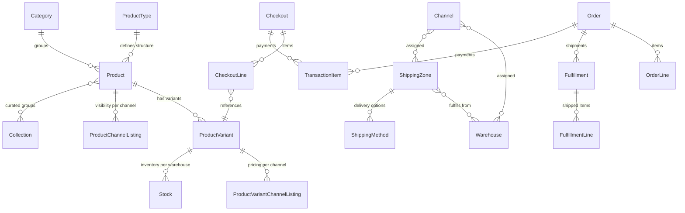

# Saleor Domain Model

Entity relationships, GraphQL types, and key concepts for engineers working with the Saleor storefront. All descriptions use **GraphQL type names** as they appear in the generated types (`src/gql/graphql.ts`).

---

## Entity Relationship Overview



---

## Product Domain

### ProductType

Template defining attribute schema for a group of products.

Key fields: `name`, `isShippingRequired`, `isDigital`, `taxClass`, `variantAttributes`, `productAttributes`.

```graphql
query {
	productType(id: $id) {
		name
		isShippingRequired
		isDigital
		variantAttributes {
			name
			inputType
		}
		productAttributes {
			name
			inputType
		}
	}
}
```

Variant selection attributes are configured here — they determine which attributes create distinct purchasable variants (e.g., Size, Color) vs. informational attributes (e.g., Material, Care Instructions).

### Product

Parent entity. **Not directly purchasable** — customers always buy a variant.

Key fields: `name`, `slug`, `description` (EditorJS JSON), `category`, `defaultVariant`, `isAvailable`, `isAvailableForPurchase`, `thumbnail`, `media`.

```graphql
query {
	product(slug: $slug, channel: $channel) {
		id
		name
		slug
		isAvailable
		isAvailableForPurchase
		description # EditorJS JSON — not plain text
		category {
			name
			slug
		}
		defaultVariant {
			id
		}
		variants {
			id
			name
			sku
		}
	}
}
```

### ProductVariant

The purchasable unit. Each variant has independent stock and channel-specific pricing.

Key fields: `sku`, `name`, `quantityAvailable`, `trackInventory`, `pricing`, `attributes`.

```graphql
query {
	product(slug: $slug, channel: $channel) {
		variants {
			id
			name
			sku
			quantityAvailable
			trackInventory
			pricing {
				price {
					gross {
						amount
						currency
					}
				}
				priceUndiscounted {
					gross {
						amount
						currency
					}
				}
			}
			attributes {
				attribute {
					name
					slug
				}
				values {
					name
					slug
				}
			}
		}
	}
}
```

### Attributes

Two usage types visible in GraphQL, configured at the ProductType level:

- **`VARIANT_SELECTION`**: Creates distinct purchasable variants (Size, Color). Appears in `variant.attributes`. Used for variant matching in the storefront.
- **Non-selection**: Informational only (Material, Care Instructions). Appears in `product.attributes`. Displayed on PDP but not used for variant selection.

See the `product-variants` rule for how the storefront uses variant selection attributes.

### ProductChannelListing

Per-channel visibility settings. Controls whether a product appears in a channel and whether it can be purchased.

Key fields: `isPublished`, `availableForPurchaseAt`, `channel { slug }`.

- Accessed via `product.channelListings` (requires `MANAGE_PRODUCTS` permission)
- Or implicitly via `product(channel: ...)` — the API filters by channel automatically

### ProductVariantChannelListing

Where the **price** lives. Each variant can have different prices per channel.

Key fields: `price { amount currency }`, `costPrice`, `channel`.

- Accessed via `variant.channelListings` (requires permissions)
- Or implicitly via `variant.pricing` when querying with a channel parameter

---

## Inventory Domain

### Warehouse

Physical inventory location.

Key fields: `name`, `address`, `clickAndCollectOption`.

`clickAndCollectOption` values:

- `LOCAL_STOCK` — only that warehouse's inventory available for pickup
- `ALL_WAREHOUSES` — any stock can be shipped to pickup point
- `DISABLED` — no pickup available

Warehouses are assigned to **Channels** and **ShippingZones** — both connections are required for stock to be purchasable.

### Stock

One record per (Warehouse, ProductVariant) combination.

Fields in GraphQL: `quantity`, `quantityAllocated`, `quantityReserved`, `warehouse { name }`.

```graphql
# Requires MANAGE_PRODUCTS permission
query {
	productVariant(id: $id) {
		stocks {
			warehouse {
				name
			}
			quantity
			quantityAllocated
			quantityReserved
		}
	}
}
```

### quantityAvailable

On `ProductVariant`: how many units a customer can buy right now.

Computed server-side as: `stock.quantity - allocations - reservations`, summed across all warehouses assigned to the queried channel. Not directly queryable as a breakdown — only the final number is returned to storefront queries.

### Allocation

Stock reserved for an **unfulfilled order**. Reduces `quantityAvailable` but doesn't change `quantity` in the warehouse. Released when the order is fulfilled (stock decreases) or cancelled (allocation removed).

Not directly queryable from the storefront — but its effect is visible in `quantityAvailable`.

### The Fulfillment Triangle

```
Channel <---> ShippingZone <---> Warehouse
   \                                /
    \________ assigned to _________/
```

**All three connections must exist** for a variant to be purchasable. Missing any link results in `isAvailable: false` even when stock exists. This is the most common cause of "product has stock but can't be purchased" issues.

Cross-reference: [ui-channels.md](../rules/ui-channels.md) for the 7-point purchasability checklist.

---

## Checkout → Order Lifecycle

### Step-by-Step with GraphQL Mutations

| Step | Mutation                                                           | Purpose                               |
| ---- | ------------------------------------------------------------------ | ------------------------------------- |
| 1    | `checkoutCreate(input: { channel, lines, email })`                 | Create checkout session               |
| 2    | `checkoutLinesAdd` / `checkoutLinesUpdate` / `checkoutLinesDelete` | Modify cart items                     |
| 3    | `checkoutShippingAddressUpdate`                                    | Set shipping address                  |
| 4    | `checkoutBillingAddressUpdate`                                     | Set billing address                   |
| 5    | `checkoutDeliveryMethodUpdate(deliveryMethodId: ...)`              | Select shipping method                |
| 6    | `checkoutAddPromoCode(promoCode: ...)`                             | Apply voucher or gift card (optional) |
| 7    | `paymentGatewayInitialize`                                         | Initialize payment gateway            |
| 8    | `transactionInitialize`                                            | Start payment transaction             |
| 9    | `transactionProcess`                                               | Complete 3DS redirect (optional)      |
| 10   | `checkoutComplete`                                                 | Convert to Order                      |

Cross-reference: [checkout-management.md](../rules/checkout-management.md) for storefront implementation details.

### Order Statuses

```
UNCONFIRMED → UNFULFILLED → PARTIALLY_FULFILLED → FULFILLED
                    ↓                                  ↓
               CANCELED                           RETURNED
                    ↓
               EXPIRED
```

### Key Concept: OrderLine Denormalization

OrderLines **copy** product data at time of purchase (name, SKU, prices, variant name). This means:

- Orders survive product deletion
- Prices on orders reflect what was charged, not current prices
- Product name changes don't affect existing orders

---

## Payment Domain

### TransactionItem (Current Model)

Independently tracks payment amounts across different states.

Key fields: `authorizedAmount`, `chargedAmount`, `refundedAmount`, `canceledAmount`, `pspReference`, `availableActions`.

- `pspReference` — External payment provider reference (e.g., Stripe PaymentIntent ID)
- `availableActions` — Array of: `CHARGE`, `REFUND`, `CANCEL`

```graphql
query {
	checkout(id: $id) {
		transactions {
			id
			authorizedAmount {
				amount
				currency
			}
			chargedAmount {
				amount
				currency
			}
			refundedAmount {
				amount
				currency
			}
			pspReference
			availableActions
		}
	}
}
```

### TransactionEvent

Immutable log entry for payment state changes.

Event types include: `CHARGE_SUCCESS`, `AUTHORIZATION_SUCCESS`, `REFUND_SUCCESS`, `CHARGE_FAILURE`, `AUTHORIZATION_FAILURE`, `REFUND_FAILURE`, `CANCEL_SUCCESS`, `CANCEL_FAILURE`.

```graphql
query {
	order(id: $id) {
		transactions {
			events {
				type
				amount {
					amount
					currency
				}
				createdAt
				pspReference
				message
			}
		}
	}
}
```

### Payment (Legacy)

Older payment model with `gateway`, `chargeStatus`, `token`. Being phased out in favor of TransactionItem. You may still see it in older order queries — prefer TransactionItem for new code.

---

## Promotions & Discounts

### Promotion (New System)

Campaign with rules. Two main types:

- **`CATALOGUE`**: Automatic price reduction on matching products. Shows as reduced `discountedPrice` on variant channel listings. No code needed — customers see the lower price automatically.
- **`ORDER`**: Applied at checkout level (like a coupon without a code). Reduces order total based on matching rules.

### PromotionRule

Targeting mechanism within a Promotion.

- `cataloguePredicate` — JSON matching products, categories, or collections
- `orderPredicate` — JSON matching order conditions
- `rewardValue` — Discount amount
- `rewardValueType` — `FIXED` or `PERCENTAGE`

### Voucher (Code-Based)

Discount applied by entering a code. Types: `ENTIRE_ORDER`, `SPECIFIC_PRODUCT`, `SHIPPING`.

Applied via `checkoutAddPromoCode`. Features: usage limits, date ranges, per-channel discount values, minimum order value requirements.

### Gift Cards

Treated as a payment method, not a discount. Applied via the `saleor.io.gift-card-payment-gateway` during payment initialization. Has a balance that decreases with use.

### How Discounts Appear in GraphQL

```graphql
query {
	product(slug: $slug, channel: $channel) {
		variants {
			pricing {
				price {
					gross {
						amount
						currency
					}
				} # Final price (after catalogue promotions)
				priceUndiscounted {
					gross {
						amount
						currency
					}
				} # Original price (before promotions)
			}
		}
	}
}
```

If `price < priceUndiscounted`, a catalogue promotion is active. The storefront uses this to show discount badges — see `product-variants` rule for discount detection logic.

---

## Channel Model

See [ui-channels.md](../rules/ui-channels.md) for multi-channel URL routing, purchasability checklist, and fulfillment model.
