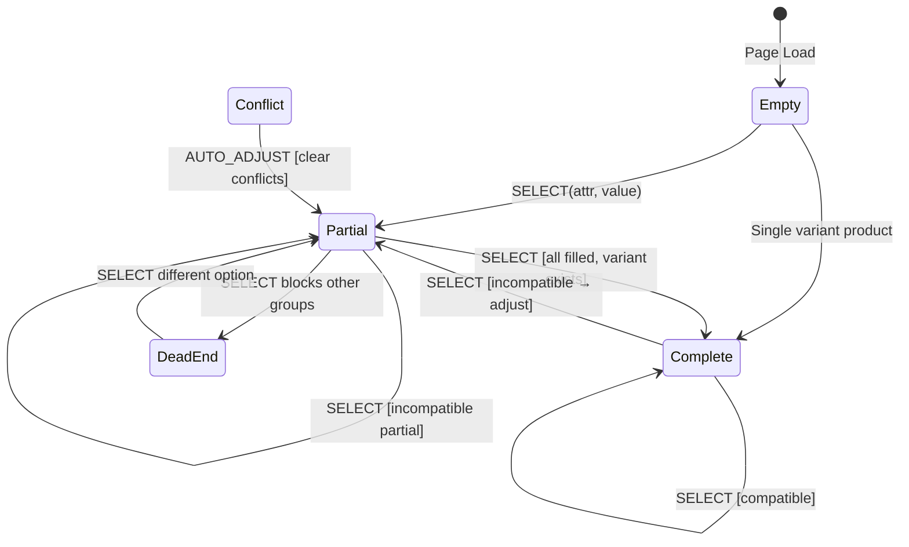

# Variant Selection State Machine

> State machines clarify complex interactive features. For multi-state UI with non-obvious transitions (like auto-adjustment here), a diagram prevents edge case bugs and helps AI agents reason about the system correctly.

## State Diagram



Note: **Conflict** only applies when all attribute groups have a selection but no variant matches.

## States

| State        | URL Params                        | Add to Cart | Description                         |
| ------------ | --------------------------------- | ----------- | ----------------------------------- |
| **Empty**    | `?`                               | No          | No selections                       |
| **Partial**  | `?color=black`                    | No          | Some attributes selected            |
| **Complete** | `?color=black&size=m&variant=abc` | Yes         | All selected, variant found         |
| **Conflict** | (transient, all attrs filled)     | --          | Impossible combination, auto-clears |
| **DeadEnd**  | `?color=black`                    | No          | Selection blocks other groups       |

## Example User Flow

```
1. User lands on product page
   State: Empty -> URL: /products/t-shirt

2. User clicks "Black" color
   State: Partial -> URL: ?color=black

3. User clicks "Medium" size
   State: Complete -> URL: ?color=black&size=medium&variant=abc123
   -> Add to Cart enabled

4. User clicks "XL" (but Black/XL doesn't exist, all attrs were filled)
   State: Conflict -> AUTO_ADJUST -> Partial
   -> URL: ?size=xl (color cleared)
```

### Multi-attribute partial flow (audiobook-style)

```
1. Click Medium MP3        -> Partial: ?medium=mp3
2. Click Audio Standard    -> Partial: ?medium=mp3&audio-quality=standard
   (medium MUST stay selected — not a conflict)
3. Click Instant Delivery  -> Complete: ?variant=... added
```

## Transition Rules

### SELECT Action

When user clicks an option:

1. **If all attributes selected and variant exists** — keep selections, set `variant` param
2. **If partial and `hasCompatibleVariant(newSelections)`** — accumulate selections
3. **If partial and incompatible** — keep only the new attribute value
4. **If all attributes selected but no variant** — AUTO_ADJUST (clear to new value only)

### AUTO_ADJUST Logic

Implemented in `getAdjustedSelections()`:

```typescript
function getAdjustedSelections(variants, currentSelections, newAttr, newValue) {
	const newSelections = { ...currentSelections, [newAttr]: newValue };

	if (findMatchingVariant(variants, newSelections)) {
		return newSelections;
	}

	const allAttributesSelected = attributeGroups.every(
		(g) => newSelections[g.slug] !== undefined && newSelections[g.slug] !== "",
	);

	// Partial: keep building when combo can still complete
	if (!allAttributesSelected && hasCompatibleVariant(variants, newSelections)) {
		return newSelections;
	}

	// Complete but impossible, or incompatible partial
	return { [newAttr]: newValue };
}
```

**Critical:** `findMatchingVariant()` returns `undefined` for partial selections by design. Do not use it alone to decide whether to clear other groups.

## Dead End Detection

A "dead end" occurs when a selection makes ALL options in another attribute group unavailable.

Detected via `getUnavailableAttributeInfo()`:

```typescript
const deadEnd = getUnavailableAttributeInfo(variants, groups, selections);
// Returns: { slug: "size", name: "Size", blockedBy: "Red" }
```
